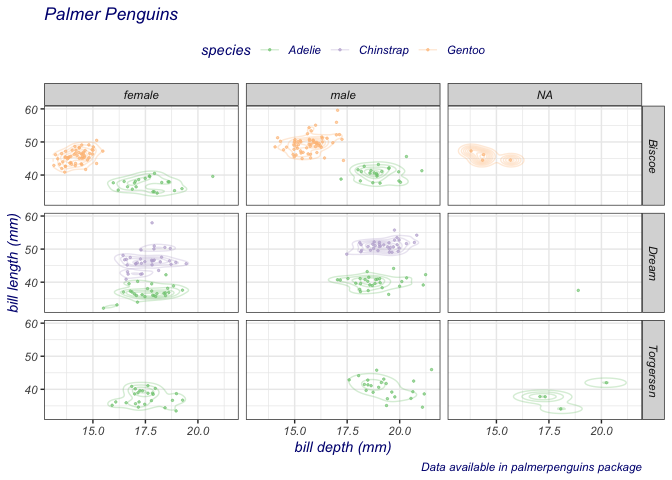

<!-- README.md is generated from README.Rmd. Please edit that file -->

# ggformula

<!-- badges: start -->

[](https://github.com/ProjectMOSAIC/ggformula/actions)
[](https://cran.r-project.org/package=ggformula)
<!-- badges: end -->

<!--
[](https://codecov.io/gh/ProjectMOSAIC/ggformula?branch=master)
-->

## Formula interface to ggplot2

`ggformula` introduces a family of graphics functions, `gf_point()`,
`gf_density()`, and so on, bring the formula interface to `ggplot()`.
This captures and extends the excellent simplicity of the
`lattice`-graphics formula interface, while providing the intuitive “add
this component” capabilities of `ggplot2`.

## Installation

You can install ggformula from CRAN sith

``` r
install.packages("ggformula")
```

or from github with:

``` r
# install.packages("devtools")
devtools::install_github("ProjectMOSAIC/ggformula")
```

## Using ggformula

The following example illustrates a typical plot constructed with
ggformula.

``` r
suppressPackageStartupMessages(library(ggformula))
data(penguins, package = "palmerpenguins")
penguins %>% 
  set_variable_labels(
    bill_length_mm = "bill length (mm)",
    bill_depth_mm = "bill depth (mm)"
  ) %>%
  gf_jitter(bill_length_mm ~ bill_depth_mm | island ~ sex, color = ~ species,
          width = 0.05, height = 0.05, size = 0.5, alpha = 0.6) %>%
  gf_density2d(alpha = 0.3) %>%
  gf_labs(title = "Palmer Penguins",
          caption = "Data available in palmerpenguins package"
  ) %>%
  gf_refine(scale_color_brewer(type = "qual")) %>%
  gf_theme(theme_bw()) %>%
  gf_theme(
    legend.position = 'top',
    text = element_text(colour = "navy", face = "italic")
  )
#> Warning: Removed 2 rows containing non-finite values (stat_density2d).
#> Warning: Computation failed in `stat_density2d()`:
#> missing value where TRUE/FALSE needed
#> Warning: Removed 2 rows containing missing values (geom_point).
```

<!-- -->

### More Information

Find out more about `ggformula` at
[projectmosiac.github.io/ggformula](https://projectmosaic.github.io/ggformula).
