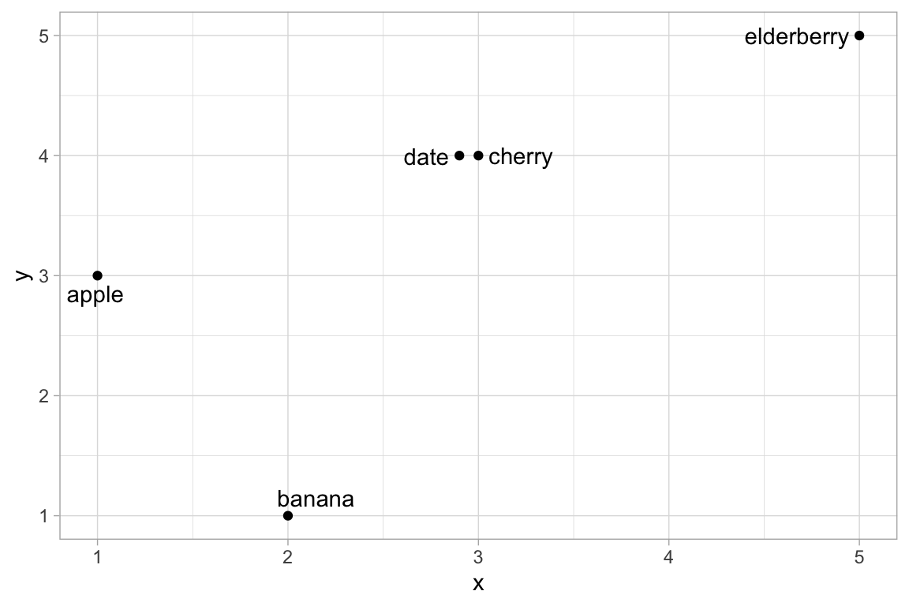
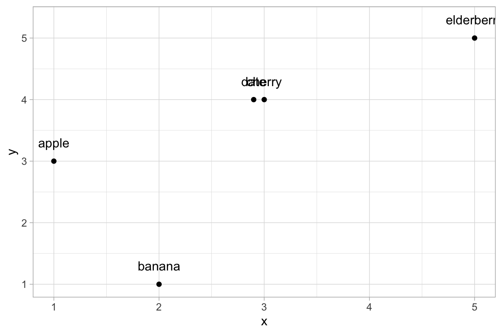
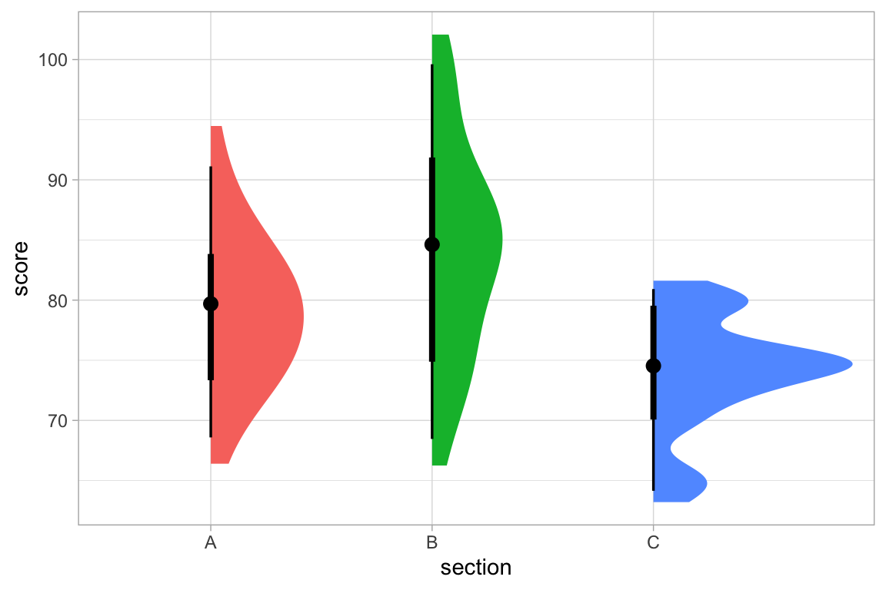

# Extending {ggformula}

Every `gf_*` function in `ggformula` –
[`gf_point()`](../reference/gf_point.md),
[`gf_boxplot()`](../reference/gf_boxplot.md),
[`gf_ribbon()`](../reference/gf_ribbon.md), and around a hundred more –
is built by a single function factory,
[`layer_factory()`](../reference/layer_factory.md). This vignette
explains how that factory works well enough that you can use it to add
your own `gf_*` wrapper around a `geom`/`stat` from another package, and
walks through two worked examples: labeling points without overlap using
[ggrepel](https://ggrepel.slowkow.com/), and half-eye/raincloud-style
distribution plots using [ggdist](https://mjskay.github.io/ggdist/).

You do not need to be a `ggformula` developer to follow along – this is
meant for anyone who wants a formula-based wrapper around a geom or stat
that `ggformula` doesn’t already provide.

## How `layer_factory()` works

Every `gf_*` function is created by calling
[`layer_factory()`](../reference/layer_factory.md) or
[`interactive_layer_factory()`](../reference/interactive_layer_factory.md)
with a small set of arguments describing the geom, stat, and position
being wrapped. Here, roughly, is how
[`gf_point()`](../reference/gf_point.md) is created inside `ggformula`
itself:[^1]

\
`gf_point`` ``<-`\
`  `[`layer_factory`](../reference/layer_factory.md)`(`\
`    geom ``=`` ``"point"``,`\
`    stat ``=`` ``"identity"``,      ``# default value`\
`    position ``=`` ``"identity"``,  ``# default value`\
`    aes_form ``=`` ``y`` ``~`` ``x``,       ``# default value`\
`    extras ``=`` `[`alist`](https://rdrr.io/r/base/list.html)`(`\
`      alpha ``=`` , color ``=`` , size ``=`` , shape ``=`` , fill ``=`` , group ``=`` , stroke ``=`` ``)`\
`  ``)`

The important arguments are:

- **`geom`** / **`stat`** / **`position`** – the geom, stat, and
  position to use, given either as strings (e.g. `"point"`, which
  resolves to `GeomPoint`) or as actual objects/functions.
- **`aes_form`** – a formula, or a list of formulas, describing the
  formula shape(s) the function accepts. It defaults to `y ~ x`, which
  is why `gf_point(mpg ~ wt, data = mtcars)` maps `wt` to `x` and `mpg`
  to `y`. Some functions allow more than one shape –
  [`gf_ribbon()`](../reference/gf_ribbon.md), for example, uses
  `list(ymin + ymax ~ x, y ~ xmin + xmax)`.
- **`extras`** – an [`alist()`](https://rdrr.io/r/base/list.html) of
  additional arguments the function should accept, with defaults where
  relevant (an empty default, as in `alpha =`, means “no default; only
  include this if the user supplies it”). Each of these can be *set*
  (`color = "red"`) or *mapped* (`color = ~species`) when the function
  is called. It is not required that every possible argument be listed
  here, but the list should include any arguments that will be given a
  different default value and any that you want listed in the short
  documentation provided when a `gf_` function is called with no
  arguments.
- **`layer_fun`** – the function ultimately used to build the layer.
  This defaults to
  [`ggplot2::layer()`](https://ggplot2.tidyverse.org/reference/layer.html),
  which is the right choice when `geom`/`stat` name registered
  `Geom*`/`Stat*` ggproto objects. If you instead want to reuse an
  existing high-level constructor function (like
  [`ggrepel::geom_text_repel()`](https://ggrepel.slowkow.com/reference/geom_text_repel.html)
  or
  [`ggdist::stat_halfeye()`](https://mjskay.github.io/ggdist/reference/stat_halfeye.html))
  rather than re-implementing its logic, you point `layer_fun` at that
  function instead – more on this below.

You can inspect the arguments any existing `gf_*` function was built
with via [`ggformula_spec()`](../reference/ggformula_spec.md):

\
[`ggformula_spec`](../reference/ggformula_spec.md)`(``gf_point``)`` ``|>`` `[`str`](https://rdrr.io/r/utils/str.html)`(``)`\
`#> List of 11`\
`#>  $ geom              : chr "point"`\
`#>  $ stat              : chr "identity"`\
`#>  $ position          : chr "identity"`\
`#>  $ aes_form          :Class 'formula'  language y ~ x`\
`#>   .. ..- attr(*, ".Environment")=<environment: 0x9998a5c78> `\
`#>  $ extras            :List of 7`\
`#>   ..$ alpha : symbol `\
`#>   ..$ color : symbol `\
`#>   ..$ size  : symbol `\
`#>   ..$ shape : symbol `\
`#>   ..$ fill  : symbol `\
`#>   ..$ group : symbol `\
`#>   ..$ stroke: symbol `\
`#>  $ pre               : language { }`\
`#>   ..- attr(*, "srcref")=List of 1`\
`#>   .. ..$ : 'srcref' int [1:8] 395 11 395 11 11 11 1002 1002`\
`#>   .. .. ..- attr(*, "srcfile")=Classes 'srcfilealias', 'srcfile' <environment: 0x999c5f5e8> `\
`#>   ..- attr(*, "srcfile")=Classes 'srcfilealias', 'srcfile' <environment: 0x999c5f5e8> `\
`#>   ..- attr(*, "wholeSrcref")= 'srcref' int [1:8] 1 0 395 12 0 12 1 1002`\
`#>   .. ..- attr(*, "srcfile")=Classes 'srcfilealias', 'srcfile' <environment: 0x999c5f5e8> `\
`#>  $ aesthetics        : <ggplot2::mapping>  Named list()`\
`#>  $ inherit.aes       : logi TRUE`\
`#>  $ check.aes         : logi TRUE`\
`#>  $ required_packages : chr(0) `\
`#>  $ installed_packages: chr(0)`

Three arguments not demonstrated in this example may be important,
especially when using stats and geoms from packages other than
`ggplot2`:

- **`required_packages`** – a character vector of package names that
  must be installed *and* attached (via
  [`library()`](https://rdrr.io/r/base/library.html)) for the function
  to work. If any are missing, the user gets an informative error before
  anything else runs – more on this below.
- **`installed_packages`** – like `required_packages`, but only checks
  that each package is installed, not that it’s attached. This may be
  the right choice when `layer_fun` calls the extension package’s own
  function directly (via `pkg::fun()`), since that often doesn’t require
  the package to be attached – more on this below.
- **`pre`** – R code to run after checking for required/installed
  packages. In earlier versions of `ggformula`, this was used to check
  for packages, but `required_packages` and `installed_packages` are
  preferred for that purpose now, but `pre` remains for cases where
  other code needs to be executed before continuing with the standard
  [`layer_factory()`](../reference/layer_factory.md) processing. See
  [`gf_text()`](../reference/gf_text.md) as an example.

\
[`ggformula_spec`](../reference/ggformula_spec.md)`(``gf_text``)`` ``|>`` `[`getElement`](https://rdrr.io/r/base/Extract.html)`(``'pre'``)`\
`#> {`\
`#>     if ((nudge_x != 0) || (nudge_y != 0)) {`\
`#>         position <- position_nudge(nudge_x, nudge_y)`\
`#>     }`\
`#> }`

## Two patterns for wrapping a new geom or stat

There are two ways to plug an extension package’s geom or stat into
[`layer_factory()`](../reference/layer_factory.md), and which one you
want depends on how that package exposes its functionality.

### Pattern 1: Point at the registered ggproto object by name

If the extension package registers a `Stat*`/`Geom*` ggproto object
(most `ggplot2` extension packages do), you can use the low-level
`geom =`/`stat =` arguments. This is how `ggformula` defines
[`gf_sina()`](../reference/gf_sina.md) as a wrapper around `ggforce`’s
sina-plot jitter, for example:

\
`gf_sina`` ``<-`\
`  `[`layer_factory`](../reference/layer_factory.md)`(`\
`    required_packages ``=`` ``"ggforce"``,`\
`    geom ``=`` ``"point"``,`\
`    stat ``=`` ``"sina"``,`\
`    position ``=`` ``"identity"``,`\
`    extras ``=`` `[`alist`](https://rdrr.io/r/base/list.html)`(``alpha ``=`` , color ``=`` , size ``=`` , fill ``=`` , group ``=`` ``)`\
`  ``)`

Because this pattern resolves `stat = "sina"` to `StatSina` by searching
the *attached* packages (not just installed ones), the extension package
must be loaded with [`library()`](https://rdrr.io/r/base/library.html),
not merely installed, for this to work. `required_packages = "ggforce"`
checks exactly that – both that `ggforce` is installed and that it’s
currently attached – and raises an actionable error otherwise, such as:

    To use gf_sina(), the ggforce package must be loaded.
        Try, for example, `library(ggforce)`.

`required_packages` is checked before anything else runs, including
`pre`, so you don’t need to write this check by hand the way earlier
versions of [`gf_sina()`](../reference/gf_sina.md) did.

### Pattern 2: Wrap an existing constructor function

Many extension packages expose their functionality only (or best)
through a full constructor function – like
[`ggplot2::geom_abline()`](https://ggplot2.tidyverse.org/reference/geom_abline.html),
[`ggrepel::geom_text_repel()`](https://ggrepel.slowkow.com/reference/geom_text_repel.html),
or
[`ggdist::stat_halfeye()`](https://mjskay.github.io/ggdist/reference/stat_halfeye.html)
– rather than through a bare ggproto object you’re expected to assemble
yourself. In that case, point `layer_fun` at that function directly, and
set `geom`/`stat` to a string with the same name (no `geom_`/`stat_`
prefix) purely so that
[`layer_factory()`](../reference/layer_factory.md) can look up that
function’s own formals to figure out which extra arguments to allow:

\
`gf_abline`` ``<-`\
`  `[`layer_factory`](../reference/layer_factory.md)`(`\
`    geom ``=`` ``"abline"``,`\
`    aes_form ``=`` ``NULL``,`\
`    extras ``=`` `\
`      `[`alist`](https://rdrr.io/r/base/list.html)`(``slope ``=`` , intercept ``=`` , color ``=`` , linetype ``=`` , linewidth ``=`` , alpha ``=`` ``)``,`\
`    inherit.aes ``=`` ``FALSE``,`\
`    data ``=`` ``NA``,`\
`    layer_fun ``=`` ``rlang``::`[`quo`](https://rlang.r-lib.org/reference/defusing-advanced.html)`(``ggplot2``::`[`geom_abline`](https://ggplot2.tidyverse.org/reference/geom_abline.html)`)`\
`  ``)`

Because Pattern 2 calls the extension package’s function directly, the
package may only need to be *installed*, not attached, in which case we
can use `installed_packages` (rather than `required_packages`) to check
for that. [`gf_sf()`](../reference/gf_sf.md), which wraps
[`ggplot2::geom_sf()`](https://ggplot2.tidyverse.org/reference/ggsf.html),
is a simple example:

\
`gf_sf`` ``<-`\
`  `[`layer_factory`](../reference/layer_factory.md)`(`\
`    layer_fun ``=`` `[`quo`](https://rlang.r-lib.org/reference/defusing-advanced.html)`(``ggplot2``::`[`geom_sf`](https://ggplot2.tidyverse.org/reference/ggsf.html)`)``,`\
`    installed_packages ``=`` ``"sf"``,`\
`    geom ``=`` ``"sf"``,`\
`    stat ``=`` ``"sf"``,`\
`    position ``=`` ``"identity"``,`\
`    aes_form ``=`` `[`list`](https://rdrr.io/r/base/list.html)`(``NULL``)``,`\
`    extras ``=`` `[`alist`](https://rdrr.io/r/base/list.html)`(``alpha ``=`` , color ``=`` , fill ``=`` , group ``=`` , linetype ``=`` , linewidth ``=`` , geometry ``=`` ``)`\
`  ``)`

This is the pattern used for both examples below.

## Example: labeling points without overlap with {ggrepel}

[ggrepel](https://ggrepel.slowkow.com/) provides
[`geom_text_repel()`](https://ggrepel.slowkow.com/reference/geom_text_repel.html)
and
[`geom_label_repel()`](https://ggrepel.slowkow.com/reference/geom_text_repel.html),
drop-in replacements for
[`ggplot2::geom_text()`](https://ggplot2.tidyverse.org/reference/geom_text.html)/
[`geom_label()`](https://ggplot2.tidyverse.org/reference/geom_text.html)
that nudge overlapping labels apart. `ggformula` already has
[`gf_text()`](../reference/gf_text.md) and
[`gf_label()`](../reference/gf_text.md); here’s a `gf_text_repel()`
built the same way, but pointed at
[`ggrepel::geom_text_repel()`](https://ggrepel.slowkow.com/reference/geom_text_repel.html).

\
[`library`](https://rdrr.io/r/base/library.html)`(`[`ggrepel`](https://ggrepel.slowkow.com/)`)`\
\
`gf_text_repel`` ``<-`\
`  `[`layer_factory`](../reference/layer_factory.md)`(`\
`    geom ``=`` ``"text_repel"``,`\
`    layer_fun ``=`` ``rlang``::`[`quo`](https://rlang.r-lib.org/reference/defusing-advanced.html)`(``ggrepel``::`[`geom_text_repel`](https://ggrepel.slowkow.com/reference/geom_text_repel.html)`)``,`\
`    extras ``=`` `[`alist`](https://rdrr.io/r/base/list.html)`(`\
`      label ``=`` ,`\
`      alpha ``=`` ,`\
`      color ``=`` ,`\
`      size ``=`` ,`\
`      fontface ``=`` ,`\
`      family ``=`` ,`\
`      box.padding ``=`` ``0.25``,`\
`      point.padding ``=`` ``1e-06``,`\
`      min.segment.length ``=`` ``0.5``,`\
`      max.overlaps ``=`` ``10``,`\
`      nudge_x ``=`` ``0``,`\
`      nudge_y ``=`` ``0``,`\
`      seed ``=`` ``NA``,`\
`      direction ``=`` ``"both"`\
`    ``)`\
`  ``)`

A few things to note:

- `geom = "text_repel"` doesn’t correspond to a real `Geom*` object;
  it’s only used to fetch `formals(geom_text_repel)` so those argument
  names (`box.padding`, `max.overlaps`, etc.) are recognized
  automatically, in addition to the ones listed explicitly in `extras`.
- Because of this, `layer_fun` is required here and tells `ggformula`
  where to locate the function used to create a plot layer.
- `aes_form` was left at its default, `y ~ x`, which is exactly what we
  want here.
- `label` is listed in `extras` with no default, the same way
  [`gf_text()`](../reference/gf_text.md) handles it, so it can be set
  (`label = "winner"`) or mapped (`label = ~name`).

Using it looks just like using [`gf_text()`](../reference/gf_text.md):

\
`df`` ``<-`` `[`data.frame`](https://rdrr.io/r/base/data.frame.html)`(`\
`  x ``=`` `[`c`](https://rdrr.io/r/base/c.html)`(``1``, ``2``, ``3``, ``2.9``, ``5``)``,`\
`  y ``=`` `[`c`](https://rdrr.io/r/base/c.html)`(``3``, ``1``, ``4``, ``4``, ``5``)``,`\
`  name ``=`` `[`c`](https://rdrr.io/r/base/c.html)`(``"apple"``, ``"banana"``, ``"cherry"``, ``"date"``, ``"elderberry"``)`\
`)`\
\
[`gf_point`](../reference/gf_point.md)`(``y`` ``~`` ``x``, data ``=`` ``df``)`` ``|>`\
`  ``gf_text_repel``(``y`` ``~`` ``x``, label ``=`` ``~``name``, seed ``=`` ``1234``)`

Compare that to [`gf_text()`](../reference/gf_text.md), which lets the
labels overlap or spill off of the graphic:

\
[`gf_point`](../reference/gf_point.md)`(``y`` ``~`` ``x``, data ``=`` ``df``)`` ``|>`\
`  `[`gf_text`](../reference/gf_text.md)`(``y`` ``~`` ``x``, label ``=`` ``~``name``, nudge_y ``=`` ``0.3``)`

## Example: half-eye plots with {ggdist}

[ggdist](https://mjskay.github.io/ggdist/) provides “raincloud”-style
[`stat_halfeye()`](https://mjskay.github.io/ggdist/reference/stat_halfeye.html),
which draws a half-violin density alongside a point estimate and one or
more uncertainty intervals – a richer alternative to
[`gf_violin()`](../reference/gf_violin.md)/[`gf_boxplot()`](../reference/gf_boxplot.md).
[`stat_halfeye()`](https://mjskay.github.io/ggdist/reference/stat_halfeye.html)
is itself a high-level constructor (its default `geom` is
`"slabinterval"`), so this again uses Pattern 2.

\
[`library`](https://rdrr.io/r/base/library.html)`(`[`ggdist`](https://mjskay.github.io/ggdist/)`)`\
`#> `\
`#> Attaching package: 'ggdist'`\
`#> The following objects are masked from 'package:ggridges':`\
`#> `\
`#>     scale_point_color_continuous, scale_point_color_discrete,`\
`#>     scale_point_colour_continuous, scale_point_colour_discrete,`\
`#>     scale_point_fill_continuous, scale_point_fill_discrete,`\
`#>     scale_point_size_continuous`\
\
`gf_halfeye`` ``<-`\
`  `[`layer_factory`](../reference/layer_factory.md)`(`\
`    geom ``=`` ``"slabinterval"``,`\
`    stat ``=`` ``"halfeye"``,`\
`    layer_fun ``=`` ``rlang``::`[`quo`](https://rlang.r-lib.org/reference/defusing-advanced.html)`(``ggdist``::`[`stat_halfeye`](https://mjskay.github.io/ggdist/reference/stat_halfeye.html)`)``,`\
`    extras ``=`` `[`alist`](https://rdrr.io/r/base/list.html)`(`\
`      fill ``=`` ,`\
`      color ``=`` ,`\
`      alpha ``=`` ,`\
`      adjust ``=`` ``1``,`\
`      point_interval ``=`` ``"median_qi"``,`\
`      .width ``=`` `[`c`](https://rdrr.io/r/base/c.html)`(``0.66``, ``0.95``)``,`\
`      side ``=`` ``"top"``,`\
`      justification ``=`` ``NULL`\
`    ``)`\
`  ``)`

Setting `stat = "halfeye"` here means
[`layer_factory()`](../reference/layer_factory.md) looks up
`formals(stat_halfeye)` itself (since
[`stat_halfeye()`](https://mjskay.github.io/ggdist/reference/stat_halfeye.html)
is both the constructor we’re calling *and* the thing we’re using to
discover valid arguments), which automatically permits arguments like
`point_interval`, `.width`, `density`, and `breaks` without having to
list every one of them in `extras`.

\
[`set.seed`](https://rdrr.io/r/base/Random.html)`(``202``)`\
`scores`` ``<-`` `[`data.frame`](https://rdrr.io/r/base/data.frame.html)`(`\
`  section ``=`` `[`rep`](https://rdrr.io/r/base/rep.html)`(`[`c`](https://rdrr.io/r/base/c.html)`(``"A"``, ``"B"``, ``"C"``)``, each ``=`` ``30``)``,`\
`  score ``=`` `[`c`](https://rdrr.io/r/base/c.html)`(`[`rnorm`](https://rdrr.io/r/stats/Normal.html)`(``30``, ``78``, ``6``)``, `[`rnorm`](https://rdrr.io/r/stats/Normal.html)`(``30``, ``82``, ``9``)``, `[`rnorm`](https://rdrr.io/r/stats/Normal.html)`(``30``, ``75``, ``5``)``)`\
`)`\
\
`gf_halfeye``(``score`` ``~`` ``section``, data ``=`` ``scores``, fill ``=`` ``~``section``, show.legend ``=`` ``FALSE``)`

[`stat_halfeye()`](https://mjskay.github.io/ggdist/reference/stat_halfeye.html)
sets its own default of `show.legend = c(size = FALSE)` when called
directly, to avoid an unwanted legend for its point-size aesthetic;
because [`layer_factory()`](../reference/layer_factory.md)-built
functions always pass an explicit `show.legend` through to `layer_fun`
(`NA` by default), that sensible default gets overridden. Passing
`show.legend = FALSE` explicitly, as above, avoids the stray legend
entry.

## Wrapping interactive geoms from `ggiraph`

If you’d like an `_interactive` counterpart of your new function (for
use with [`gf_girafe()`](../reference/gf_girafe.md)), you generally
don’t need to do anything extra:
[`interactive_layer_factory()`](../reference/interactive_layer_factory.md)
builds one automatically from any function’s
[`ggformula_spec()`](../reference/ggformula_spec.md), as long as
[ggiraph](https://davidgohel.github.io/ggiraph/) provides an interactive
version of the same geom (e.g.
[`ggiraph::geom_text_repel_interactive()`](https://davidgohel.github.io/ggiraph/reference/geom_text_repel_interactive.html)).
See
[`vignette("interactive-graphics")`](../articles/interactive-graphics.md)
for more on interactive plots in general.

## Tips and things to watch for

- **Attach vs. install.** If you use Pattern 1 (a bare `geom =`/`stat =`
  name), the extension package must be *attached* with
  [`library()`](https://rdrr.io/r/base/library.html), not merely
  installed, because `ggplot2` resolves those names by searching
  attached namespaces. Use `required_packages` to enforce this, as in
  the [`gf_sina()`](../reference/gf_sina.md) example above. Pattern 2
  (`layer_fun =`) doesn’t have this restriction, since you’re calling
  the extension’s function directly; `installed_packages` may be
  sufficient, as in the [`gf_sf()`](../reference/gf_sf.md) example
  above, to check only that the package is installed. In general, if you
  can get by without attaching a package, that is preferable.

- **`check.aes`.** By default,
  [`layer_factory()`](../reference/layer_factory.md) warns if you supply
  an aesthetic that isn’t among the geom’s/stat’s known aesthetics. Set
  `check.aes = FALSE` if you need to pass an aesthetic that
  [`layer_factory()`](../reference/layer_factory.md) can’t discover
  automatically (this is rarely necessary if you list the relevant names
  in `extras`).

- **`pre` for other guardrails.** The `pre` argument lets you run
  arbitrary code before the layer is built – useful for small
  argument-massaging steps like the `nudge_x`/`nudge_y` handling used
  internally by [`gf_text()`](../reference/gf_text.md). You will
  typically want to surround your code with curly braces:
  [`{ }`](https://rdrr.io/r/base/Paren.html). `required_packages` and
  `installed_packages` are always checked first, before `pre` runs.

- **Testing.** `ggformula`’s own test suite uses
  [`vdiffr::expect_doppelganger()`](https://vdiffr.r-lib.org/reference/expect_doppelganger.html)
  (wrapped as `wrapped_expect_doppelganger()` internally) to catch
  unintended rendering changes; the same approach works well for testing
  a new wrapper you’ve written.

- Some packages use `ggplot2` in “non-standard” ways. Rather than
  creating and exporting new Stats or Geoms and corresponding `stat_`
  and `geom_`functions and following `ggplot2`’s general grammar of
  graphics approach, they follow some other convention and provide
  functions that use the information provided to construct a `ggplot2`
  plot in some other way. `ggformula` is not designed to work with
  packages of this type.

## Further reading

- [`?layer_factory`](../reference/layer_factory.md) for the full list of
  arguments.
- [`?ggformula_spec`](../reference/ggformula_spec.md) for introspecting
  existing `gf_*` functions.
- [`vignette("ggformula")`](../articles/ggformula.md) for the base
  formula syntax that every `gf_*` function (including ones you build
  yourself) inherits for free.

[^1]: For emphasis, we explicitly define three arguments that take on
    their default values so could be omitted.
