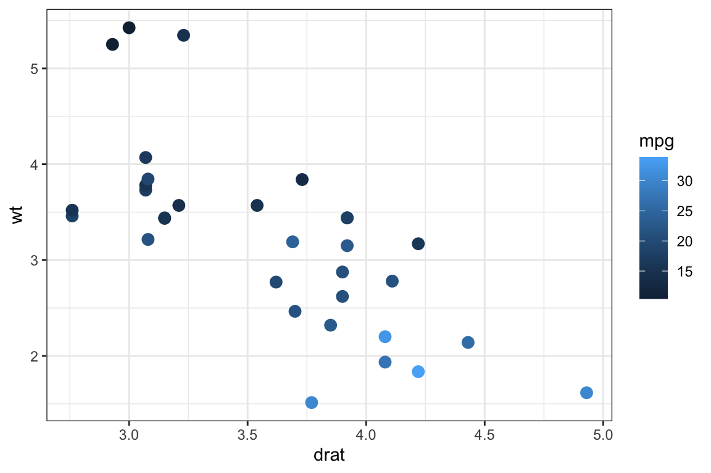

# Interactive graphics with {ggformula}

{ggformula} provides `gf_*_interactive()` companions to many of its
plotting functions, built on top of {ggiraph}. These let you add
tooltips, hover highlighting, click-driven JavaScript, linked brushing
across multiple plots, and more – all from the same formula interface
used by the rest of {ggformula}.

For example, a static scatterplot like this

\
`mtcars2`` ``<-`` ``mtcars`` ``|>`` ``tibble``::`[`rownames_to_column`](https://tibble.tidyverse.org/reference/rownames.html)`(``var ``=`` ``"carname"``)`\
\
`mtcars2`` ``|>`\
`  `[`gf_point`](../reference/gf_point.md)`(``wt`` ``~`` ``drat``, color ``=`` ``~``mpg``, size ``=`` ``3``)`

has an interactive counterpart

\
`mtcars2`` ``|>`\
`  `[`gf_point_interactive`](../reference/gf_point_interactive.md)`(`\
`    ``wt`` ``~`` ``drat``,`\
`    color ``=`` ``~``mpg``,`\
`    tooltip ``=`` ``~``carname``,`\
`    data_id ``=`` ``~``carname``,`\
`    hover_nearest ``=`` ``TRUE``,`\
`    size ``=`` ``3`\
`  ``)`` ``|>`\
`  `[`gf_girafe`](../reference/gf_girafe.md)`(``)`

that pops up the car’s name when you hover over a point.

Each interactive plot produced this way embeds its own copy of some
JavaScript and font data, so a document with many such plots can become
quite large. To keep the installed package small, the full, runnable
demonstration – covering interactive geoms, scales, facets, themes,
linked plots with {patchwork}, JavaScript click actions, and styling
options – lives on the package website instead of in this vignette:

**[See the full interactive graphics
article](https://www.mosaic-web.org/ggformula/articles/interactive-graphics.html)**

That article is rendered from the same source used to develop and test
these features, so it always reflects the current behavior of the
`gf_*_interactive()` functions.
