# ggformula: Another Option for Teaching Graphics in R to Beginners

David Robinson’s excellent blog entry “Teach the tidyverse to beginners”
(http://varianceexplained.org/r/teach-tidyverse) argues that a
`tidyverse` approach is the better of two prevalent options for teaching
beginners:

1.  “Base R first”: teach syntax such as `$` and `[[ ]]`, use built-in
    functions like [`ave()`](https://rdrr.io/r/stats/ave.html) and
    [`tapply()`](https://rdrr.io/r/base/tapply.html), and use base
    graphics.

2.  “Tidyverse first”: start from scratch with pipes (`|>`), leverage
    `dplyr` for data transformations and summarization, and use
    `ggplot2` for graphics.

As his title suggests, David prefers the second option and makes a
strong case for it. Indeed, if those were the only two options, I’d
probably choose `tidyverse` as well.

## A third way

But these are not the only options. Nick Horton’s “Options for teaching
R to beginners: a false
dichotomy?”(http://sas-and-r.blogspot.com/2017/07/options-for-teaching-r-to-beginners.html)
describes a third alternative that also “get\[s\] students doing
powerful things quickly”, as David desires. This third way is based on a
formula interface provided by the combination of

- the `lattice` package for graphics,
- several functions from the `stats` package for modeling (e.g.,
  [`lm()`](https://rdrr.io/r/stats/lm.html),
  [`t.test()`](https://rdrr.io/r/stats/t.test.html)), and
- the `mosaic` package for numerical summaries and for smoothing over
  edge cases and inconsistencies in the other two components.

Important in this approach is the syntactic similarity that the
following “formula template” brings to all of these operations.

 

## **goal ( y ~ x , data = mydata, … )**

 

Many important data analysis operations can be executed by filling in
the four boxes with the appropriate information for the desired task.
This allows students to become fluent quickly with a powerful, coherant
toolkit for data analysis.

Nick’s post illustrates this with an investigation of how the price of
diamonds depends on (among other things) color. The similarity among the
commands to compute mean price for each of two colors, to create
side-by-side boxplots, to run a two-sample t test, and to fit a linear
model are what make this approach so compelling.

\
`` # diamonds2 was called `recoded' in Nick's post ``\
[`library`](https://rdrr.io/r/base/library.html)`(`[`dplyr`](https://dplyr.tidyverse.org)`)`\
`diamonds2`` ``<-`` ``diamonds`` ``|>`` `\
`  `[`filter`](https://dplyr.tidyverse.org/reference/filter.html)`(``color`` ``==`` ``"D"`` ``|`` ``color`` ``==`` ``"J"``)`` ``|>`\
`  `[`mutate`](https://dplyr.tidyverse.org/reference/mutate.html)`(``col ``=`` `[`as.character`](https://rdrr.io/r/base/character.html)`(``color``)``)`\
\
`  `[`mean`](https://rdrr.io/r/base/mean.html)`(``price`` ``~`` ``col``, data ``=`` ``diamonds2``)``  `\
`#> Warning in mean.default(price ~ col, data = diamonds2): argument is not numeric`\
`#> or logical: returning NA`\
`bwplot``(``price`` ``~`` ``col``, data ``=`` ``diamonds2``)`\
[`t.test`](https://rdrr.io/r/stats/t.test.html)`(``price`` ``~`` ``col``, data ``=`` ``diamonds2``)`\
`    `[`lm`](https://rdrr.io/r/stats/lm.html)`(``price`` ``~`` ``col``, data ``=`` ``diamonds2``)`

This “Less Volume, More Creativity” approach is outlined in more detail
in a recent [*R Journal*
article](https://journal.r-project.org/archive/2017/RJ-2017-024/) and
has worked well for a growing number of instructors in first (and
subsequent) courses (see for example Wang et al., “Data Viz on Day One:
bringing big ideas into intro stats early and often” (2017), TISE).

## Trouble in paradise

But as Nick hinted in his blog post, the use of `lattice` has some
drawbacks. While basic graphs like histograms, boxplots, scatterplots,
and quantile-quantile plots are simple to make with `lattice`, it is
challenging to combine these simple plots into more complex plots or to
plot data from multiple data sources. Splitting data into subgroups and
either overlaying with multiple colors or separating into sub-plots
(facets) is easy, but the labeling of such plots is not as convenient
(and takes more space) that the equivalent plots made with `ggplot2`.
And in our experience, students generally find the look of `ggplot2`
graphics more appealing.

On the other hand, introducing `ggplot2` into a first course is
challenging. The syntax is more verbose, so it takes up more of the
limited space on projected images and course handouts. More importantly,
the syntax is entirely unrelated to the syntax used for other aspects of
the course. For those adopting a “Less Volume, More Creativity”
approach, `ggplot2` is tough to justify.

## ggformula: The third-and-a half way

Danny Kaplan and I recently introduced `ggformula`, a package that
provides a formula interface to `ggplot2` graphics. Our hope is that
this provides the best aspects of `lattice` (the formula interface and
lighter syntax) and `ggplot2` (modularity, layering, and better visual
aesthetics).

For simple plots, the only thing that changes is the name of the
plotting function. Each of these functions begins with `gf`. Here are
two examples, either of which could replace the side-by-side boxplots
made with `lattice` in Nick’s post.

\
[`gf_boxplot`](../reference/gf_boxplot.md)`(``price`` ``~`` ``col``, data ``=`` ``diamonds2``)`\
[`gf_violin`](../reference/gf_violin.md)`(``price`` ``~`` ``col``, data ``=`` ``diamonds2``)`

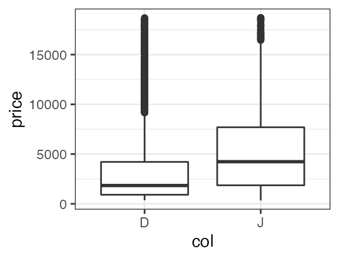

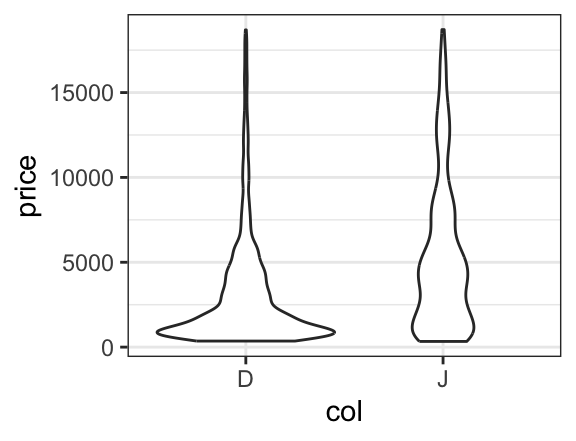

If we like, we can even overlay these two types of plots to see how they
compare. To do so, we simply place the then operator (`|>`, also called
a pipe) between the two layers and adjust the transparency so we can see
both where they overlap.

\
[`gf_boxplot`](../reference/gf_boxplot.md)`(``price`` ``~`` ``col``, data ``=`` ``diamonds2``, alpha ``=`` ``0.05``)`` ``|>`\
[`gf_violin`](../reference/gf_violin.md)`(``price`` ``~`` ``col``, data ``=`` ``diamonds2``, alpha ``=`` ``0.3``, fill ``=`` ``"navy"``, col ``=`` ``NA``)`

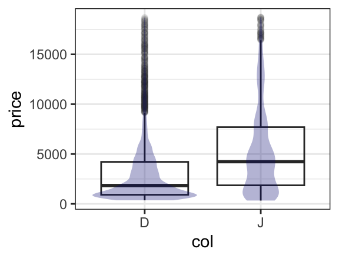

## Setting and mapping attributes of a plot

In the example above, we set certain attributes (fill, color, opacity)
to constants (`"navy"`, `NA`, `0.3`). Often we want the values of these
attributes to be determined by the data, this is called mapping rather
than setting and is indicated by an additional `~`. One can read
`fill = "navy"` as “fill is (or equals) navy” and `fill = ~ col` as
“fill *is determined by* `col`. (Which colors get used for which values
is controled by the fill scale for the plot, and this scale can be
modified by the user who doesn’t like the default scale choice.)

\
[`gf_boxplot`](../reference/gf_boxplot.md)`(``price`` ``~`` ``col``, data ``=`` ``diamonds2``, alpha ``=`` ``0.05``)`` ``|>`\
`  `[`gf_violin`](../reference/gf_violin.md)`(``price`` ``~`` ``col``, data ``=`` ``diamonds2``, alpha ``=`` ``0.3``, fill ``=`` ``~`` ``col``)`

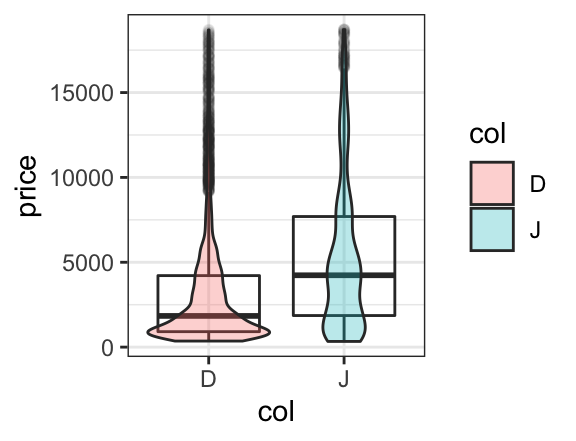

A more interesting use of mapping colors occurs when elements of each
color overlap. For example, a scatterplot with overlaid regression fits
shows that although the price of J diamonds tends to be higher overall,
after taking into consideration the number of carats, the D color
diamonds tend to sell for more than the J color diamonds. (It also shows
that the simple linear fit is poor for the largest diamonds.)

\
`xyplot``(``price`` ``~`` ``carat``, groups ``=`` ``col``, data ``=`` ``diamonds2``,`\
`       auto.key ``=`` ``TRUE``, type ``=`` `[`c`](https://rdrr.io/r/base/c.html)`(``"p"``, ``"r"``)``, alpha ``=`` ``0.5``)`` `\
[`gf_point`](../reference/gf_point.md)`(``price`` ``~`` ``carat``, color ``=`` ``~`` ``col``, data ``=`` ``diamonds2``, alpha ``=`` ``0.5``)`` ``|>`\
`   `[`gf_lm`](../reference/gf_smooth.md)`(``price`` ``~`` ``carat``, color ``=`` ``~`` ``col``, data ``=`` ``diamonds2``, alpha ``=`` ``0.5``)`` `

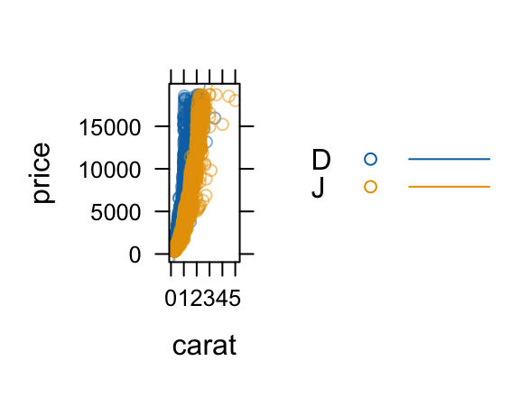

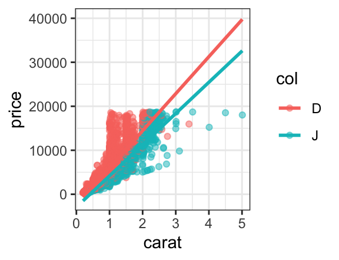

In `lattice`, this requires us to manually turn on a legend with
`auto.key = TRUE` and to introduce the `type` argument and the
[`c()`](https://rdrr.io/r/base/c.html) function to get both layers. In
`ggplot2`, we simply put one layer over the other (so no new syntax to
learn). The (improved) legend is generated automatically, and the
portion of the plot devoted to the data is substantially larger than for
the `lattice` plot. So the `ggformula` plot is both technically better
and syntactically simpler than its `lattice` counterpart.

## Getting a little help

Everyone forgets some details from time to time. The `ggformula`
functions provide a mechanism for obtaining a bit of help without going
to the full help page for the function: simply execute the function with
no arguments.

\
[`gf_violin`](../reference/gf_violin.md)`(``)`\
`#> gf_violin() uses `\
`#>     * a formula with shape y ~ x. `\
`#>     * geom:  violin `\
`#>     * stat:  ydensity `\
`#>     * position:  dodge `\
`#>     * key attributes:  alpha, color, fill, group, linetype, linewidth, weight,`\
`#>                    quantile.colour = NULL, quantile.color =`\
`#>                    NULL, quantile.linetype = 0,`\
`#>                    quantile.linewidth = NULL, trim = TRUE,`\
`#>                    scale = "area", bw, adjust = 1, kernel =`\
`#>                    "gaussian"`\
`#> `\
`#> For more information, try ?gf_violin`

This terse help describes how the formula is used. (For those already
familiar with `ggplot2`, the formula shape shows how the formula is
converted into `ggplot2` aesthetics.) Also listed are the geom (type of
mark drawn), any non-identity stats and positions, and the main
attributes that can be mapped or set to refine the plot. Just this much
help lets us quickly (a) thinken the lines, (b) make the violins less
(or more) smooth, (c) add lines at the quartiles of the data, and scale
the area of the violins according the number of observations
represented.

\
[`gf_violin`](../reference/gf_violin.md)`(``price`` ``~`` ``col``, data ``=`` ``diamonds2``,`\
`          color ``=`` ``~`` ``col``, fill ``=`` ``~``col``, alpha ``=`` ``0.2``,`\
`          scale ``=`` ``"count"``,`\
`          draw_quantiles ``=`` `[`c`](https://rdrr.io/r/base/c.html)`(``0.25``, ``0.5``, ``0.75``)``, size ``=`` ``0.8``,`\
`          adjust ``=`` ``1``/``2``)`\
`` #> Warning: The `draw_quantiles` argument of `geom_violin()` is deprecated as of ggplot2 ``\
`#> 4.0.0.`\
`` #> ℹ Please use the `quantiles.linetype` argument instead. ``\
`` #> Warning: Using `size` aesthetic for lines was deprecated in ggplot2 3.4.0. ``\
`` #> ℹ Please use `linewidth` instead. ``

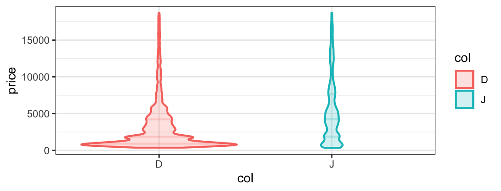

## Facets

Sometimes it is preferable to create multiple plot arranged in a grid
rather than to overlay subgroups in the same space. `ggformula` provides
two ways to create these facets. The first uses `|` very much like
`lattice` does.

\
[`gf_point`](../reference/gf_point.md)`(``price`` ``~`` ``carat`` ``|`` ``col``, data ``=`` ``diamonds2``, alpha ``=`` ``0.2``)`` ``|>`\
`  `[`gf_lm`](../reference/gf_smooth.md)`(``)`\
[`gf_point`](../reference/gf_point.md)`(``price`` ``~`` ``carat`` ``|`` ``col`` ``~`` ``clarity``, data ``=`` ``diamonds2``, alpha ``=`` ``0.2``)`` ``|>`\
`  `[`gf_lm`](../reference/gf_smooth.md)`(``)`

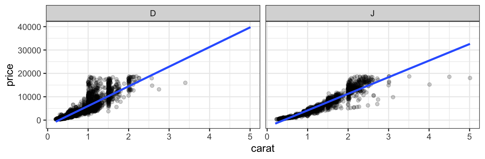

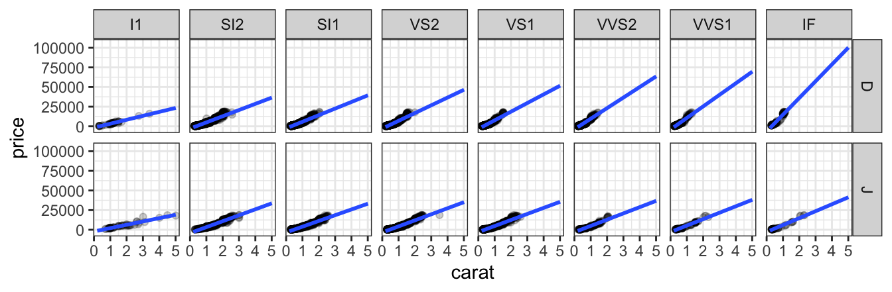

Notice that the [`gf_lm()`](../reference/gf_smooth.md) layer inherits
information from the the `gf_points()` layer in these plots, saving some
typing when the information is the same in multiple layers.

The second way to adds facets with
[`gf_facet_wrap()`](../reference/gf_facet_grid.md) or
[`gf_facet_grid()`](../reference/gf_facet_grid.md). The commands below
create the same plots as those above.

\
[`gf_point`](../reference/gf_point.md)`(``price`` ``~`` ``carat``, data ``=`` ``diamonds2``, alpha ``=`` ``0.2``, size ``=`` ``0.5``)`` ``|>`\
`  `[`gf_lm`](../reference/gf_smooth.md)`(``alpha ``=`` ``0.5``)`` ``|>`\
`  `[`gf_facet_wrap`](../reference/gf_facet_grid.md)`(`` ``~`` ``color``)`\
\
[`gf_point`](../reference/gf_point.md)`(``price`` ``~`` ``carat``, data ``=`` ``diamonds2``, alpha ``=`` ``0.2``, size ``=`` ``0.5``)`` ``|>`\
`  `[`gf_lm`](../reference/gf_smooth.md)`(``alpha ``=`` ``0.5``)`` ``|>`\
`  `[`gf_facet_grid`](../reference/gf_facet_grid.md)`(`` ``color`` ``~`` ``clarity``)`

## Refinements

The full power to modify plot limits, titles, scales, theme elements,
etc. is inherited by `ggformula` from `ggplot2`. For the most common of
these we offer the functions [`gf_lims()`](../reference/gf_aux.md),
[`gf_labs()`](../reference/gf_aux.md), and
[`gf_theme()`](../reference/gf_theme.md).\
For the rest, we offer [`gf_refine()`](../reference/gf_aux.md) which
allows us to make any `ggplot2` refinements without resorting to the `+`
syntax used by `ggformula`.

\
[`gf_point`](../reference/gf_point.md)`(``price`` ``~`` ``carat``, data ``=`` ``diamonds2``, `\
`         color ``=`` ``~`` ``col``, alpha ``=`` ``0.2``, size ``=`` ``0.5``)`` ``|>`\
`  `[`gf_lm`](../reference/gf_smooth.md)`(``alpha ``=`` ``0.5``)`` ``|>`\
`  `[`gf_facet_wrap`](../reference/gf_facet_grid.md)`(`` ``~`` ``color``)`` ``|>`\
`  `[`gf_labs`](../reference/gf_aux.md)`(``title ``=`` ``"Price vs Size"``, subtitle ``=`` ``"(2 colors of diamonds)"``,`\
`          caption ``=`` ``"source: ggplot2::diamonds"``,`\
`          x ``=`` ``"size (carat)"``, y ``=`` ``"price (US dollars)"`\
`  ``)`` ``|>`\
`  `[`gf_refine`](../reference/gf_aux.md)`(`[`scale_color_manual`](https://ggplot2.tidyverse.org/reference/scale_manual.html)`(``values ``=`` `[`c`](https://rdrr.io/r/base/c.html)`(``"red"``, ``"navy"``)``, guide ``=`` ``"none"``)``)`` ``|>`\
`  `[`gf_theme`](../reference/gf_theme.md)`(`[`theme_minimal`](https://ggplot2.tidyverse.org/reference/ggtheme.html)`(``)``)`

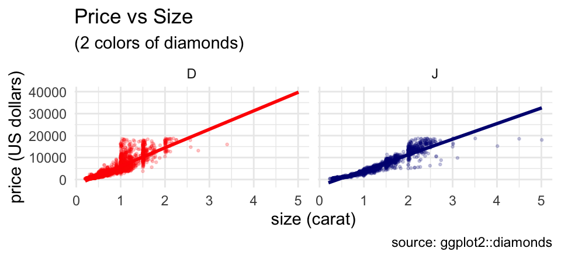

Although this example uses a lot of customization, it is completely
modular. Any line of the customization can be omitted, or additional
features can be customized one line at a time.

## Fitting into the tidyverse work flow

`ggformala` also fits into a tidyverse-style workflow (arguably better
than `ggplot2` itself does). Data can be piped into the initial call to
a `ggformula` function and there is no need to switch between `|>` and
`+` when moving from data transformations to plot operations.

\
`diamonds`` ``|>`\
`  `[`filter`](https://dplyr.tidyverse.org/reference/filter.html)`(``color`` `[`%in%`](https://rdrr.io/r/base/match.html)` `[`c`](https://rdrr.io/r/base/c.html)`(``"D"``, ``"G"``, ``"J"``)``)`` ``|>`\
`  `[`mutate`](https://dplyr.tidyverse.org/reference/mutate.html)`(``col ``=`` `[`as.character`](https://rdrr.io/r/base/character.html)`(``color``)``)`` ``|>`\
`  `[`gf_bar`](../reference/gf_bar.md)`(`` ``~`` ``col``)`

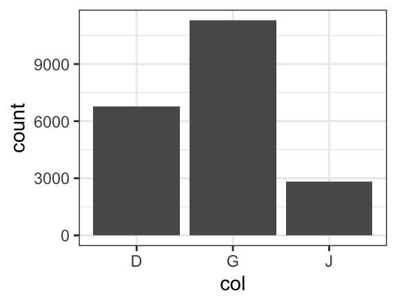

## Summary

The “Less Volume, More Creativity” approach based on a common formula
template has served well for several years, but the arrival of
`ggformula` strengthens this approach by bringing a richer graphical
system into reach for beginners without introducing new syntactical
structures.
