# Formula Interface for ggplot2 (full version)

## Formula-driven graphics

There are several excellent graphics packages provided for R. The
`ggformula` package currently builds on one of them, `ggplot2`, but
provides a very different user interface for creating plots. The
interface is based on formulas (much like the `lattice` interface) and
the use of the chaining operator (`|>`) to build more complex graphics
from simpler components.

The `ggformula` graphics were designed with several user groups in mind:

- beginners who want to get started quickly and may find the syntax of
  `ggplot2()` a bit offputting,

- those familiar with `lattice` graphics, but wanting to be able to
  easily create multilayered plots,

- those who prefer a formula interface, perhaps because it is familiar
  from use with functions like [`lm()`](https://rdrr.io/r/stats/lm.html)
  or from use of the `mosaic` package for numerical summaries.

### The basic formula template

The basic template for creating a plot with `ggformula` is

\
`gf_plottype``(``formula``, data ``=`` ``mydata``)`

or, equivalently,

\
`mydata`` ``|>`` ``gf_plottype``(``formula``)`

where

- `plottype` describes the type of plot (layer) desired (points, lines,
  a histogram, etc., etc.),

- `mydata` is a data frame containing the variables used in the plot,
  and

- `formula` describes how/where those variables are used.

For example, in a bivariate plot, `formula` will take the form `y ~ x`,
where `y` is the name of a variable to be plotted on the y-axis and `x`
is the name of a variable to be plotted on the x-axis. (It is also
possible to use expressions that can be evaluated using variables in the
data frame as well.)

The first form of the tempate is useful for simple plots or for
multi-layered plots where different layers use different data. The
second form is useful for multi-layered plots or plots with many
arguments.

Here is a simple example:

\
[`library`](https://rdrr.io/r/base/library.html)`(`[`ggformula`](https://github.com/ProjectMOSAIC/ggformula)`)`\
[`gf_point`](../reference/gf_point.md)`(``mpg`` ``~`` ``hp``, data ``=`` ``mtcars``)`

\
`mtcars`` ``|>`` `[`gf_point`](../reference/gf_point.md)`(``mpg`` ``~`` ``hp``)`

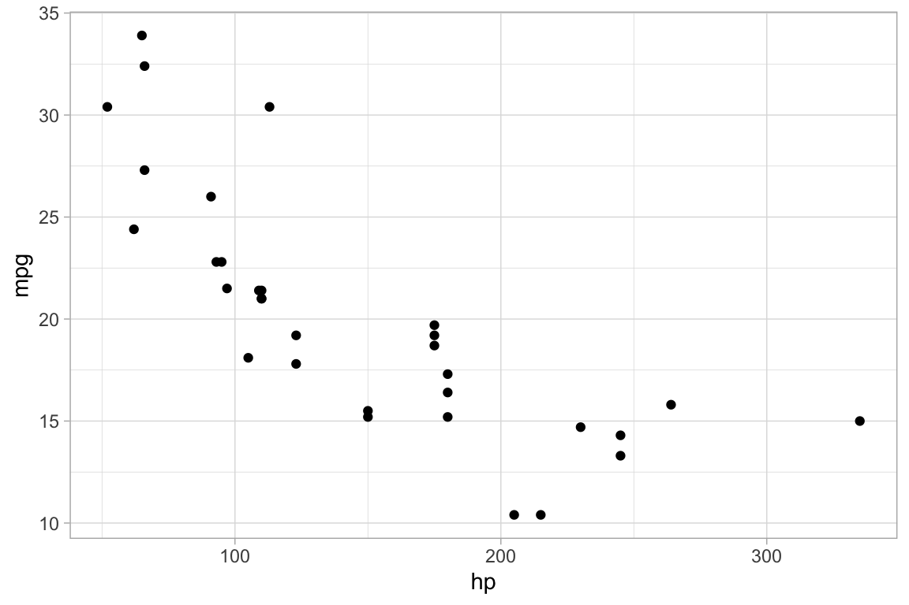

### Selecting the glyph type

The “kind of graphic” is specified by the name of the graphics function.
All of the `ggformula` data graphics functions have names starting with
`gf_`, which is intended to remind the user that they are formula-based
interfaces to `ggplot2`: `g` for `ggplot2` and `f` for “formula.”
Commonly used functions include

- [`gf_point()`](../reference/gf_point.md) for scatter plots
- [`gf_line()`](../reference/gf_line.md) for line plots (connecting dots
  in a scatter plot)
- [`gf_density()`](../reference/gf_density.md) or
  [`gf_dens()`](../reference/gf_density.md) or
  [`gf_histogram()`](../reference/gf_histogram.md) or
  [`gf_dhistogram()`](../reference/gf_histogram.md) or
  [`gf_freqpoly()`](../reference/gf_freqpoly.md) to display
  distributions of a quantitative variable
- [`gf_boxplot()`](../reference/gf_boxplot.md) or
  [`gf_violin()`](../reference/gf_violin.md) for comparing distributions
  side-by-side
- [`gf_counts()`](../reference/gf_bar.md) for bar-graph style depictions
  of counts.
- [`gf_bar()`](../reference/gf_bar.md) for more general bar-graph style
  graphics

The function names generally match a corresponding function name from
`ggplot2`, although

- [`gf_counts()`](../reference/gf_bar.md) is a simplified special case
  of
  [`geom_bar()`](https://ggplot2.tidyverse.org/reference/geom_bar.html),
- [`gf_dens()`](../reference/gf_density.md) is an alternative to
  [`gf_density()`](../reference/gf_density.md) that displays the density
  plot slightly differently
- [`gf_dhistogram()`](../reference/gf_histogram.md) produces a density
  histogram rather than a count histogram.

Each of the `gf_` functions can create the coordinate axes and fill it
in one operation. (In `ggplot2` nomenclature, `gf_` functions create a
frame and add a layer, all in one operation.) This is what happens for
the first `gf_` function in a chain. For subsequent `gf_` functions, new
layers are added, each one “on top of” the previous layers.

### Attributes

Each of the marks in the plot is a *glyph*. Every glyph has graphical
*attributes* (called aesthetics in `ggplot2`) that tell where and how to
draw the glyph. In the above plot, the obvious attributes are x- and
y-position:\
We’ve told R to put `mpg` along the y-axis and `hp` along the x-asis, as
is clear from the plot.

But each point also has other attributes, including color, shape, size,
stroke, fill, and alpha (transparency). We didn’t specify those in our
example, so [`gf_point()`](../reference/gf_point.md) uses some default
values for those – in this case smallish black filled-in circles.

#### Specifying attributes

In the `gf_` functions, you specify the non-position graphical
attributes using additional arguments to the function. Attributes can be
**set** to a constant value (e.g, set the color to “blue”; set the size
to 2) or they can be **mapped** to a variable in the data or some
expression involving the variables (e.g., map the color to `sex`, so sex
determines the color groupings)

Attributes are set or mapped using additional arguments.

- adding an argument of the form `attribute = value` **sets**
  `attribute` to `value`.
- adding an argument of the form `attribute = ~ expression` **maps**
  `attribute` to `expression`

where `attribute` is one of `color`, `shape`, etc., `value` is a
constant (e.g. `"red"` or `0.5`, as appropriate), and `expression` may
be some more general expression that can be computed using the variables
in `data` (although often is is better to create a new variable in the
data and to use that variable instead of an on-the-fly calculation
within the plot).

The following plot, for instance,

- We use `cyl` to determine the color and `carb` to determine the size
  of each dot. Color and size are **mapped** to `cyl` and `carb`. A
  legend is provided to show us how the mapping is being done. (Later,
  we can use scales to control precisely how the mapping is done – which
  colors and sizes are used to represent which values of `cyl` and
  `carb`.)

- We also **set** the transparency to 50%. The gives the same value of
  `alpha` to all glyphs in this layer.

\
[`gf_point`](../reference/gf_point.md)`(``mpg`` ``~`` ``hp``, color ``=`` ``~`` ``cyl``, size ``=`` ``~`` ``carb``, alpha ``=`` ``0.50``, data ``=`` ``mtcars``)`` `

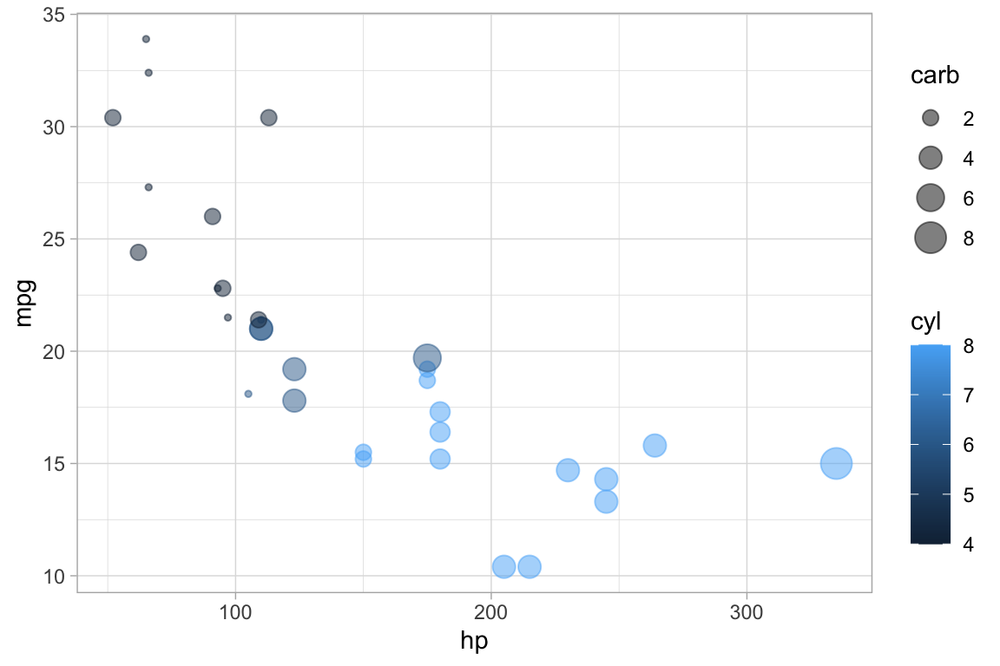

#### On-the-fly calculations

`ggformula` allows for on-the-fly calculations of attributes, although
the default labeling of the plot is often better if we create a new
variable in our data frame. In the examples below, since there are only
three values for `carb`, it is easier to read the graph if we tell R to
treat `cyl` as a categorical variable by converting to a factor (or to a
string). Except for the labeling of the legend, these two plots are the
same. In the second example, we see how the ggformula works well with
data tranformations using `|>`.

\
[`library`](https://rdrr.io/r/base/library.html)`(`[`dplyr`](https://dplyr.tidyverse.org)`)`\
[`gf_point`](../reference/gf_point.md)`(``mpg`` ``~`` ``hp``,  color ``=`` ``~`` `[`factor`](https://rdrr.io/r/base/factor.html)`(``cyl``)``, size ``=`` ``~`` ``carb``, alpha ``=`` ``0.75``, data ``=`` ``mtcars``)`

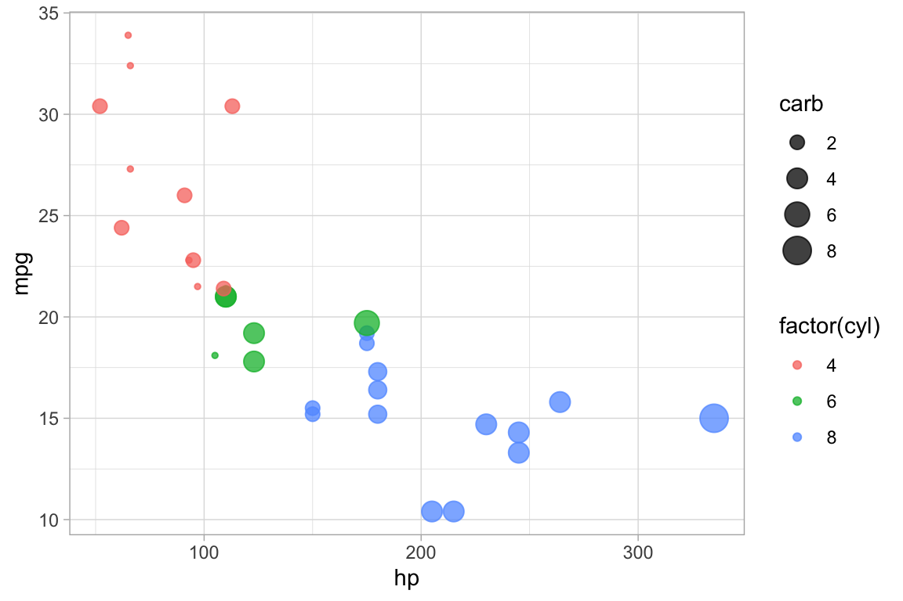

\
`mtcars`` ``|>`` `\
`  `[`mutate`](https://dplyr.tidyverse.org/reference/mutate.html)`(``cylinders ``=`` `[`factor`](https://rdrr.io/r/base/factor.html)`(``cyl``)``)`` ``|>`` `\
`  `[`gf_point`](../reference/gf_point.md)`(``mpg`` ``~`` ``hp``,  color ``=`` ``~`` ``cylinders``, size ``=`` ``~`` ``carb``, alpha ``=`` ``0.75``)`

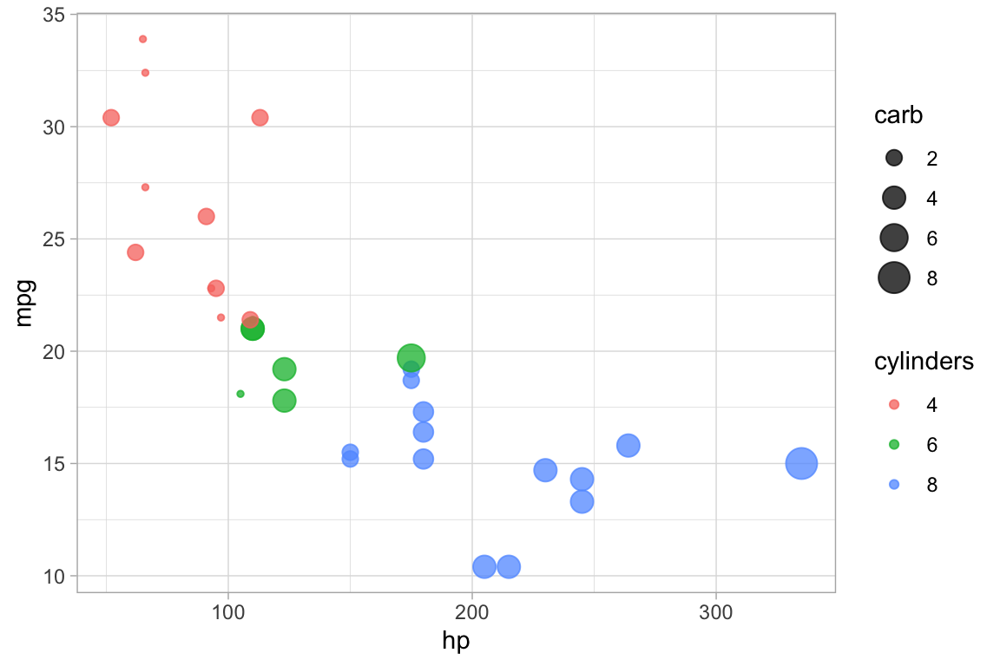

### “One-variable” plots

For some plots, we only have to specify the x-position because the
y-position is calculated from the x-values. Histograms, densityplots,
and frequency polygons are examples. To illustrate, we’ll use density
plots, but the same ideas apply to
[`gf_histogram()`](../reference/gf_histogram.md), and `gf_freqpolygon()`
as well. *Note that in the one-variable density graphics, the variable
whose density is to be calculated goes to the right of the tilde, in the
position reserved for the x-axis variable.*

\
[`data`](https://rdrr.io/r/utils/data.html)`(``penguins``, package ``=`` ``"palmerpenguins"``)``   `\
[`gf_density`](../reference/gf_density.md)`(`` ``~`` ``bill_length_mm``, data ``=`` ``penguins``)`

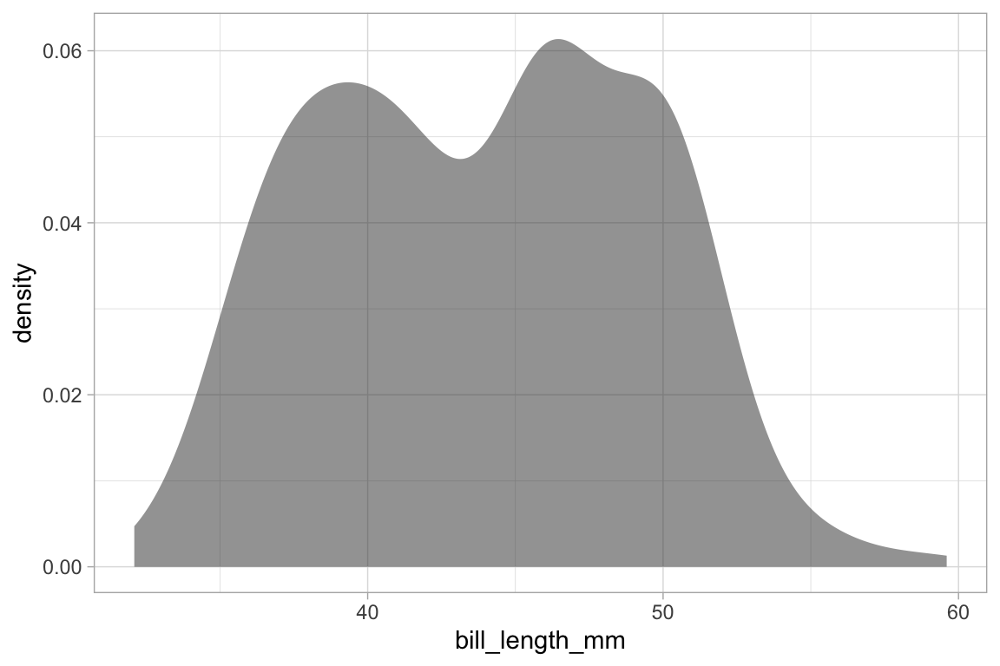

\
[`gf_density`](../reference/gf_density.md)`(`` ``~`` ``bill_length_mm``,  fill ``=`` ``~`` ``species``,  alpha ``=`` ``0.5``, data ``=`` ``penguins``)`

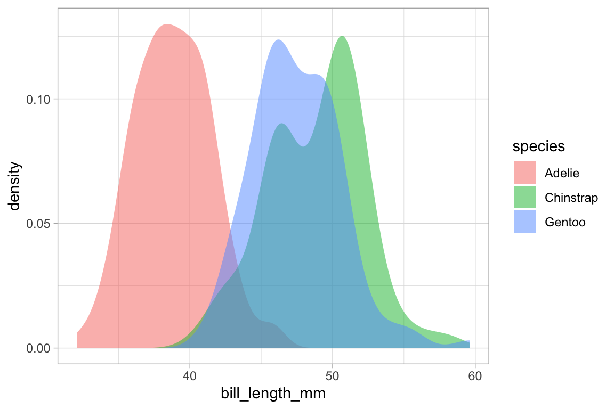

\
`# gf_dens() is similar, but there is no line at bottom/sides and the plot is not fillable`\
[`gf_dens`](../reference/gf_density.md)`(`` ``~`` ``bill_length_mm``, color ``=`` ``~`` ``species``,  alpha ``=`` ``0.7``, data ``=`` ``penguins``)`

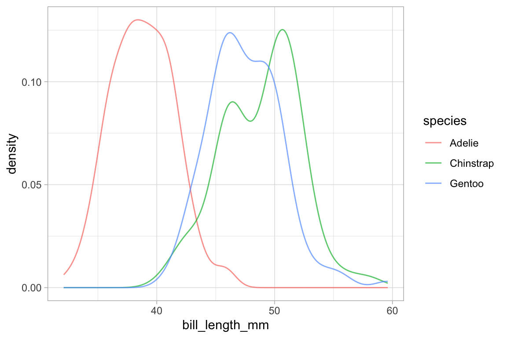

\
`# gf_dens2() is like gf_dens() but is fillable`\
[`gf_dens2`](../reference/gf_density.md)`(`` ``~`` ``bill_length_mm``, fill ``=`` ``~`` ``species``, data ``=`` ``penguins``,`\
`          color ``=`` ``"gray50"``, alpha ``=`` ``0.4``)`` `

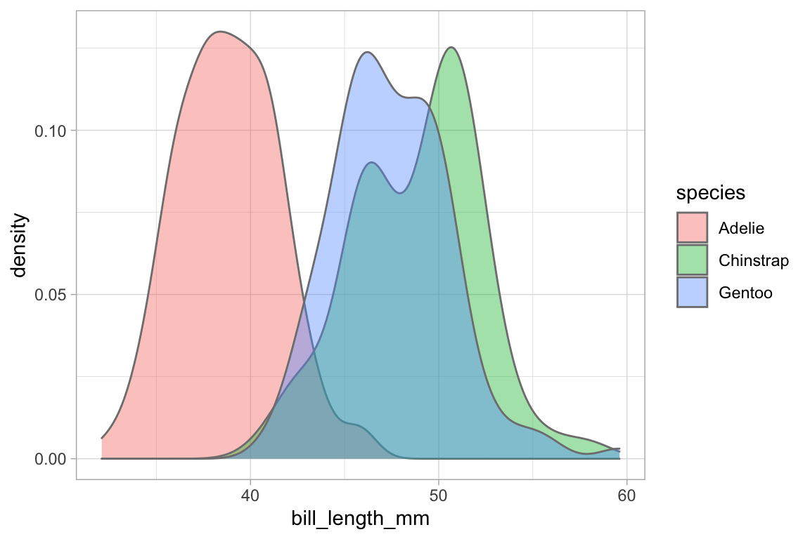

Several of the plotting functions include additional arguments that do
not modify attributes of individual glyphs but control some other aspect
of the plot. In this case, `adjust` can be used to increase or decrease
the amount of smoothing.

\
`# less smoothing`\
`penguins`` ``|>`` `[`gf_dens`](../reference/gf_density.md)`(`` ``~`` ``bill_length_mm``, color ``=`` ``~`` ``species``, alpha ``=`` ``0.7``, adjust ``=`` ``0.25``)``  `\
`#> Warning: Removed 2 rows containing non-finite outside the scale range`\
`` #> (`stat_density()`). ``

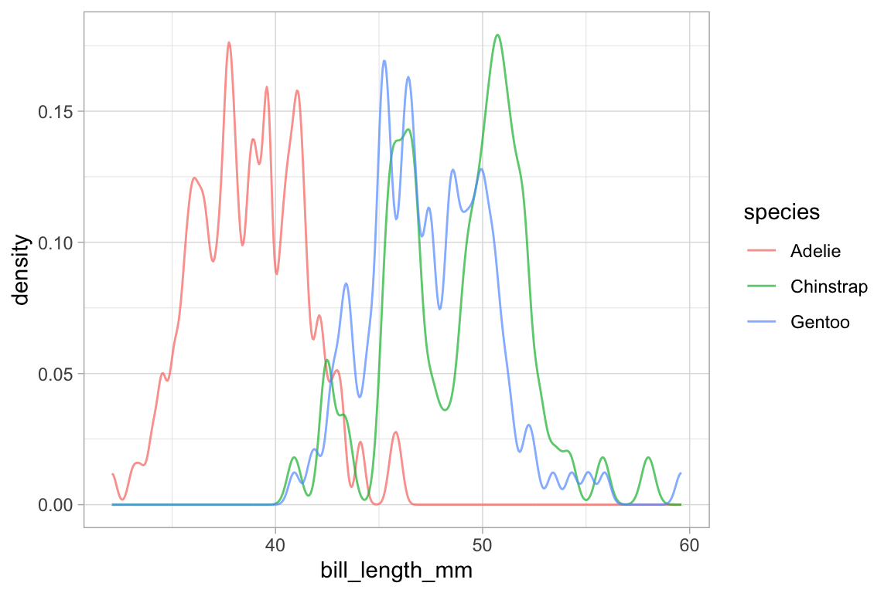

\
`# more smoothing`\
`penguins`` ``|>`` `[`gf_dens`](../reference/gf_density.md)`(`` ``~`` ``bill_length_mm``, color ``=`` ``~`` ``species``, alpha ``=`` ``0.7``, adjust ``=`` ``4``)``     `\
`#> Warning: Removed 2 rows containing non-finite outside the scale range`\
`` #> (`stat_density()`). ``

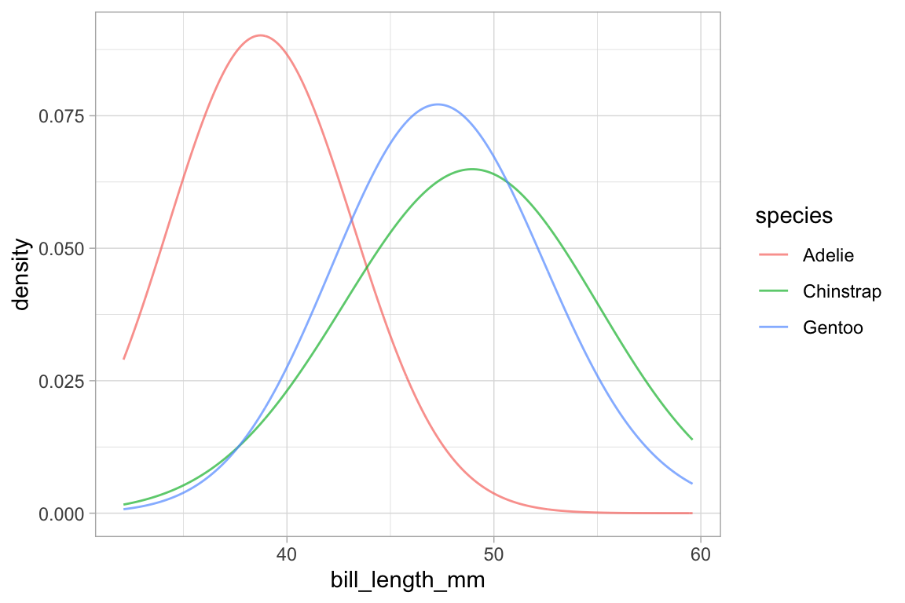

### Position

When the `fill` or `color` or `group` aesthetics are mapped to a
variable, the default behavior is to lay the group-wise densities on top
of one another. Other behavior is also available by using the `position`
argument. Using the value `"stack"` causes the densities to be laid one
on top of another. This makes the overall height of the stack represent
the density across all groups, but it can be difficult to discern the
shape of the distribution for the individual groups. The value `"fill"`
produces a conditional probability graphic.

\
`penguins`` ``|>`` `\
`  `[`gf_density`](../reference/gf_density.md)`(`` ``~`` ``bill_length_mm``, fill ``=`` ``~`` ``species``, color ``=`` ``NA``, position ``=`` ``"stack"``)`` `

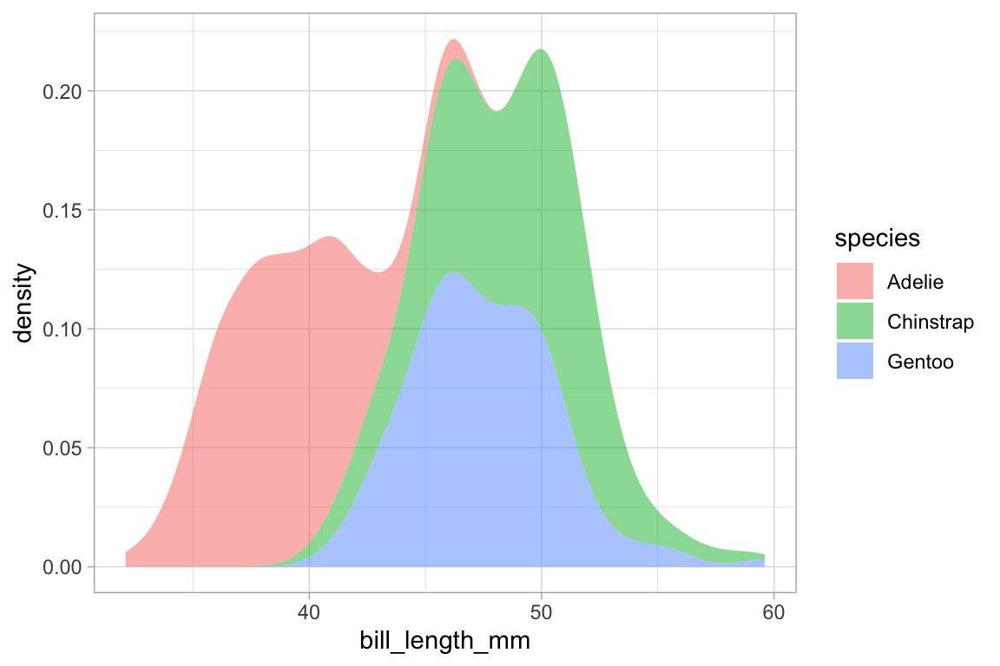

\
`penguins`` ``|>`` `\
`  `[`gf_density`](../reference/gf_density.md)`(`` ``~`` ``bill_length_mm``, fill ``=`` ``~`` ``species``, color ``=`` ``NA``, position ``=`` ``"fill"``, `\
`              adjust ``=`` ``2``)`

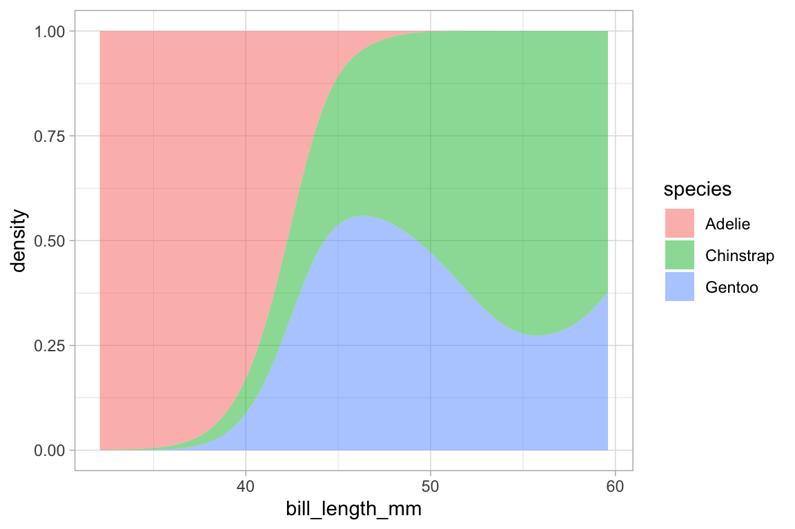

Similar commands can be constructed with
[`gf_histogram()`](../reference/gf_histogram.md) and
[`gf_freqpoly()`](../reference/gf_freqpoly.md), but note that `color`,
not `fill`, is the active attribute for frequency polygons. It’s also
rarely good to overlay histograms on top of one another – better to use
a density plot or a frequency polygon for that application.

### Faceting

The `ggplot2` system allows you to make subplots — called “facets” —
based on the values of one or two categorical variables. This is done by
chaining with [`gf_facet_grid()`](../reference/gf_facet_grid.md) or
[`gf_facet_wrap()`](../reference/gf_facet_grid.md). These functions use
formulas to specify which variable(s) are to be used for faceting.

\
`penguins`` ``|>`` `\
`  `[`gf_density_2d`](../reference/gf_density_2d.md)`(``bill_length_mm`` ``~`` ``bill_depth_mm``)`` ``|>`` `\
`  `[`gf_facet_grid`](../reference/gf_facet_grid.md)`(`` ``~`` ``species``)`

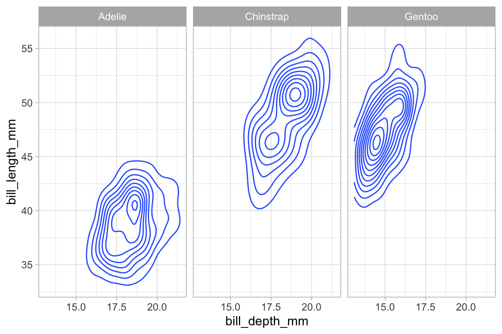

\
`# the dot here is a bit strange, but required to make a valid formula`\
`penguins`` ``|>`` `\
`  `[`gf_density_2d`](../reference/gf_density_2d.md)`(``bill_length_mm`` ``~`` ``bill_depth_mm``)`` ``|>`` `\
`  `[`gf_facet_grid`](../reference/gf_facet_grid.md)`(`` ``species`` ``~`` ``.``)`

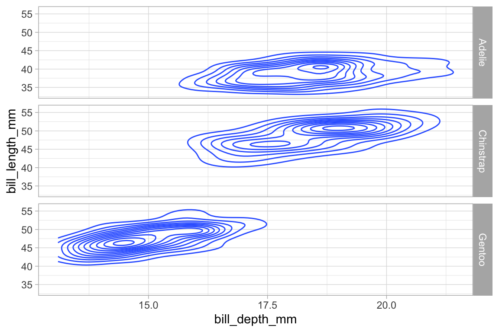

\
`penguins`` ``|>`` `\
`  `[`gf_density_2d`](../reference/gf_density_2d.md)`(``bill_length_mm`` ``~`` ``bill_depth_mm``)`` ``|>`` `\
`  `[`gf_facet_grid`](../reference/gf_facet_grid.md)`(``island`` ``~`` ``species``)`

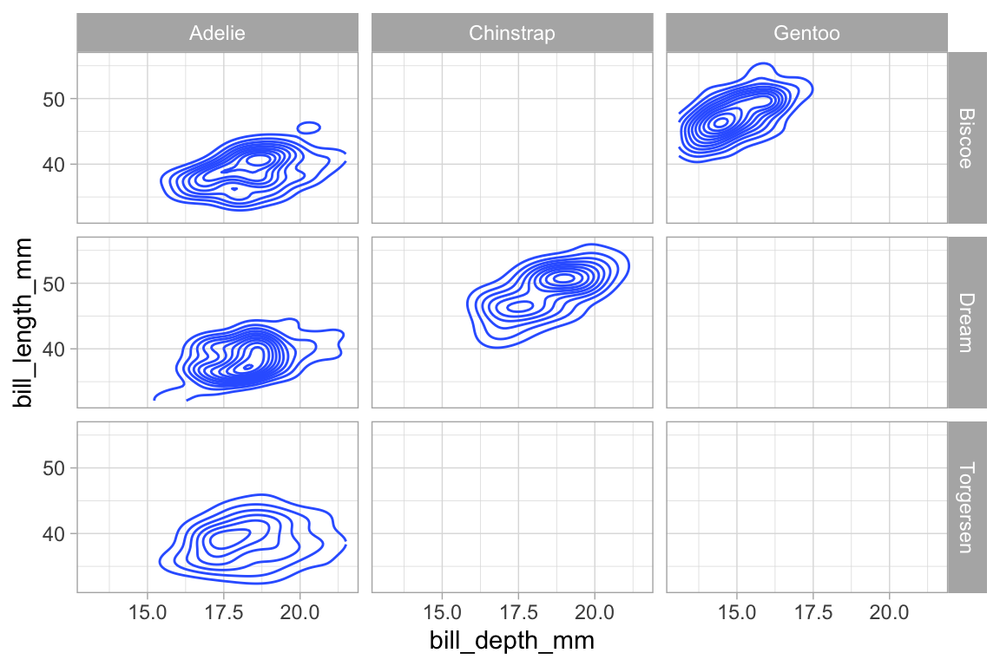

\
`penguins`` ``|>`` `\
`  `[`gf_density_2d_filled`](../reference/gf_density_2d.md)`(``bill_length_mm`` ``~`` ``bill_depth_mm``, `\
`                       show.legend ``=`` ``FALSE``)`` ``|>`` `\
`  `[`gf_facet_wrap`](../reference/gf_facet_grid.md)`(``island`` ``~`` ``species``)`

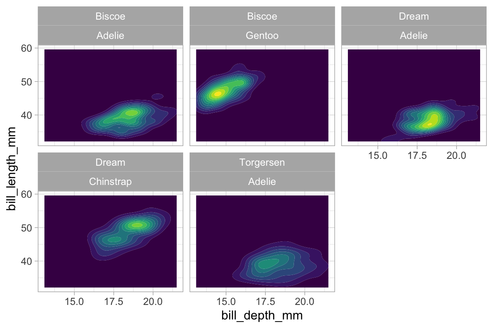

An alternative syntax uses `|` to separate the faceting information from
the main part of the formula.\
Here is another example using our weather data. The redundant use of the
`y` and `color` attributes for temperature makes it easier to compare
across facets.

\
`Weather`` ``|>`` `\
`  `[`gf_ribbon`](../reference/gf_ribbon.md)`(``low_temp`` ``+`` ``high_temp`` ``~`` ``date`` ``|`` ``city`` ``~`` ``year``, alpha ``=`` ``0.3``)`` `

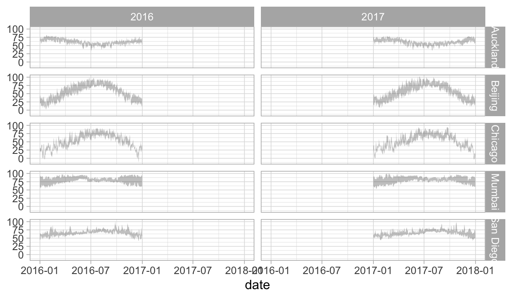

\
\
`Weather`` ``|>`` `\
`  `[`gf_linerange`](../reference/gf_linerange.md)`(``low_temp`` ``+`` ``high_temp`` ``~`` ``date`` ``|`` ``city`` ``~`` ``year``, color ``=`` ``~`` ``avg_temp``)`` ``|>`\
`  `[`gf_refine`](../reference/gf_aux.md)`(`[`scale_colour_gradientn`](https://ggplot2.tidyverse.org/reference/scale_gradient.html)`(``colors ``=`` `[`rev`](https://rdrr.io/r/base/rev.html)`(`[`rainbow`](https://rdrr.io/r/grDevices/palettes.html)`(``5``)``)``)``)`

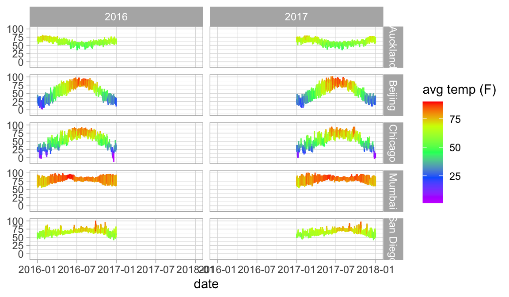

In this case, we should either not facet by year, or allows the x-scale
to be freely adjusted in each column so that we don’t have so much
unnecessary white space. We can do the latter using the `scales`
argument to [`gf_facet_grid()`](../reference/gf_facet_grid.md).

\
`Weather`` ``|>`` `\
`  `[`gf_ribbon`](../reference/gf_ribbon.md)`(``low_temp`` ``+`` ``high_temp`` ``~`` ``date`` ``|`` ``city`` ``~`` ``.``, alpha ``=`` ``0.3``)`` `

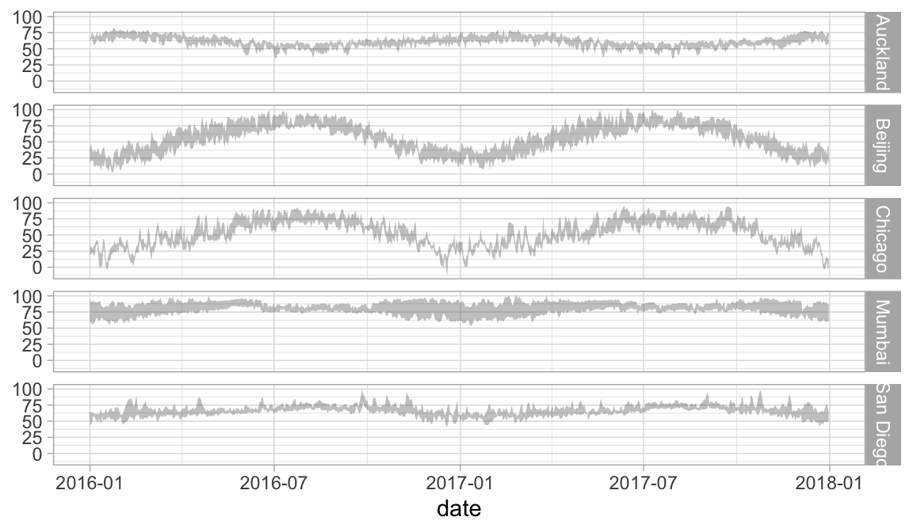

\
\
`Weather`` ``|>`` `\
`  `[`gf_linerange`](../reference/gf_linerange.md)`(``low_temp`` ``+`` ``high_temp`` ``~`` ``date``, color ``=`` ``~`` ``avg_temp``)`` ``|>`\
`  `[`gf_refine`](../reference/gf_aux.md)`(`[`scale_colour_gradientn`](https://ggplot2.tidyverse.org/reference/scale_gradient.html)`(``colors ``=`` `[`rev`](https://rdrr.io/r/base/rev.html)`(`[`rainbow`](https://rdrr.io/r/grDevices/palettes.html)`(``5``)``)``)``)`` ``|>`\
`  `[`gf_facet_grid`](../reference/gf_facet_grid.md)`(``city`` ``~`` ``year``, scales ``=`` ``"free_x"``)`

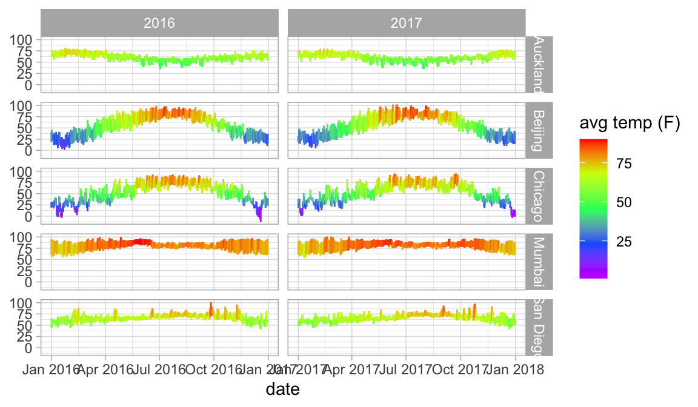

### Labels in plots

Usually plot labels reflect the expression mapped to a given attribute.
But in the previous example, our colorbar legend is labeled “avg temp
(F)” even though the variable name is `avg_temp`. This is because the
`Weather` data set is *labeled*.

\
[`get_variable_labels`](../reference/labels.md)`(``Weather``)`\
`#> $city`\
`#> NULL`\
`#> `\
`#> $date`\
`#> NULL`\
`#> `\
`#> $year`\
`#> NULL`\
`#> `\
`#> $month`\
`#> NULL`\
`#> `\
`#> $day`\
`#> NULL`\
`#> `\
`#> $high_temp`\
`#> [1] "high temp (F)"`\
`#> `\
`#> $avg_temp`\
`#> [1] "avg temp (F)"`\
`#> `\
`#> $low_temp`\
`#> [1] "low temp (F)"`\
`#> `\
`#> $high_dewpt`\
`#> [1] "high dew point (F)"`\
`#> `\
`#> $avg_dewpt`\
`#> [1] "avg dew point (F)"`\
`#> `\
`#> $low_dewpt`\
`#> [1] "low dew point (F)"`\
`#> `\
`#> $high_humidity`\
`#> [1] "high relative humidity"`\
`#> `\
`#> $avg_humidity`\
`#> [1] "avg relative humidity"`\
`#> `\
`#> $low_humidity`\
`#> [1] "low relative humidity"`\
`#> `\
`#> $high_hg`\
`#> [1] "high pressure (mm Hg)"`\
`#> `\
`#> $avg_hg`\
`#> [1] "avg pressure (mm Hg)"`\
`#> `\
`#> $low_hg`\
`#> [1] "low pressure (mm Hg)"`\
`#> `\
`#> $high_vis`\
`#> [1] "high visibility (miles)"`\
`#> `\
`#> $avg_vis`\
`#> [1] "avg visibility (miles)"`\
`#> `\
`#> $low_vis`\
`#> [1] "low visibility (miles)"`\
`#> `\
`#> $high_wind`\
`#> [1] "high wind speed (mph)"`\
`#> `\
`#> $avg_wind`\
`#> [1] "avg wind speed (mph)"`\
`#> `\
`#> $low_wind`\
`#> [1] "low wind speed (mph)"`\
`#> `\
`#> $precip`\
`#> [1] "precipitation"`\
`#> `\
`#> $events`\
`#> [1] "events"`

ggformula will detect these labels and use them on our plots. We can use
[`set_variable_labels()`](https://larmarange.github.io/labelled/reference/var_label.html)
to add custom labels to some or all of the variables in a data
frame.[^1]

\
`KF`` ``<-`` ``KidsFeet`` ``|>`` `\
`  `[`set_variable_labels`](https://larmarange.github.io/labelled/reference/var_label.html)`(`\
`    length ``=`` ``"length (cm)"``, `\
`    width ``=`` ``"width (cm)"``,`\
`    domhand ``=`` ``"dominant hand"``,`\
`    biggerfoot ``=`` ``"bigger foot"`\
`  ``)`\
\
`KidsFeet`` ``|>`` `\
`  `[`gf_point`](../reference/gf_point.md)`(``width`` ``~`` ``length``, color ``=`` ``~``domhand``)`

\
`KF`` ``|>`\
`  `[`gf_point`](../reference/gf_point.md)`(``width`` ``~`` ``length``, color ``=`` ``~``domhand``)`

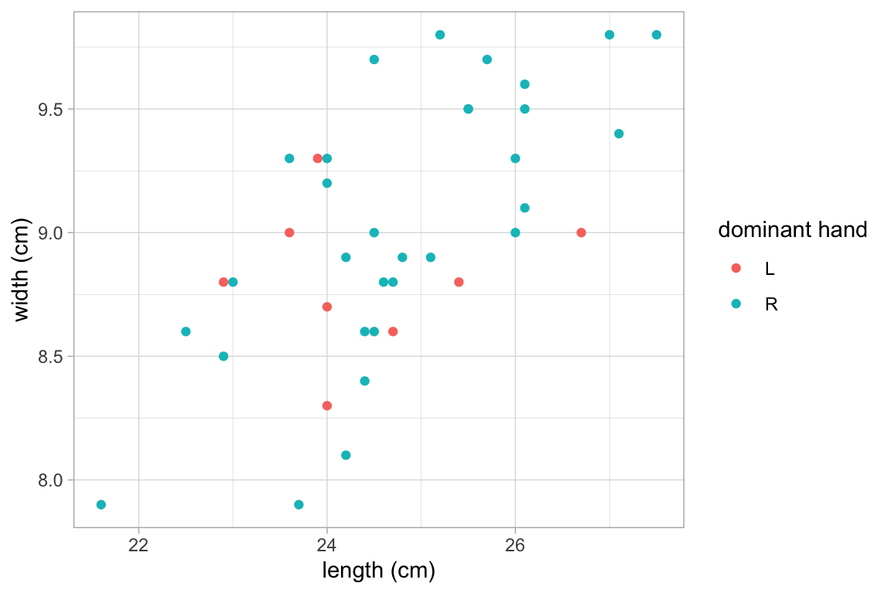

\
\
`Penguins`` ``<-`` ``penguins`` ``|>`\
`  `[`set_variable_labels`](https://larmarange.github.io/labelled/reference/var_label.html)`(`\
`    species ``=`` ``"Species"``,`\
`    island ``=`` ``"Island"``,`\
`    bill_length_mm ``=`` ``"Bill Length (mm)"``,`\
`    bill_depth_mm ``=`` ``"Bill Depth (mm)"``,`\
`    flipper_length_mm ``=`` ``"Flipper Length (mm)"``,`\
`    body_mass_g ``=`` ``"Body Mass (g)"``,`\
`    sex ``=`` ``"Sex"`\
`  ``)`\
\
`Penguins`` ``|>`\
`  `[`gf_point`](../reference/gf_point.md)`(``bill_length_mm`` ``~`` ``bill_depth_mm``, color ``=`` ``~`` ``species``)`` `\
`#> Warning: Removed 2 rows containing missing values or values outside the scale range`\
`` #> (`geom_point()`). ``

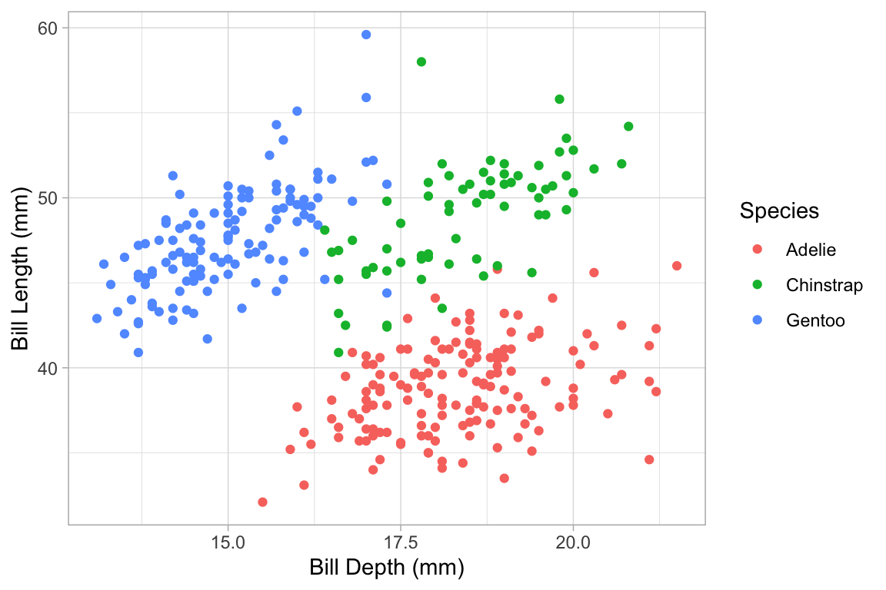

By adding labels to the data, we can ensure consitent labeling across
several plots. But it is also possible to modify labels just for one
plot. This can be done in three ways:

- We can use arguments like `xlab`, `ylab`, and `title`;
- We can use the [`gf_labs()`](../reference/gf_aux.md) function (which
  has arguments like `x`, `y`, `title`, etc.);
- We can use the [`gf_relabel()`](../reference/gf_relabel.md) function.

\
`KidsFeet`` ``|>`\
`  `[`gf_point`](../reference/gf_point.md)`(``width`` ``~`` ``length``, color ``=`` ``~``domhand``, xlab ``=`` ``"length (cm)"``, `\
`           title ``=`` ``"Length and width of kids' feet"``)`

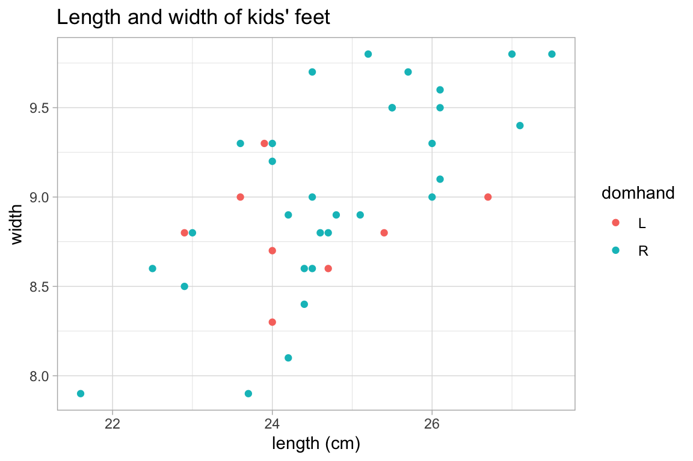

\
\
`p`` ``<-`` ``KidsFeet`` ``|>`` `[`gf_point`](../reference/gf_point.md)`(``width`` ``~`` ``length``, color ``=`` ``~``domhand``)`\
\
`p`` ``|>`` `\
`  `[`gf_labs`](../reference/gf_aux.md)`(``x ``=`` ``"length (cm)"``, color ``=`` ``"dominant hand"``, title ``=`` ``"Some kids' feet"``)`

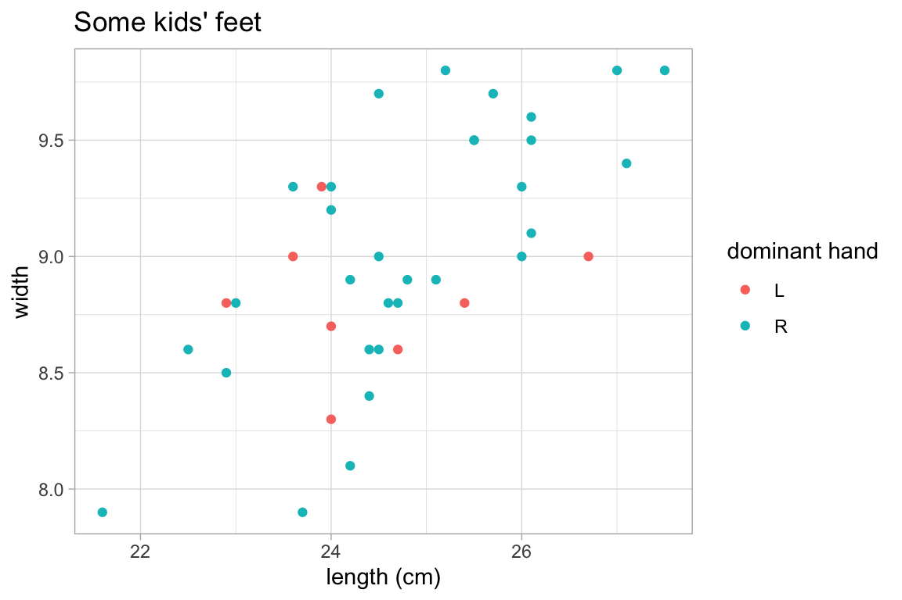

\
\
`p`` ``|>`` `\
`  `[`gf_relabel`](../reference/gf_relabel.md)`(``length ``=`` ``"length (cm)"``, width ``=`` ``"width (cm)"``, domhand ``=`` ``"dominant hand"``)`

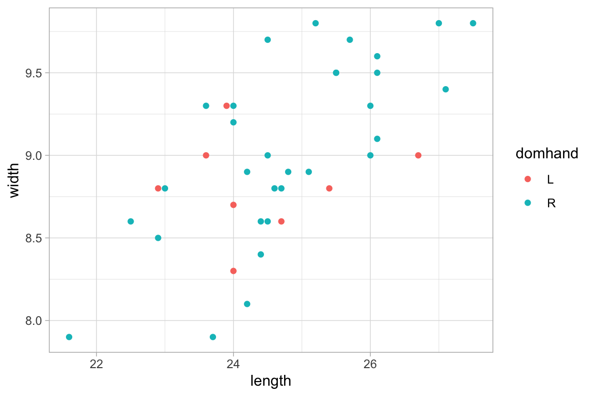

\
\
`# alternatively, we can use a list. `\
`# this is handy if we have several data sets with the same variables.`\
`KFlabels`` ``<-`` `\
`  `[`list`](https://rdrr.io/r/base/list.html)`(``length ``=`` ``"length (cm)"``, width ``=`` ``"width (cm)"``, domhand ``=`` ``"dominant hand"``)`\
`p`` ``|>`` `\
`  `[`gf_relabel`](../reference/gf_relabel.md)`(``KFlabels``)`

Notice that [`gf_labs()`](../reference/gf_aux.md) and
[`gf_relabel()`](../reference/gf_relabel.md) take a different approaches
to labeling. [`gf_labs()`](../reference/gf_aux.md) refers to labels by
their *role in the plot* whereas
[`gf_relabel()`](../reference/gf_relabel.md) refers to variables in the
data set and uses the new labels wherever the variable appears. Both are
useful. [`gf_labs()`](../reference/gf_aux.md) provides access to
additional labels (title, subtitle, caption, etc.), but it easier to
mistakenly create a plot with a label that doesn’t match the true
content of the plot. [`gf_relabel()`](../reference/gf_relabel.md) only
deals with labels associated with variables, but the label is guaranteed
to match that variable no matter how the variable is used within the
plot.

### Chaining to create complex plots

Often it is useful to overlay multiple layers onto a single plot. This
can be done by chaining them with `|>`, the “then” operator from
`magrittr`. The `data` argument can be omitted if the new layers uses
the same data as the first layer in the chain.

The following plot illustrates how histograms and frequency polygons are
related.

\
`Penguins`` ``|>`` `\
`  `[`gf_histogram`](../reference/gf_histogram.md)`(`` ``~`` ``bill_length_mm``, alpha ``=`` ``0.3``, fill ``=`` ``"navy"``, binwidth ``=`` ``1``)`` ``|>`\
`  `[`gf_freqpoly`](../reference/gf_freqpoly.md)`(`` ``~`` ``bill_length_mm`` , binwidth ``=`` ``1``)`` ``|>`` `\
`  `[`gf_facet_grid`](../reference/gf_facet_grid.md)`(``species`` ``~`` ``.``)`\
`` #> Warning: Removed 2 rows containing non-finite outside the scale range (`stat_bin()`). ``\
`` #> Removed 2 rows containing non-finite outside the scale range (`stat_bin()`). ``

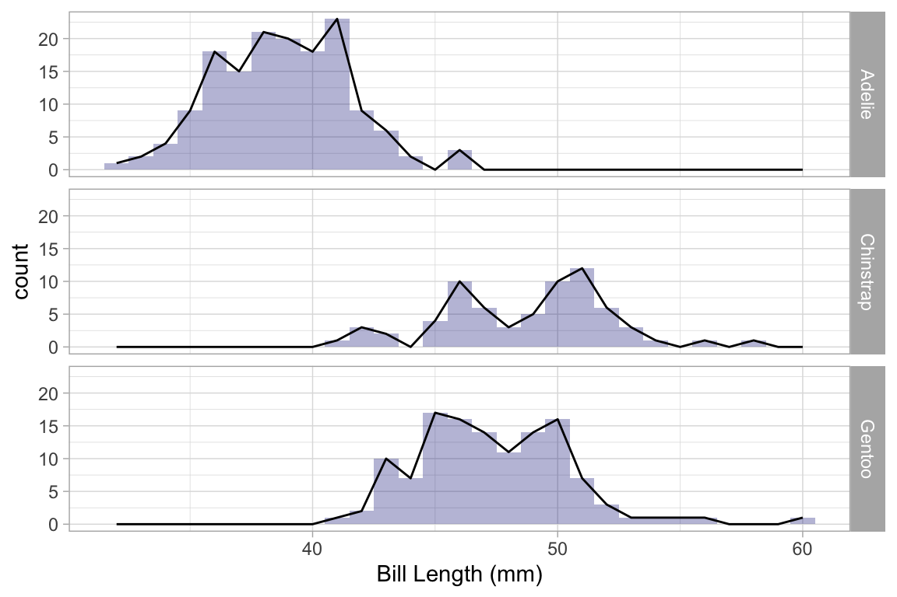

A 2-d density plot can be augmented with a scatterplot.

\
`Penguins`` ``|>`` `\
`  `[`gf_density_2d`](../reference/gf_density_2d.md)`(``bill_length_mm`` ``~`` ``bill_depth_mm``)`` ``|>`\
`  `[`gf_jitter`](../reference/gf_jitter.md)`(``bill_length_mm`` ``~`` ``bill_depth_mm``, alpha ``=`` ``0.2``, width ``=`` ``0.2``, height ``=`` ``0.2``)`` ``|>`\
`  `[`gf_facet_wrap`](../reference/gf_facet_grid.md)`(``~``species``)`\
`#> Warning: Removed 2 rows containing non-finite outside the scale range`\
`` #> (`stat_density2d()`). ``\
`#> Warning: Removed 2 rows containing missing values or values outside the scale range`\
`` #> (`geom_point()`). ``

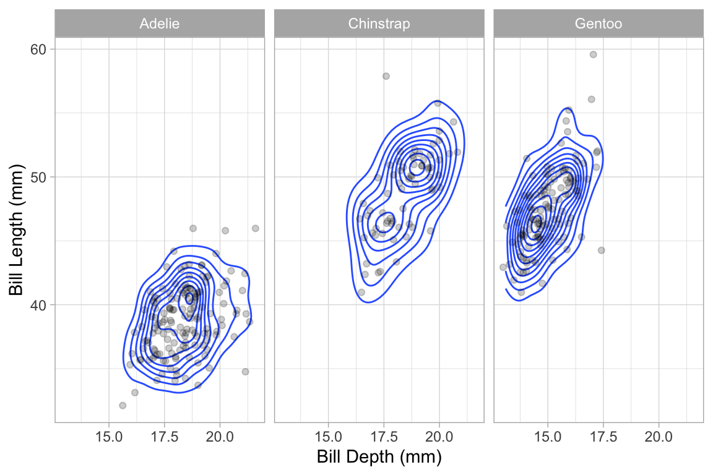

### More 2-variable plots

#### Using jitter and transparency to handle overlapping cases

Sometimes you have so many points in a scatter plot that they obscure
one another. The `ggplot2` system provides two easy ways to deal with
this: translucency and jittering. Use `alpha` to make the points
semi-translucent.

Using [`gf_jitter()`](../reference/gf_jitter.md) in place of
[`gf_point()`](../reference/gf_point.md) will move the plotted points to
reduce overlap. Jitter and transparency can be used together as well.

\
`Penguins`` ``|>`` `\
`  `[`gf_point`](../reference/gf_point.md)`(``bill_length_mm`` ``~`` ``species``, alpha ``=`` ``0.15``)``  `\
`#> Warning: Removed 2 rows containing missing values or values outside the scale range`\
`` #> (`geom_point()`). ``

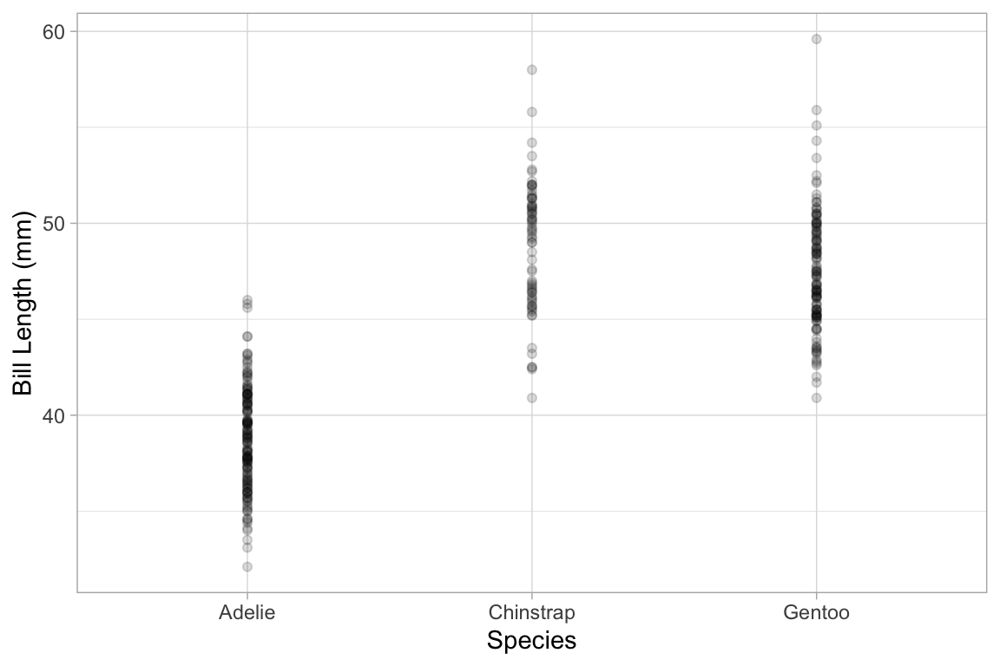

\
`Penguins`` ``|>`\
`  `[`gf_jitter`](../reference/gf_jitter.md)`(``bill_length_mm`` ``~`` ``species``, alpha ``=`` ``0.35``)`\
`#> Warning: Removed 2 rows containing missing values or values outside the scale range`\
`` #> (`geom_point()`). ``

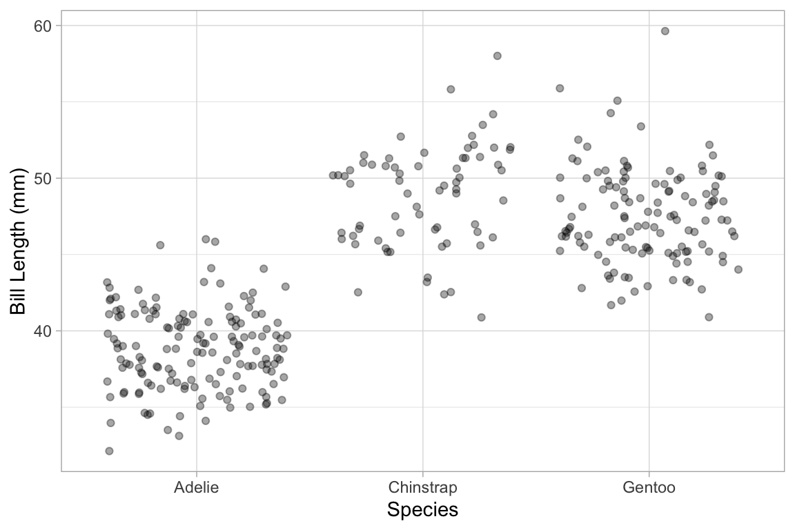

\
`# width and heigh control the amount of horizontal and vertical jitter`\
`Penguins`` ``|>`\
`  `[`gf_jitter`](../reference/gf_jitter.md)`(``bill_length_mm`` ``~`` ``species``, alpha ``=`` ``0.35``, width ``=`` ``0.2``, height ``=`` ``0``)`\
`#> Warning: Removed 2 rows containing missing values or values outside the scale range`\
`` #> (`geom_point()`). ``

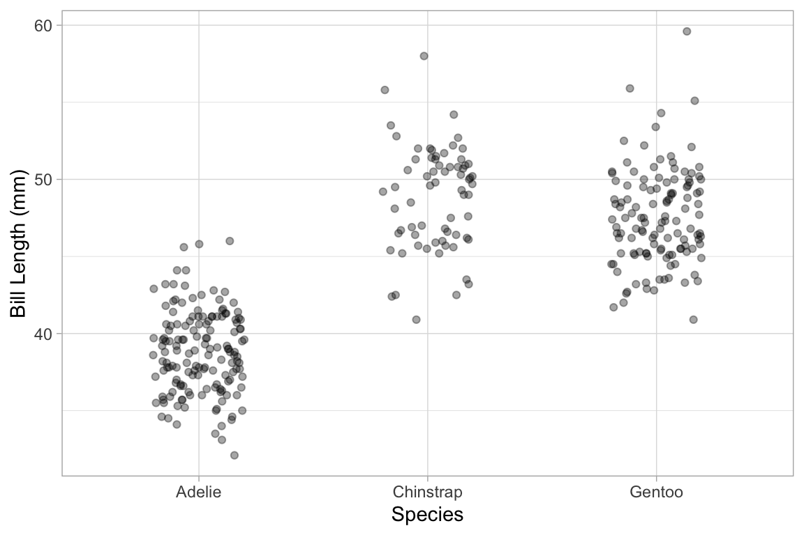

#### Box and Whisker plots

Box and whisker plots show the distribution of a quantitative variable
as a function of a categorical variable. The formula used in
[`gf_boxplot()`](../reference/gf_boxplot.md) should have the
quantitative variable to the left of the tilde. (To make horizontal
boxplots using `ggplot2` you have to make vertical boxplots and then
flip the coordinates with
[`coord_flip()`](https://ggplot2.tidyverse.org/reference/coord_flip.html).)

\
[`gf_boxplot`](../reference/gf_boxplot.md)`(``length`` ``~`` ``sex``, color ``=`` ``"red"``, data ``=`` ``KF``)`

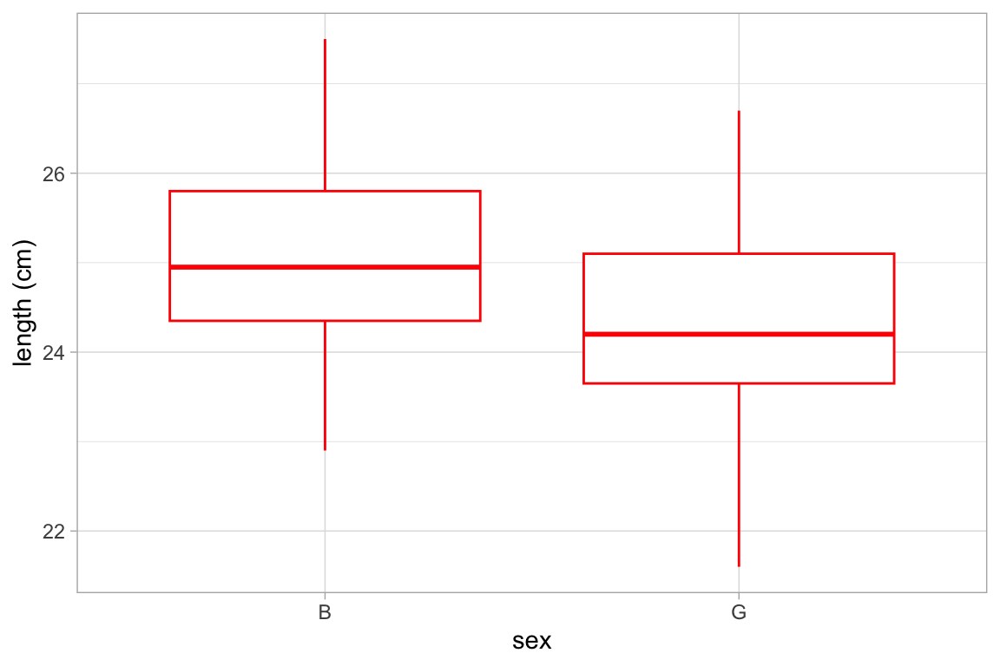

\
[`gf_boxplot`](../reference/gf_boxplot.md)`(``length`` ``~`` ``sex``, color ``=`` ``~``biggerfoot`` , data ``=`` ``KF``)`

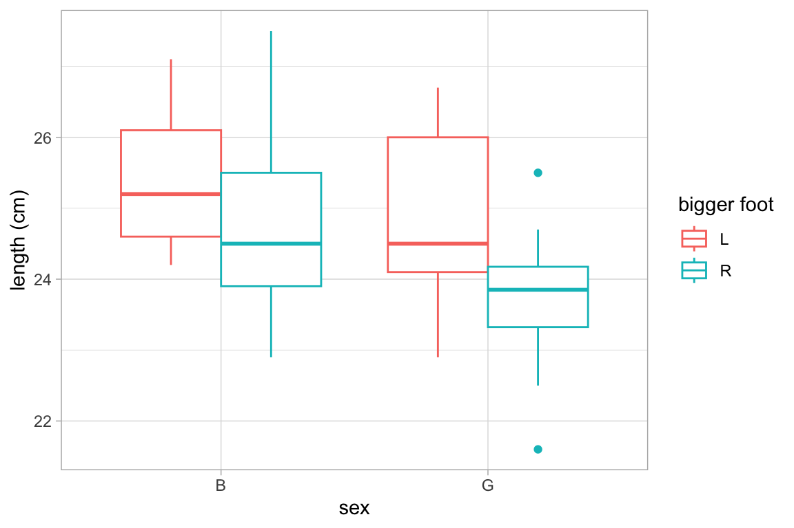

This plot may surprise you.

\
`Weather`` ``|>`` `\
`  `[`gf_boxplot`](../reference/gf_boxplot.md)`(``high_temp`` ``~`` ``month`` ``|`` ``city``)`\
`#> Warning: Orientation is not uniquely specified when both the x and y aesthetics are`\
`#> continuous. Picking default orientation 'x'.`\
`#> Warning: Continuous x aesthetic`\
`` #> ℹ did you forget `aes(group = ...)`? ``

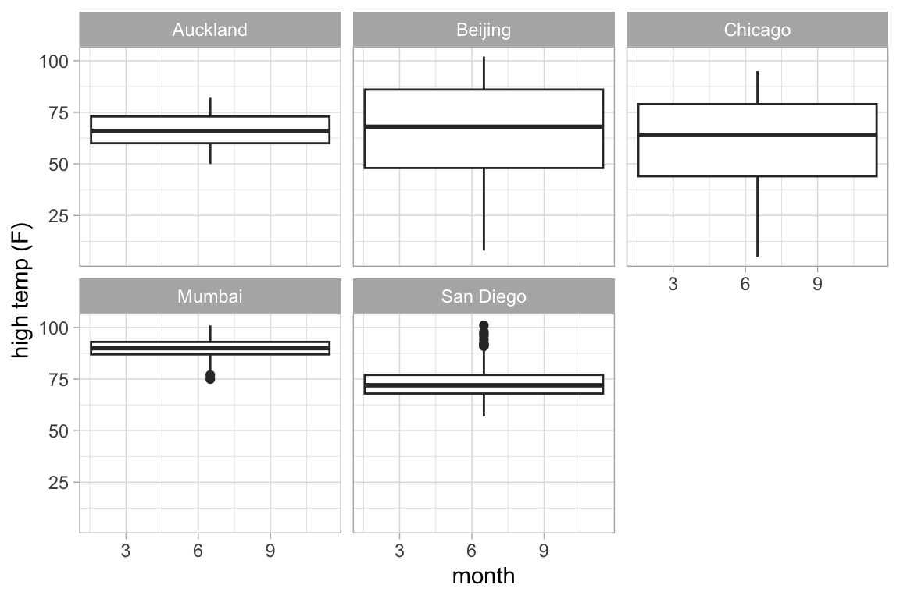

A single plot is placed at the at the mean value of `month` (for each
city). The warning message suggests that we need to tell R how to form
the groups when using a quantitative variable for `x`. It suggests using
the `group` aesthetic, and sometimes, this is just what we want.

\
`Weather`` ``|>`\
`  `[`gf_boxplot`](../reference/gf_boxplot.md)`(``high_temp`` ``~`` ``month`` ``|``  ``city``, group ``=`` ``~`` ``month``)`

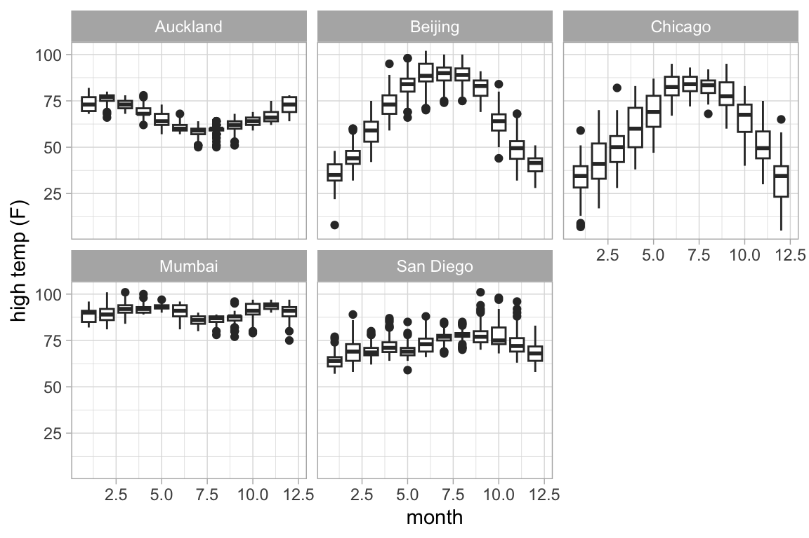

Alternatively, we could create a new categorical variable that puts the
quantitative values into one of a few different bins.

#### Alternatives to box and whisker plots.

[`gf_violin()`](../reference/gf_violin.md) and
[`gf_sina()`](../reference/gf_sina.md) provide two alternatives to box
and whisker plots.

\
`Penguins`` ``|>`` `[`gf_violin`](../reference/gf_violin.md)`(``bill_length_mm`` ``~``  ``species``)`\
`#> Warning: Removed 2 rows containing non-finite outside the scale range`\
`` #> (`stat_ydensity()`). ``

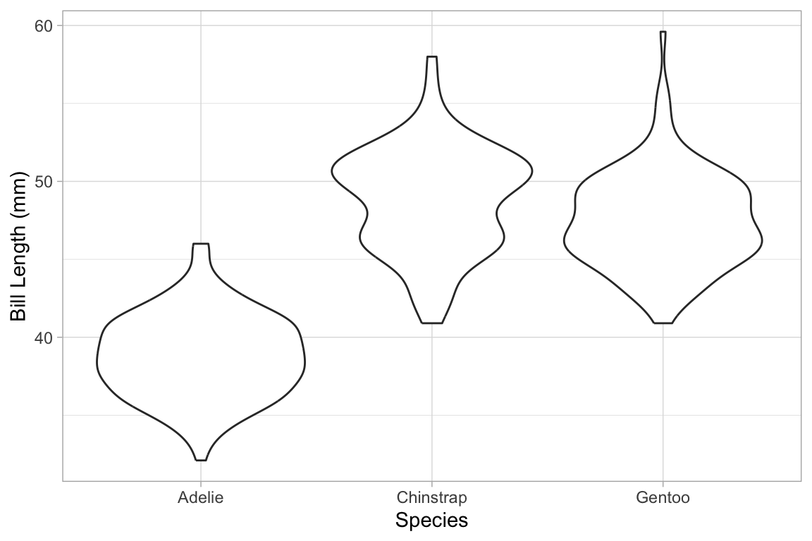

\
`if`` ``(`[`require`](https://rdrr.io/r/base/library.html)`(`[`ggforce`](https://ggforce.data-imaginist.com)`)``)`` ``{`\
`  ``Penguins`` ``|>`` `[`gf_sina`](../reference/gf_sina.md)`(``bill_length_mm`` ``~``  ``species``, alpha ``=`` ``0.5``)`\
`  ``Penguins`` ``|>`\
`    `[`gf_violin`](../reference/gf_violin.md)`(``bill_length_mm`` ``~``  ``species``)`` ``|>`\
`    `[`gf_sina`](../reference/gf_sina.md)`(``bill_length_mm`` ``~``  ``species``, alpha ``=`` ``0.5``, color ``=`` ``~`` ``island``)`\
`}`\
`#> Loading required package: ggforce`\
`#> Warning: Removed 2 rows containing non-finite outside the scale range`\
`` #> (`stat_ydensity()`). ``\
`#> Warning: Removed 2 rows containing non-finite outside the scale range`\
`` #> (`stat_sina()`). ``

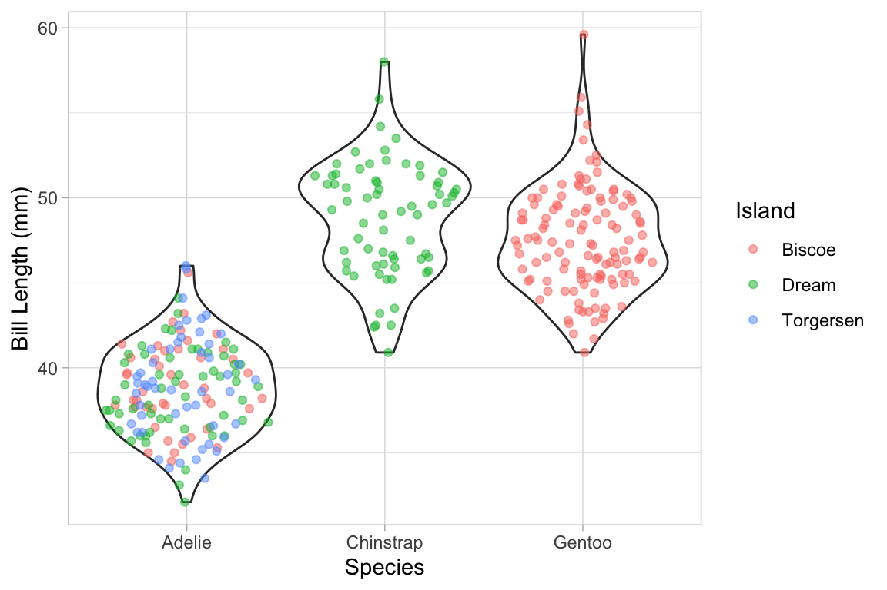

#### Ridge plots

Ridge plots can be useful to displaying multiple density plots
compactly.

\
`Weather`` ``|>`\
`  `[`gf_density_ridges`](../reference/ggridges.md)`(``month`` ``~`` ``high_temp`` ``|`` ``city``, group ``=`` ``~``month``)`\
`#> Picking joint bandwidth of 1.09`\
`#> Picking joint bandwidth of 2.45`\
`#> Picking joint bandwidth of 3.79`\
`#> Picking joint bandwidth of 1.16`\
`#> Picking joint bandwidth of 1.7`

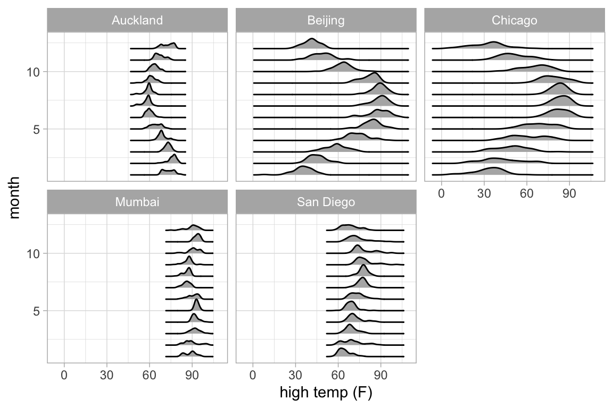

\
`Weather`` ``|>`\
`  `[`gf_density_ridges_gradient`](../reference/ggridges.md)`(``month`` ``~`` ``high_temp`` ``|`` ``city``, group ``=`` ``~`` ``month``, `\
`                             show.legend ``=`` ``FALSE``)`` ``|>`` `\
`  `[`gf_refine`](../reference/gf_aux.md)`(`[`scale_fill_viridis_c`](https://ggplot2.tidyverse.org/reference/scale_viridis.html)`(``option ``=`` ``"B"``)``)`\
`` #> Warning: `stat(x)` was deprecated in ggplot2 3.4.0. ``\
`` #> ℹ Please use `after_stat(x)` instead. ``\
`#> Picking joint bandwidth of 1.09`\
`#> Picking joint bandwidth of 2.45`\
`#> Picking joint bandwidth of 3.79`\
`#> Picking joint bandwidth of 1.16`\
`#> Picking joint bandwidth of 1.7`

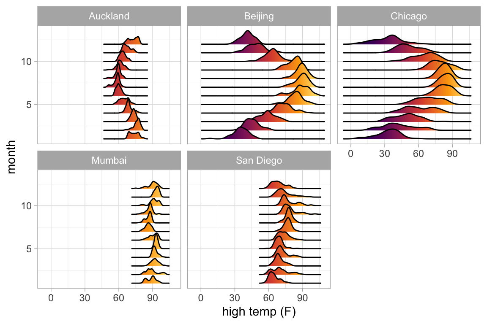

#### 2-dimensional density plots

Two-dimensional plots of density also have both a left and right
component to the formula.

\
`Penguins`` ``|>`` `[`gf_density_2d`](../reference/gf_density_2d.md)`(``bill_length_mm`` ``~`` ``bill_depth_mm`` ``|`` ``species``)`\
`#> Warning: Removed 2 rows containing non-finite outside the scale range`\
`` #> (`stat_density2d()`). ``

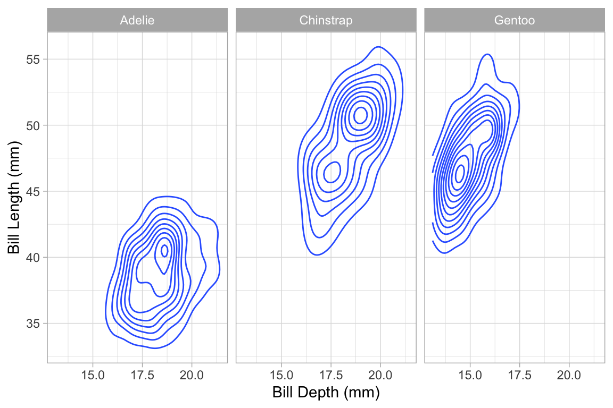

\
`Penguins`` ``|>`` `[`gf_density_2d_filled`](../reference/gf_density_2d.md)`(``bill_length_mm`` ``~`` ``bill_depth_mm`` ``|`` ``species``)`\
`#> Warning: Removed 2 rows containing non-finite outside the scale range`\
`` #> (`stat_density2d_filled()`). ``

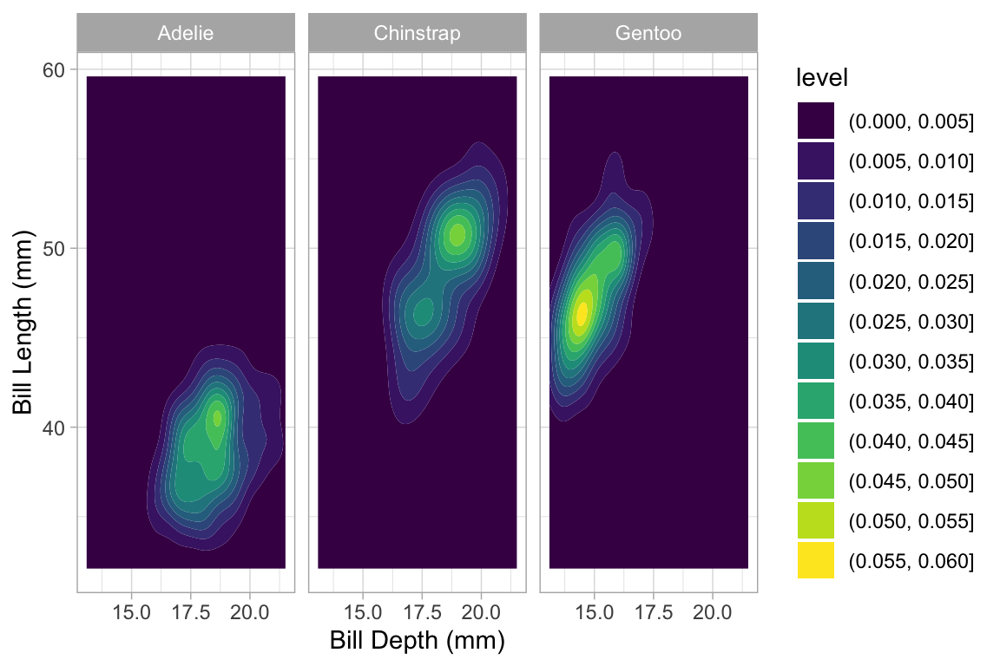

\
`Penguins`` ``|>`` `[`gf_hex`](../reference/gf_hex.md)`(``bill_length_mm`` ``~`` ``bill_depth_mm`` ``|`` ``species``, binwidth ``=`` ``1``)`\
`#> Warning: Removed 2 rows containing non-finite outside the scale range`\
`` #> (`stat_binhex()`). ``

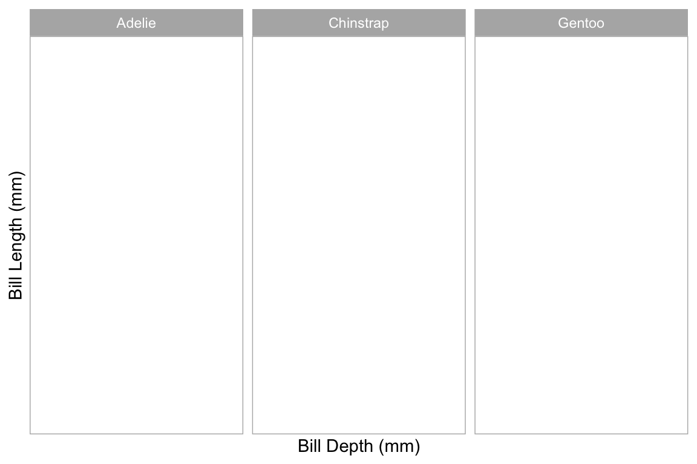

#### Paths and lines

The `ggplot2` system offers two ways to connect points.
[`gf_line()`](../reference/gf_line.md) ignores the order of the points
in the data, and draws the line going from left to right.
[`gf_path()`](../reference/gf_line.md) goes from point to point
according to the order in the data. Both forms can use a `color` or
`group` aesthetic to indicate which groups of points are connected.

Here’s an example where [`gf_line()`](../reference/gf_line.md) is
useful. We begin with a scatter plot showing the number of live births
in the US for each day of 1978.

\
`Births78`` ``|>`` `[`gf_point`](../reference/gf_point.md)`(``births`` ``~`` ``date``)`

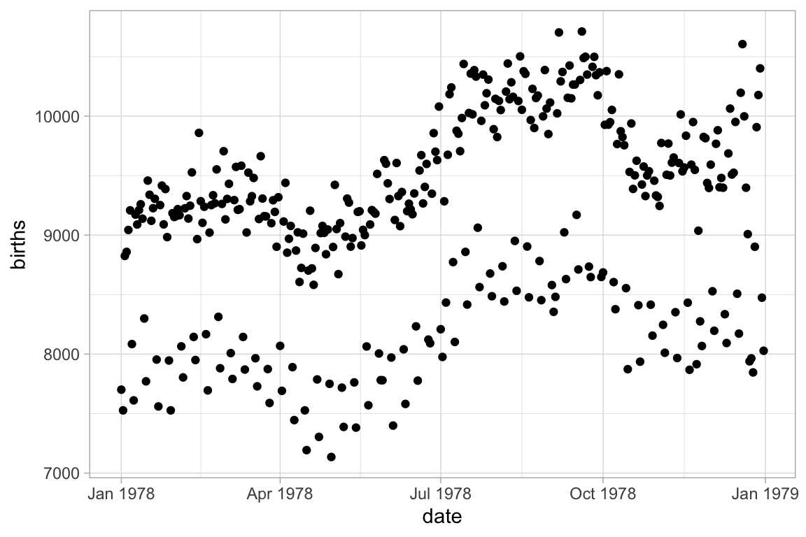

Can this interesting pattern be explained by a weekday/weekend effect?\
Converting to a line plot and coloring by day of week highlights the
pattern and makes it easy to spot the unusual days.

\
`Births78`` ``|>`` `[`gf_line`](../reference/gf_line.md)`(``births`` ``~`` ``date``, color ``=`` ``~`` ``wday``)`

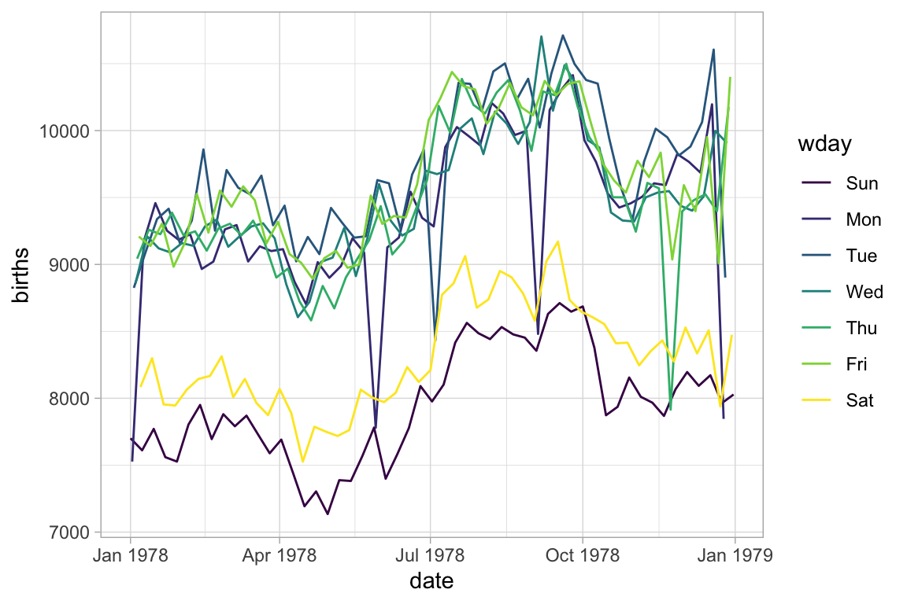

The example above would look the same if we used
[`gf_path()`](../reference/gf_line.md) because the data set is already
sorted by date. But in general, [`gf_path()`](../reference/gf_line.md)
and [`gf_line()`](../reference/gf_line.md) produce different results. In
the plots below, the first connects days chronologically (because the
data are sorted by date) and the second in order of their low
temperature.

\
`Weather`` ``|>`\
`  `[`filter`](https://dplyr.tidyverse.org/reference/filter.html)`(``month`` ``==`` ``5``, ``year`` ``==`` ``2017``, ``city`` ``==`` ``"Chicago"``)`` ``|>`\
`  `[`gf_path`](../reference/gf_line.md)`(``high_temp`` ``~`` ``low_temp`` ``|`` ``city`` ``~`` ``year``, color ``=`` ``~`` ``day``)`` ``|>`\
`  `[`gf_refine`](../reference/gf_aux.md)`(`[`scale_color_viridis_c`](https://ggplot2.tidyverse.org/reference/scale_viridis.html)`(``option ``=`` ``"C"``, begin ``=`` ``0.2``, end ``=`` ``0.8``)``)`

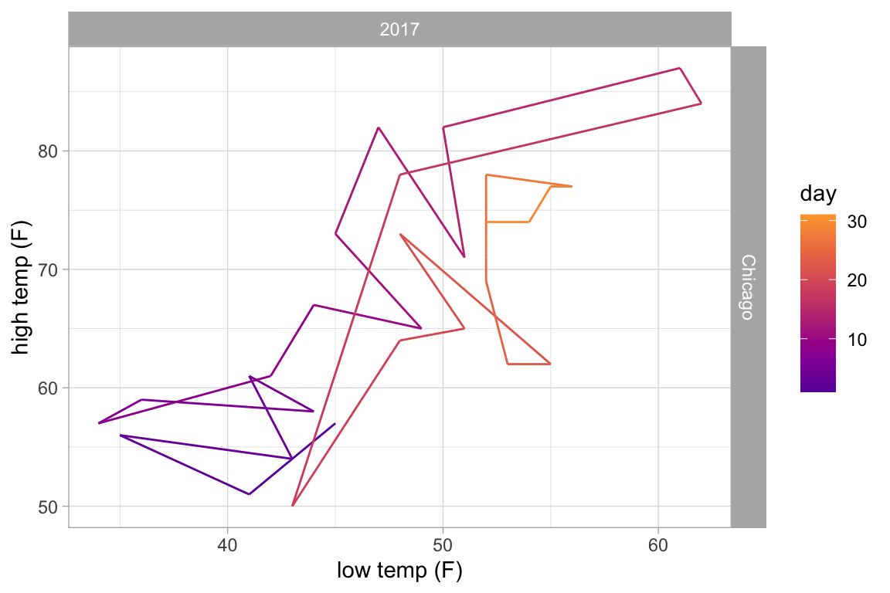

\
`Weather`` ``|>`\
`  `[`filter`](https://dplyr.tidyverse.org/reference/filter.html)`(``month`` ``==`` ``5``, ``year`` ``==`` ``2017``, ``city`` ``==`` ``"Chicago"``)`` ``|>`\
`  `[`gf_line`](../reference/gf_line.md)`(``high_temp`` ``~`` ``low_temp`` ``|`` ``city`` ``~`` ``year``, color ``=`` ``~`` ``day``)`` ``|>`\
`  `[`gf_refine`](../reference/gf_aux.md)`(`[`scale_color_viridis_c`](https://ggplot2.tidyverse.org/reference/scale_viridis.html)`(``option ``=`` ``"C"``, begin ``=`` ``0.2``, end ``=`` ``0.8``)``)`

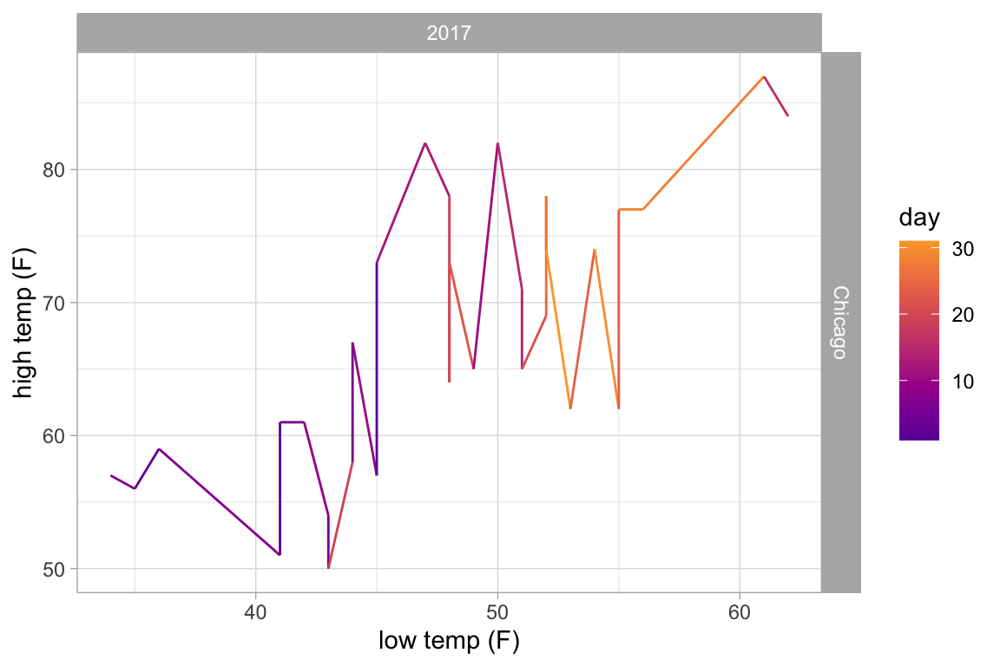

### Plots with more than 2 positional attributes

Some layers require more than two attributes. Typically this happens
when the glyphs of a layer are complex objects that could have been made
using multiple layers, but belong together conceptually. Examples
include

- [`gf_pointrange()`](../reference/gf_linerange.md) – plots a dot
  flanked by a line segment.\
- `gf_linrange()` – like
  [`gf_pointrange()`](../reference/gf_linerange.md) but without the
  point.
- [`gf_errorbar()`](../reference/gf_errorbar.md) – vertical error bars.
- [`gf_errorbarh()`](../reference/ggstance.md) – horizontal error bars.
- [`gf_ribbon()`](../reference/gf_ribbon.md) – a band between a line
  above and line below.

Often these are used to depict some sort of estimate of uncertainty in a
measurement or a prediction, but they can be used to represent any data
of the correct form. Here we will use
[`gf_linerange()`](../reference/gf_linerange.md) and
[`gf_ribbon()`](../reference/gf_ribbon.md) to indicate the high and low
temperatures in New York for the first few months of 2013.

\
`Temps`` ``<-`\
`  ``Weather`` ``|>`\
`  `[`filter`](https://dplyr.tidyverse.org/reference/filter.html)`(``month`` ``<=`` ``4``, ``year`` ``<=`` ``2016``, ``city`` ``==`` ``"Chicago"``)`\
\
`Temps`` ``|>`` `\
`  `[`gf_pointrange`](../reference/gf_linerange.md)`(``avg_temp`` ``+`` ``low_temp`` ``+`` ``high_temp``  ``~`` ``date``, color ``=`` ``~`` ``avg_temp``)`` ``|>`` `\
`  `[`gf_refine`](../reference/gf_aux.md)`(`[`scale_color_gradientn`](https://ggplot2.tidyverse.org/reference/scale_gradient.html)`(``colors ``=`` `[`c`](https://rdrr.io/r/base/c.html)`(``"blue"``, ``"green"``, ``"orange"``, ``"red"``)``)``)`

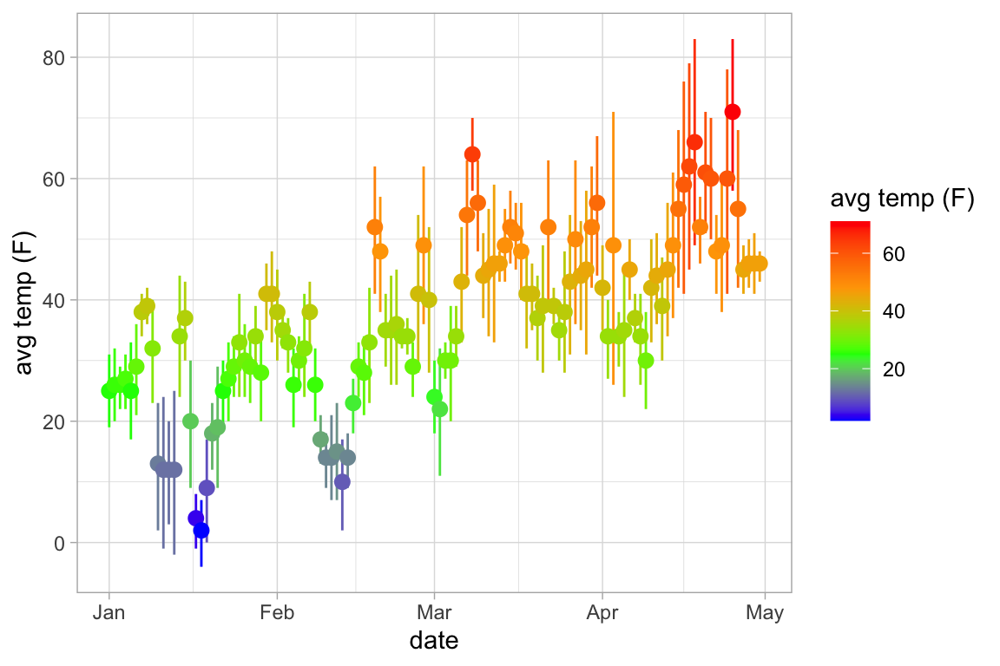

\
\
`Temps`` ``|>`` `\
`  `[`gf_ribbon`](../reference/gf_ribbon.md)`(``low_temp`` ``+`` ``high_temp``  ``~`` ``date``, color ``=`` ``"navy"``, alpha ``=`` ``0.3``)`

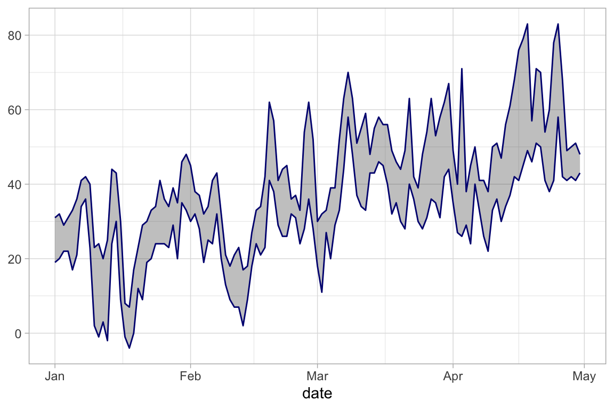

### Positions and Stats

#### Positions

[`position_dodge()`](https://ggplot2.tidyverse.org/reference/position_dodge.html),
[`position_jitter()`](https://ggplot2.tidyverse.org/reference/position_jitter.html),
and
[`position_jitterdodge()`](https://ggplot2.tidyverse.org/reference/position_jitterdodge.html)
can be used to adjust the positions at which glyphs are placed.
Jittering adds some random noise and can be useful when many
observations have the same value. Dodging moves groups of glyphs a fixed
difference to make it easier to distinguish the groups.

\
`KidsFeet`` ``|>`` `\
`  `[`gf_point`](../reference/gf_point.md)`(``length`` ``~`` ``sex``, color ``=`` ``~`` ``domhand``, `\
`           position ``=`` `[`position_jitterdodge`](https://ggplot2.tidyverse.org/reference/position_jitterdodge.html)`(``jitter.width ``=`` ``0.2``, dodge.width ``=`` ``0.4``)``)`

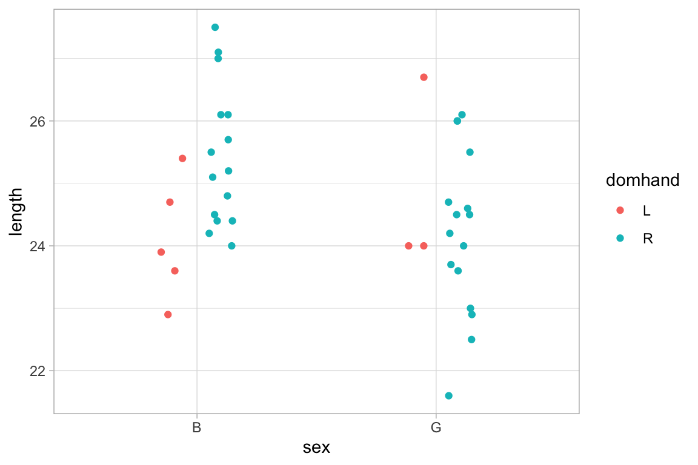

#### Stats

A **stat** is a transformation that is applied to the data before a plot
is generated. Several of the plots we have seen have made use of stats.

- [`gf_histogram()`](../reference/gf_histogram.md) uses
  [`stat_bin()`](https://ggplot2.tidyverse.org/reference/geom_histogram.html)
  to bin the data and count the number of observations in each bin. It
  is equivalent to

\
`HELPrct`` ``|>`` `[`gf_bar`](../reference/gf_bar.md)`(`` ``~`` ``age``, stat ``=`` ``"bin"``)`\
`` #> `stat_bin()` using `bins = 30`. Pick better value `binwidth`. ``

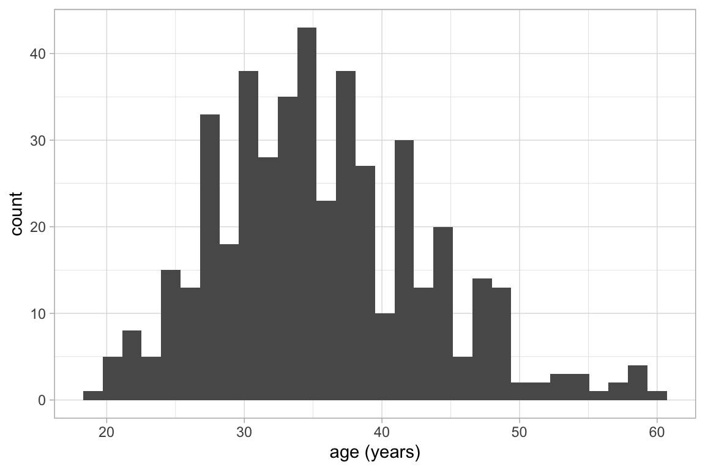

- [`gf_boxplot()`](../reference/gf_boxplot.md) uses
  [`stat_boxplot()`](https://ggplot2.tidyverse.org/reference/geom_boxplot.html)
  to compute the five-number summary on which the boxplot is based.

- [`gf_violin()`](../reference/gf_violin.md),
  [`gf_density()`](../reference/gf_density.md), and
  [`gf_density2d()`](../reference/gf_density_2d.md) use stats to compute
  a sequence of points along an estimated density. It is these points,
  and the not the raw data that are used to create the plot.
  [`gf_sina()`](../reference/gf_sina.md) uses the estimated density to
  jitter points.

\
[`gf_boxplot`](../reference/gf_boxplot.md)`(``age`` ``~`` ``substance``, data ``=`` ``HELPrct``)`

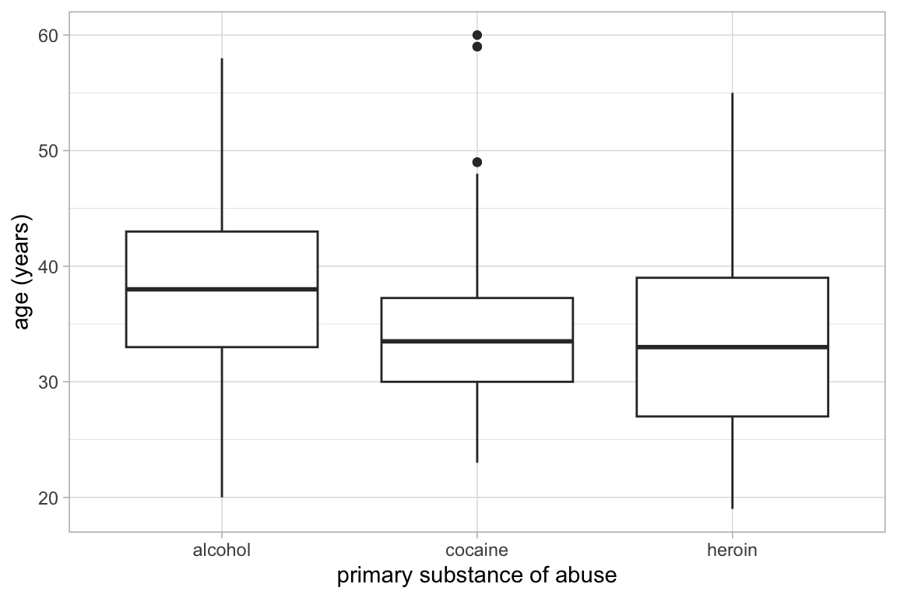

\
[`gf_violin`](../reference/gf_violin.md)`(``age`` ``~`` ``substance``, data ``=`` ``HELPrct``)`` ``|>`\
`  `[`gf_sina`](../reference/gf_sina.md)`(``alpha ``=`` ``0.3``)`

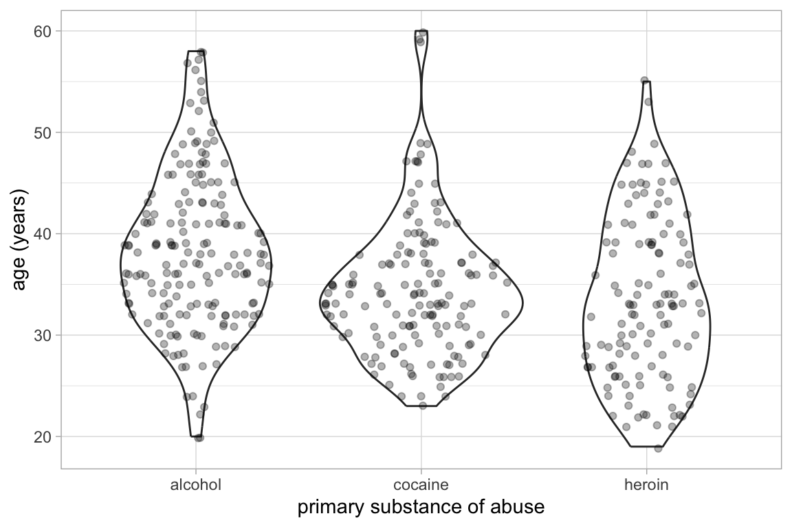

There are also a number of stats that can be used to show a functional
relationship between two variables.

- [`gf_smooth()`](../reference/gf_smooth.md) plots a model fit using
  [`lm()`](https://rdrr.io/r/stats/lm.html),
  [`glm()`](https://rdrr.io/r/stats/glm.html), `gam()`,
  [`loess()`](https://rdrr.io/r/stats/loess.html),
  [`MASS::rlm()`](https://rdrr.io/pkg/MASS/man/rlm.html).

- [`gf_lm()`](../reference/gf_smooth.md) is
  [`gf_smooth()`](../reference/gf_smooth.md) with the method set to
  [`lm()`](https://rdrr.io/r/stats/lm.html) so it plots a least squares
  regression line.

- [`gf_spline()`](../reference/gf_spline.md) plots a spline fit to the
  data.

\
`KidsFeet`` ``|>`` `\
`  `[`gf_point`](../reference/gf_point.md)`(``length`` ``~`` ``width``, color ``=`` ``~`` ``sex``)`` ``|>`\
`  `[`gf_lm`](../reference/gf_smooth.md)`(``)`

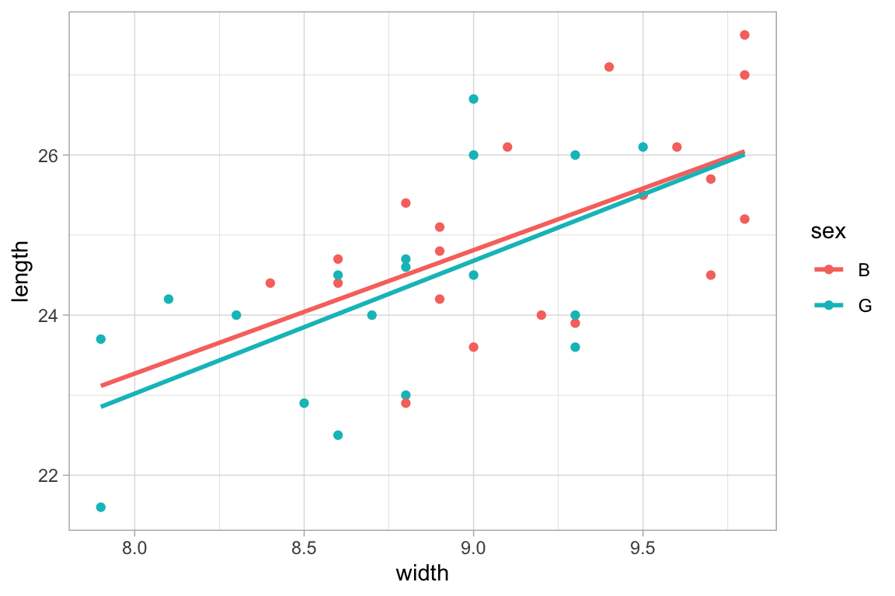

\
\
`mosaicData``::`[`Births`](https://rdrr.io/pkg/mosaicData/man/Births.html)` ``|>``  `\
`  `[`gf_point`](../reference/gf_point.md)`(``births`` ``~`` ``date``, color ``=`` ``~``wday``, alpha ``=`` ``0.15``)`` ``|>`\
`  `[`gf_smooth`](../reference/gf_smooth.md)`(``method ``=`` ``"loess"``)`

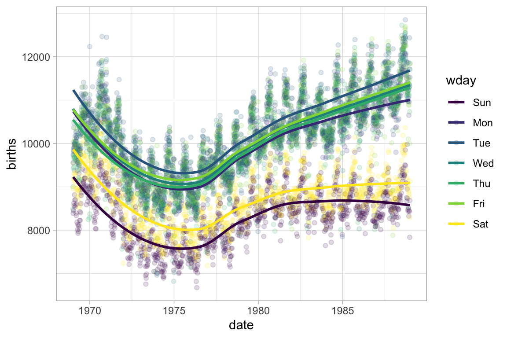

\
\
`mosaicData``::`[`Births`](https://rdrr.io/pkg/mosaicData/man/Births.html)` ``|>``  `\
`  `[`gf_point`](../reference/gf_point.md)`(``births`` ``~`` ``date``, color ``=`` ``~``wday``, alpha ``=`` ``0.15``)`` ``|>`\
`  `[`gf_spline`](../reference/gf_spline.md)`(``spar ``=`` ``1``)`

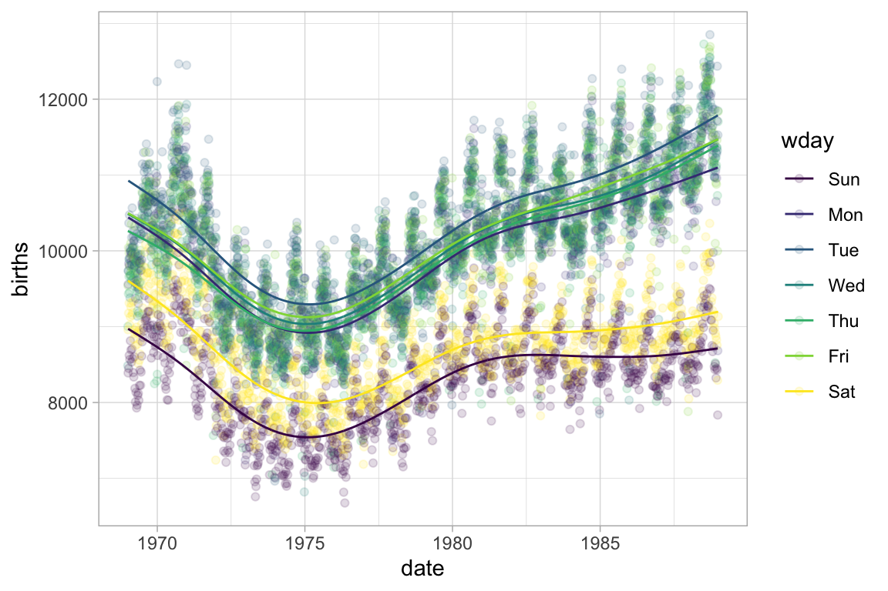

Confidence or prediction bands can be added to these as well.

\
`KidsFeet`` ``|>`` `\
`  `[`gf_point`](../reference/gf_point.md)`(``length`` ``~`` ``width`` ``|`` ``sex``, color ``=`` ``~`` ``sex``)`` ``|>`\
`  `[`gf_lm`](../reference/gf_smooth.md)`(``interval ``=`` ``"prediction"``, fill ``=`` ``"red"``)`` ``|>`\
`  `[`gf_lm`](../reference/gf_smooth.md)`(``interval ``=`` ``"confidence"``, fill ``=`` ``"navy"``)`

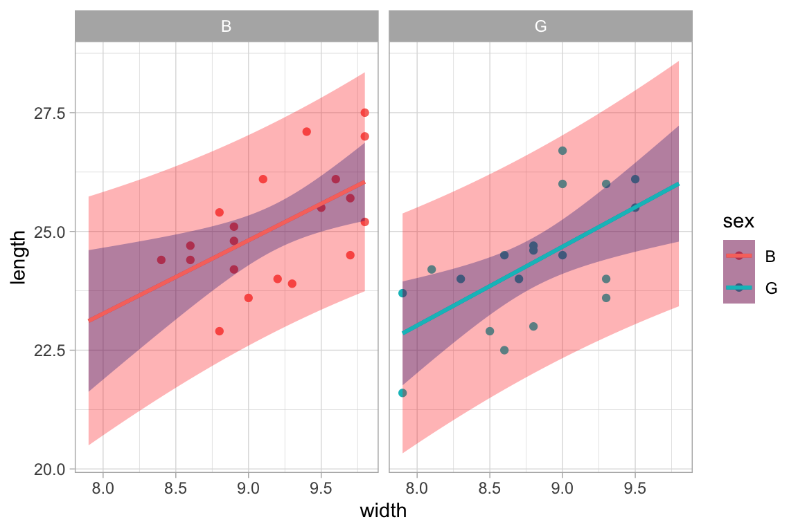

Mostly, the stats selected by default are just the ones you need. But
sometimes it is useful to select a different stat. The
[`stat_summary()`](https://ggplot2.tidyverse.org/reference/stat_summary.html)
and
[`stat_summary_bin()`](https://ggplot2.tidyverse.org/reference/stat_summary.html)
stats are particularly useful in this respect. These stats use a
function to aggregate over unique values of `x` or over bins of `x`
values and save the user needing to do that data transformation
manually.

The default function applied in each group is
[`mean_se()`](https://ggplot2.tidyverse.org/reference/mean_se.html),
which computes the mean (and the mean plus and minus one standard error)
This makes it simple to create an “interaction plot”.

\
`KidsFeet`` ``|>`` `\
`  `[`gf_jitter`](../reference/gf_jitter.md)`(``length`` ``~`` ``sex``, color ``=`` ``~`` ``domhand``, width ``=`` ``0.1``, height ``=`` ``0``)`` ``|>`\
`  `[`gf_line`](../reference/gf_line.md)`(``length`` ``~`` ``sex``, color ``=`` ``~`` ``domhand``, group ``=`` ``~`` ``domhand``, stat ``=`` ``"summary"``)`\
`` #> No summary function supplied, defaulting to `mean_se()` ``

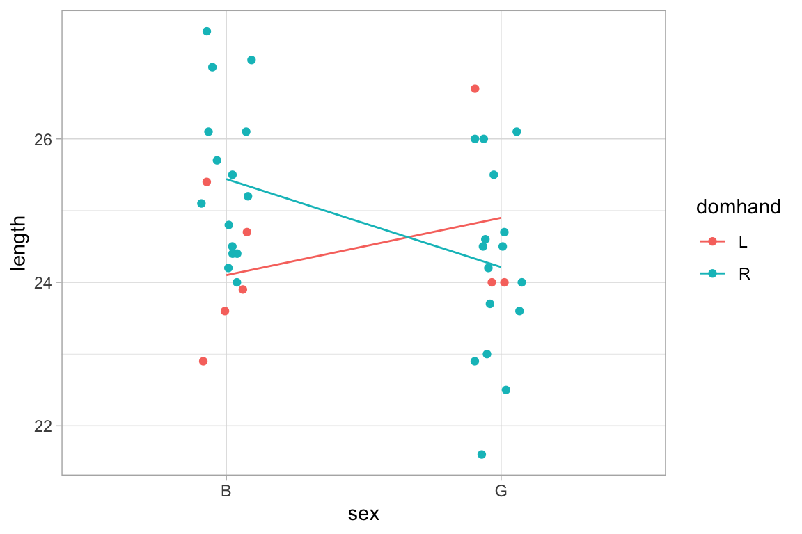

\
`Penguins`` ``|>`` `\
`  `[`gf_jitter`](../reference/gf_jitter.md)`(``body_mass_g`` ``~`` ``sex``, color ``=`` ``~`` ``species``, width ``=`` ``0.1``, height ``=`` ``0``)`` ``|>`\
`  `[`gf_line`](../reference/gf_line.md)`(``body_mass_g`` ``~`` ``sex``, color ``=`` ``~`` ``species``, group ``=`` ``~`` ``species``, stat ``=`` ``"summary"``)`\
`` #> No summary function supplied, defaulting to `mean_se()` ``\
`#> Warning: Removed 2 rows containing non-finite outside the scale range`\
`` #> (`stat_summary()`). ``\
`#> Warning: Removed 2 rows containing missing values or values outside the scale range`\
`` #> (`geom_point()`). ``

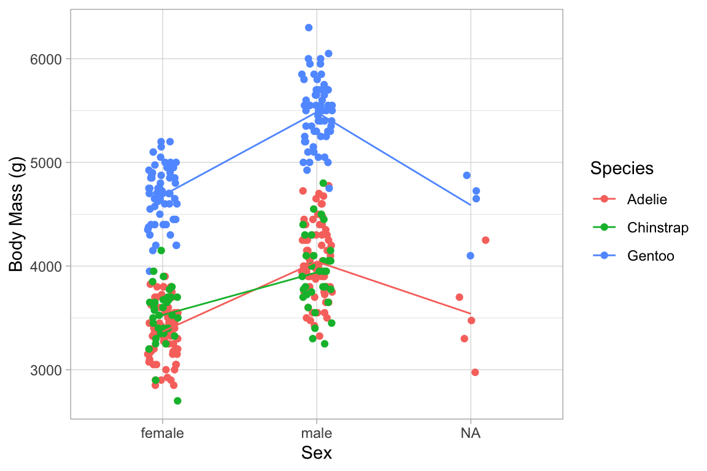

The other two values computed by
[`mean_se()`](https://ggplot2.tidyverse.org/reference/mean_se.html) are
available (starting with `ggplot2` version 2.3) as `stat(ymin)` and
`stat(ymax)`.

\
`KidsFeet`` ``|>`` `\
`  `[`gf_jitter`](../reference/gf_jitter.md)`(``length`` ``~`` ``sex``, color ``=`` ``~`` ``domhand``, width ``=`` ``0.1``, height ``=`` ``0``, alpha ``=`` ``0.5``)`` ``|>`\
`  `[`gf_pointrange`](../reference/gf_linerange.md)`(``length`` ``+`` `[`stat`](https://ggplot2.tidyverse.org/reference/aes_eval.html)`(``ymin``)`` ``+`` `[`stat`](https://ggplot2.tidyverse.org/reference/aes_eval.html)`(``ymax``)`` ``~`` ``sex``, `\
`                color ``=`` ``~`` ``domhand``, group ``=`` ``~`` ``domhand``, stat``=``"summary"``)`\
`` #> No summary function supplied, defaulting to `mean_se()` ``

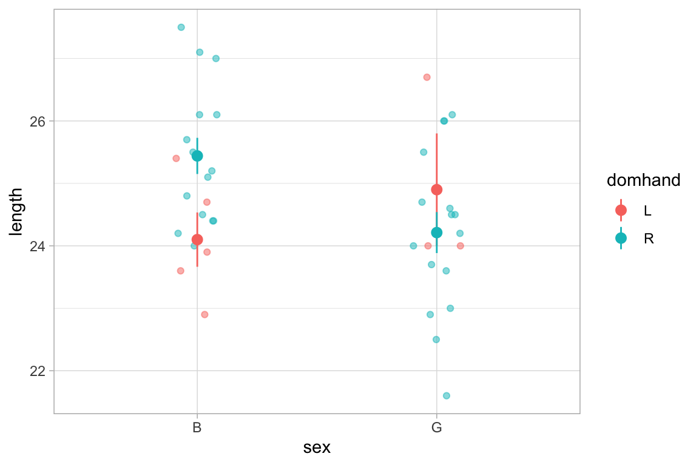

\
`Penguins`` ``|>`` `\
`  `[`gf_jitter`](../reference/gf_jitter.md)`(``body_mass_g`` ``~`` ``sex``, color ``=`` ``~`` ``species``, width ``=`` ``0.1``, height ``=`` ``0``, alpha ``=`` ``0.3``)`` ``|>`\
`  `[`gf_pointrange`](../reference/gf_linerange.md)`(``body_mass_g`` ``+`` `[`stat`](https://ggplot2.tidyverse.org/reference/aes_eval.html)`(``ymin``)`` ``+`` `[`stat`](https://ggplot2.tidyverse.org/reference/aes_eval.html)`(``ymax``)`` ``~`` ``sex``, color ``=`` ``~`` ``species``, `\
`                group ``=`` ``~`` ``species``, size ``=`` ``1.5``, stat``=``"summary"``)`\
`` #> No summary function supplied, defaulting to `mean_se()` ``\
`#> Warning: Removed 2 rows containing non-finite outside the scale range`\
`` #> (`stat_summary()`). ``\
`#> Warning: Removed 2 rows containing missing values or values outside the scale range`\
`` #> (`geom_point()`). ``

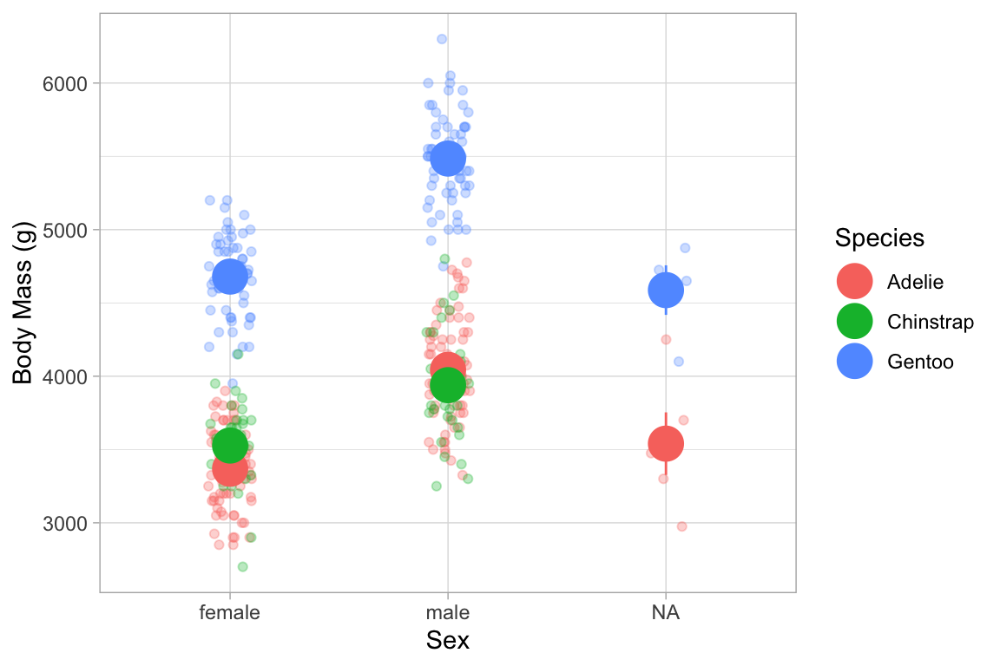

Custom functions can be used by defining `fun.y`, `fun.ymin`, and
`fun.ymax`, or a single function `fun.data` that returns a data frame
with variables named `y`, `ymin`, and `ymax`.

\
`KidsFeet`` ``|>`` `\
`  `[`gf_point`](../reference/gf_point.md)`(``length`` ``~`` ``sex``, color ``=`` ``~`` ``domhand``, width ``=`` ``0.1``, height ``=`` ``0``, alpha ``=`` ``0.5``,`\
`           position ``=`` `[`position_jitterdodge`](https://ggplot2.tidyverse.org/reference/position_jitterdodge.html)`(``jitter.width ``=`` ``0.2``, dodge.width ``=`` ``0.3``)``)`` ``|>`\
`  `[`gf_pointrange`](../reference/gf_linerange.md)`(``length`` ``+`` `[`stat`](https://ggplot2.tidyverse.org/reference/aes_eval.html)`(``ymin``)`` ``+`` `[`stat`](https://ggplot2.tidyverse.org/reference/aes_eval.html)`(``ymax``)`` ``~`` ``sex``, `\
`                color ``=`` ``~`` ``domhand``, group ``=`` ``~`` ``domhand``, stat``=``"summary"``,`\
`                fun.y ``=`` ``median``, fun.ymin ``=`` ``min``, fun.ymax ``=`` ``max``,`\
`                position ``=`` `[`position_dodge`](https://ggplot2.tidyverse.org/reference/position_dodge.html)`(``width ``=`` ``0.6``)``, size ``=`` ``1.2``)`\
`` #> No summary function supplied, defaulting to `mean_se()` ``

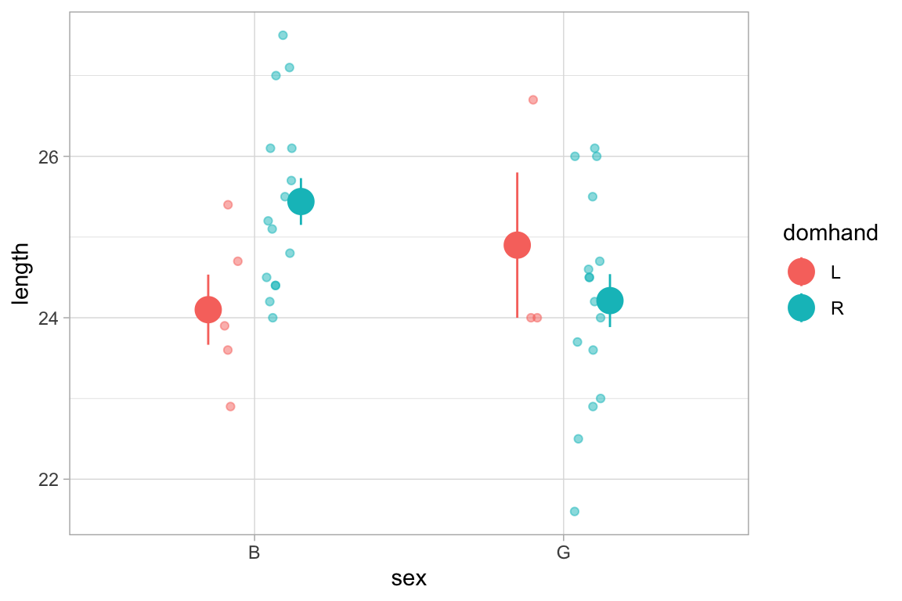

#### Plotting functions

`ggformula` provides two way to plot functions:
[`gf_function()`](../reference/gf_function.md) and
[`gf_fun()`](../reference/gf_function.md). They differ primarily in how
one specifies the function to be plotted.

- [`gf_function()`](../reference/gf_function.md) requires a (vectorized)
  function of one variable.
- [`gf_fun()`](../reference/gf_function.md) requires a formula
  describing how the y-values are computed from the x-values.

If these are used as a first layer, the limits for the x-axis must be
specified.

\
[`gf_function`](../reference/gf_function.md)`(``fun ``=`` ``sqrt``, xlim ``=`` `[`c`](https://rdrr.io/r/base/c.html)`(``0``, ``10``)``)`` ``|>`\
`  `[`gf_fun`](../reference/gf_function.md)`(``2`` ``+`` ``3`` ``*`` `[`cos`](https://rdrr.io/r/base/Trig.html)`(``10`` ``*`` ``x``)`` ``~`` ``x``, color ``=`` ``"red"``, n ``=`` ``800``)`

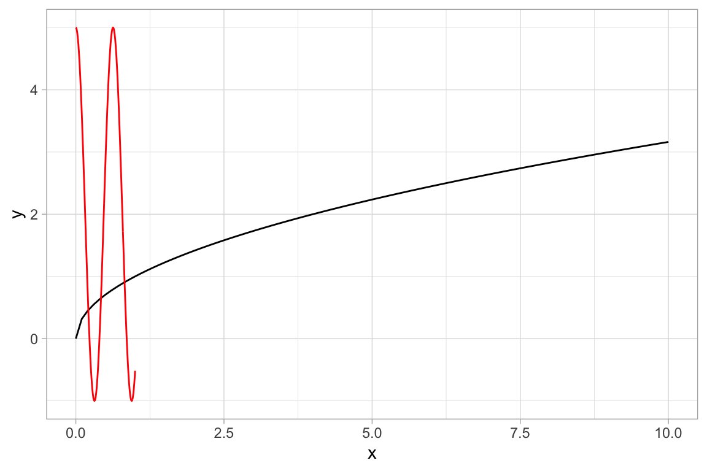

\
`f`` ``<-`` `[`makeFun`](https://rdrr.io/pkg/mosaicCore/man/makeFun.html)`(`[`lm`](https://rdrr.io/r/stats/lm.html)`(``totalbill`` ``~`` `[`poly`](https://rdrr.io/r/stats/poly.html)`(``month``, ``2``)``, data ``=`` ``mosaicData``::`[`Utilities`](https://rdrr.io/pkg/mosaicData/man/Utilities.html)`)``)`\
`mosaicData``::`[`Utilities`](https://rdrr.io/pkg/mosaicData/man/Utilities.html)` ``|>``  `\
`  `[`gf_point`](../reference/gf_point.md)`(``totalbill`` ``~`` ``month``, alpha ``=`` ``0.6``)`` ``|>`\
`  `[`gf_fun`](../reference/gf_function.md)`(``f``(``m``)`` ``~`` ``m``, color ``=`` ``"red"``)`

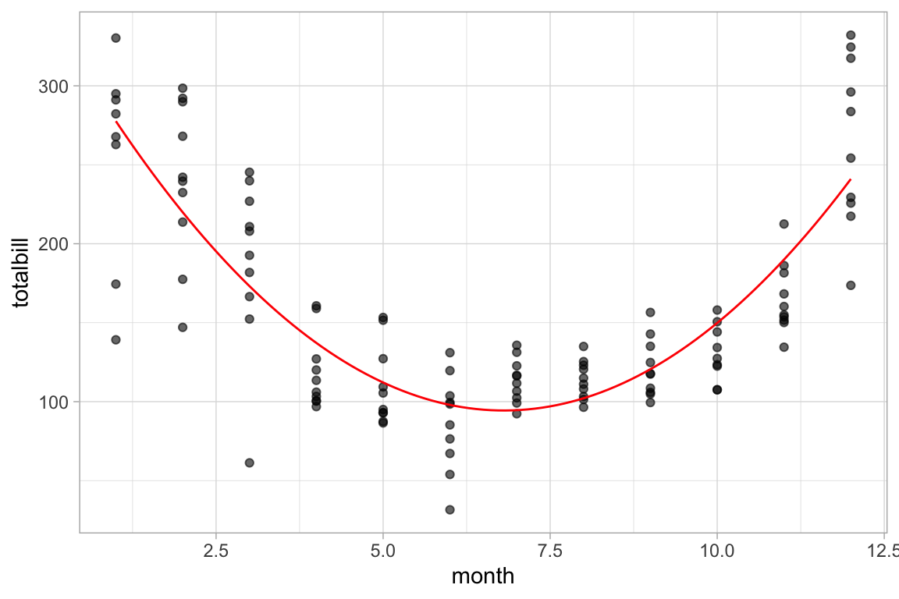

### Maps

Prior to `ggplot2` version 2.3, basic maps could be created using
[`gf_polygon()`](../reference/gf_polygon.md).

\
`if`` ``(`[`require`](https://rdrr.io/r/base/library.html)`(`[`maps`](https://github.com/adeckmyn/maps)`)`` ``&&`` `[`require`](https://rdrr.io/r/base/library.html)`(`[`dplyr`](https://dplyr.tidyverse.org)`)``)`` ``{`\
`  ``US`` ``<-`` `[`map_data`](https://ggplot2.tidyverse.org/reference/map_data.html)`(``"state"``)`` ``|>`\
`    ``dplyr``::`[`mutate`](https://dplyr.tidyverse.org/reference/mutate.html)`(``name_length ``=`` `[`nchar`](https://rdrr.io/r/base/nchar.html)`(``region``)``)`\
`  ``States`` ``<-`` ``US`` ``|>`\
`    ``dplyr``::`[`group_by`](https://dplyr.tidyverse.org/reference/group_by.html)`(``region``)`` ``|>`\
`    ``dplyr``::`[`summarise`](https://dplyr.tidyverse.org/reference/summarise.html)`(``lat ``=`` `[`mean`](https://rdrr.io/r/base/mean.html)`(`[`range`](https://rdrr.io/r/base/range.html)`(``lat``)``)``, long ``=`` `[`mean`](https://rdrr.io/r/base/mean.html)`(`[`range`](https://rdrr.io/r/base/range.html)`(``long``)``)``)`` ``|>`\
`    ``dplyr``::`[`mutate`](https://dplyr.tidyverse.org/reference/mutate.html)`(``name ``=`` `[`abbreviate`](https://rdrr.io/r/base/abbreviate.html)`(``region``, ``3``)``)`\
\
`  `[`gf_polygon`](../reference/gf_polygon.md)`(``lat`` ``~`` ``long``, data ``=`` ``US``, group ``=`` ``~`` ``group``,`\
`             fill ``=`` ``~`` ``name_length``, color ``=`` ``"white"``)`` ``|>`\
`  `[`gf_text`](../reference/gf_text.md)`(``lat`` ``~`` ``long``, label ``=`` ``~`` ``name``, data ``=`` ``States``,`\
`    color ``=`` ``"gray70"``, inherit ``=`` ``FALSE``)`` ``|>`\
`  `[`gf_refine`](../reference/gf_aux.md)`(``mosaic``::`[`theme_map`](https://www.mosaic-web.org/mosaic/reference/theme_map.html)`(``)``)`\
`}`

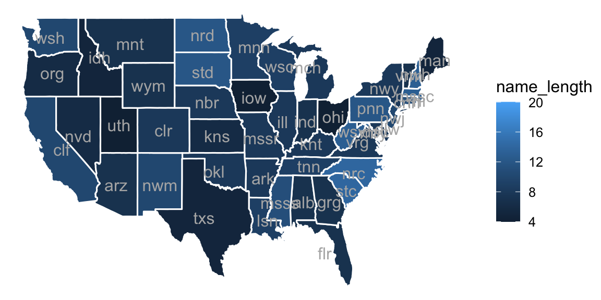

Starting with `ggplot2` version 2.3, there is direct support for shape
files. This allows each row of a data frame to contain all the geometry
information for a region in a single column. There is also better
support for overlaying information from multiple shape files.

\
`if`` ``(`[`require`](https://rdrr.io/r/base/library.html)`(`[`maps`](https://github.com/adeckmyn/maps)`)`` ``&&`` `[`require`](https://rdrr.io/r/base/library.html)`(`[`dplyr`](https://dplyr.tidyverse.org)`)`` ``&&`` `[`require`](https://rdrr.io/r/base/library.html)`(`[`sf`](https://r-spatial.github.io/sf/)`)`` ``&&`` `[`require`](https://rdrr.io/r/base/library.html)`(`[`purrr`](https://purrr.tidyverse.org/)`)``)`` ``{`\
`  ``USshape`` ``<-`` `\
`    ``sf``::`[`st_as_sf`](https://r-spatial.github.io/sf/reference/st_as_sf.html)`(``maps``::`[`map`](https://rdrr.io/pkg/maps/man/map.html)`(``'state'``, plot ``=`` ``FALSE``, fill ``=`` ``TRUE``)``)`` ``|>`\
`    ``dplyr``::`[`mutate`](https://dplyr.tidyverse.org/reference/mutate.html)`(`\
`      name_length ``=`` `[`nchar`](https://rdrr.io/r/base/nchar.html)`(`[`as.character`](https://rdrr.io/r/base/character.html)`(``ID``)``)``,`\
`      centroid ``=`` ``purrr``::`[`map`](https://purrr.tidyverse.org/reference/map.html)`(``geom``, ``st_centroid``)``,`\
`      coords_x ``=`` ``purrr``::`[`map_dbl`](https://purrr.tidyverse.org/reference/map.html)`(``centroid``, ``1``)``,`\
`      coords_y ``=`` ``purrr``::`[`map_dbl`](https://purrr.tidyverse.org/reference/map.html)`(``centroid``, ``2``)`\
`    ``)`` `\
`    `\
`  `[`gf_sf`](../reference/gf_sf.md)`(``fill ``=`` ``~`` `[`factor`](https://rdrr.io/r/base/factor.html)`(``name_length``)``, color ``=`` ``"white"``, data ``=`` ``USshape``, alpha ``=`` ``0.5``)`` ``|>`\
`    `[`gf_text`](../reference/gf_text.md)`(``coords_y`` ``~`` ``coords_x``, label ``=`` ``~`` ``ID``, color ``=`` ``"gray20"``, size ``=`` ``2``)`` ``|>`\
`    `[`gf_labs`](../reference/gf_aux.md)`(``x ``=`` ``""``, y ``=`` ``""``)`` ``|>`\
`    `[`gf_refine`](../reference/gf_aux.md)`(`[`coord_sf`](https://ggplot2.tidyverse.org/reference/ggsf.html)`(``)``)`` ``|>`\
`    `[`gf_theme`](../reference/gf_theme.md)`(``mosaic``::`[`theme_map`](https://www.mosaic-web.org/mosaic/reference/theme_map.html)`(``)``)`` ``|>`\
`    `[`gf_labs`](../reference/gf_aux.md)`(``fill ``=`` ``"name length"``)`\
`}`

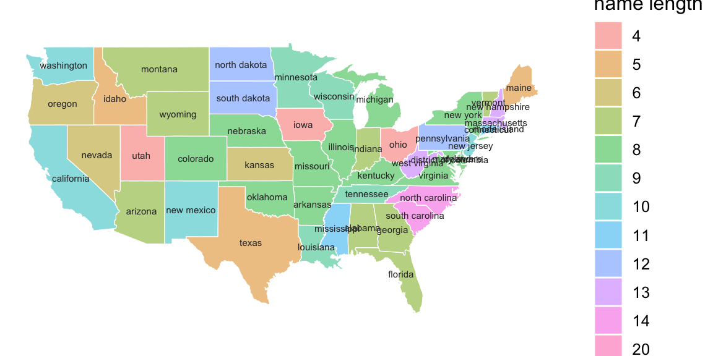

    <!-- # gf_sf(data = sf::st_centroid(USshape), color = "white", alpha = 0.5, size = 3) |> -->

### New types of plots

`ggformula` adds some additional plot options to `ggplot2`

#### ASH plots

Average shifted histograms can be created with
[`gf_ash()`](../reference/gf_ash.md). These plots average the height
over all histograms with the same bin width. ASH plots often work well
with larger bin widths than you might use for an individual histogram.

\
`HELPrct`` ``|>`` `\
`  `[`gf_ash`](../reference/gf_ash.md)`(`` ``~`` ``age``, data ``=`` ``HELPrct``, binwidth ``=`` ``2``)`` ``|>`\
`  `[`gf_dhistogram`](../reference/gf_histogram.md)`(`` ``~`` ``age``, binwidth ``=`` ``2``, alpha ``=`` ``0.3``)`` `

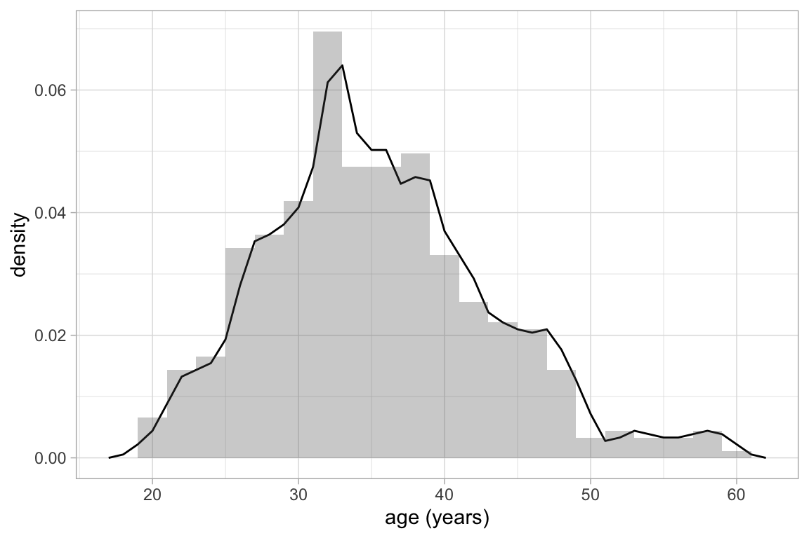

\
`HELPrct`` ``|>`` `\
`  `[`gf_ash`](../reference/gf_ash.md)`(`` ``~`` ``age``, binwidth ``=`` ``10``)`` ``|>`` `\
`  `[`gf_dhistogram`](../reference/gf_histogram.md)`(`` ``~`` ``age``, binwidth ``=`` ``2``, alpha ``=`` ``0.3``)`` `

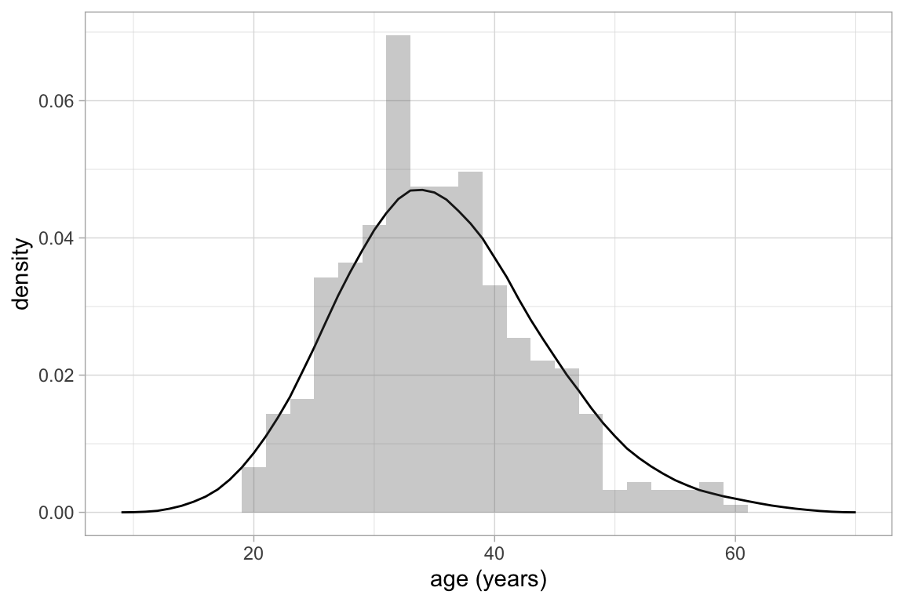

#### Distribution plots

[`gf_dist()`](../reference/gf_dist.md) can be used to create plots of
discrete and continuous distributions.

\
[`gf_dist`](../reference/gf_dist.md)`(``"pois"``, lambda ``=`` ``5``)`

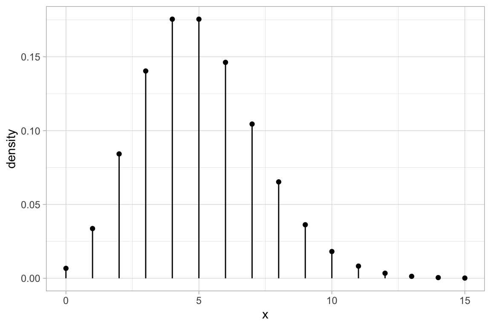

\
[`gf_dist`](../reference/gf_dist.md)`(``"pois"``, lambda ``=`` ``5``, kind ``=`` ``"cdf"``)`

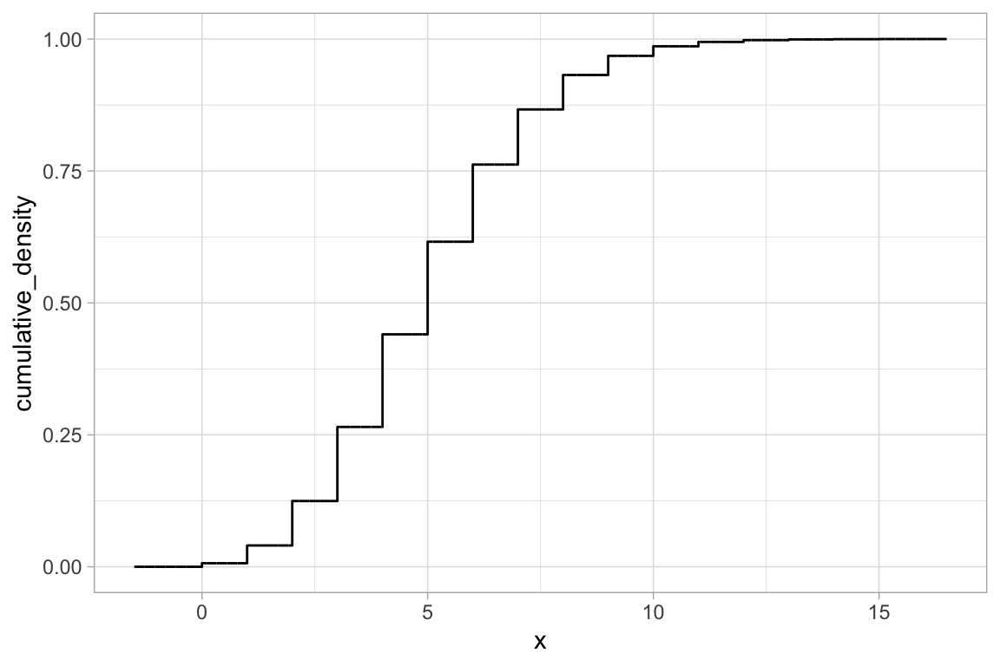

\
[`gf_dist`](../reference/gf_dist.md)`(``"gamma"``, shape ``=`` ``3``, rate ``=`` ``4``, geom ``=`` ``"area"``)`

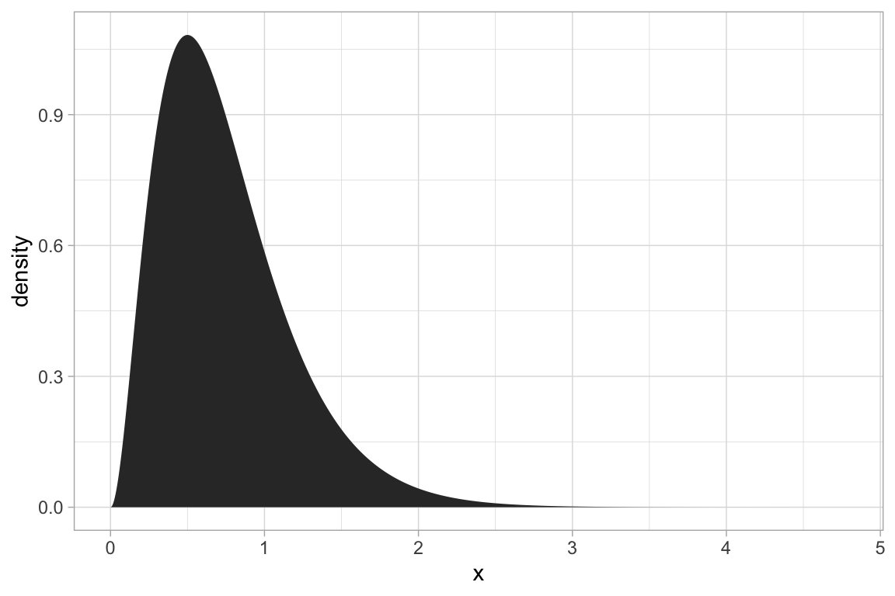

\
[`gf_dist`](../reference/gf_dist.md)`(``"gamma"``, shape ``=`` ``3``, rate ``=`` ``4``, geom ``=`` ``"area"``, fill ``=`` ``~`` ``(``x`` ``<=`` ``1``)``)`

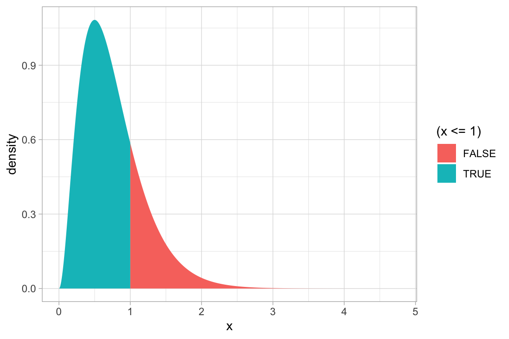

\
[`gf_dist`](../reference/gf_dist.md)`(``"gamma"``, shape ``=`` ``3``, rate ``=`` ``4``, kind ``=`` ``"cdf"``)`

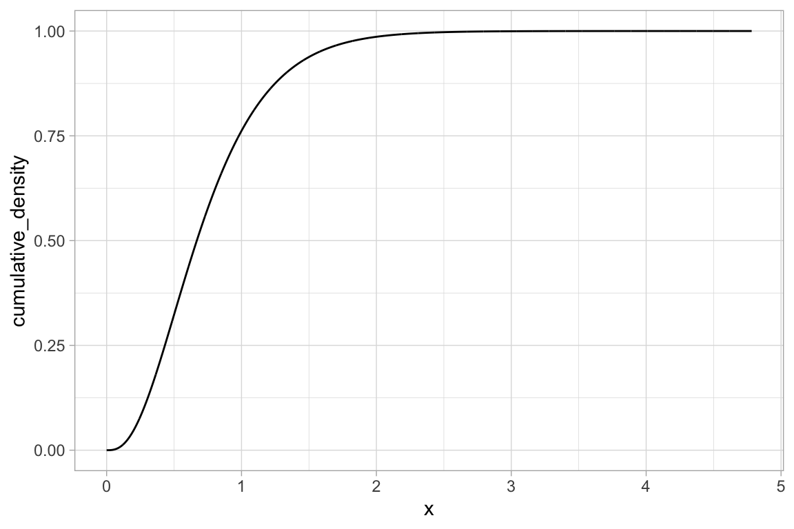

When distribution parameters and plot attributes have the same name,
there are two ways to avoid the name collision:

\
`# size is used by the binomial distribution functions and when plotting`\
[`gf_dist`](../reference/gf_dist.md)`(``"binom"``, size ``=`` ``20``, prob ``=`` ``0.25``, plot_size ``=`` ``5``)`

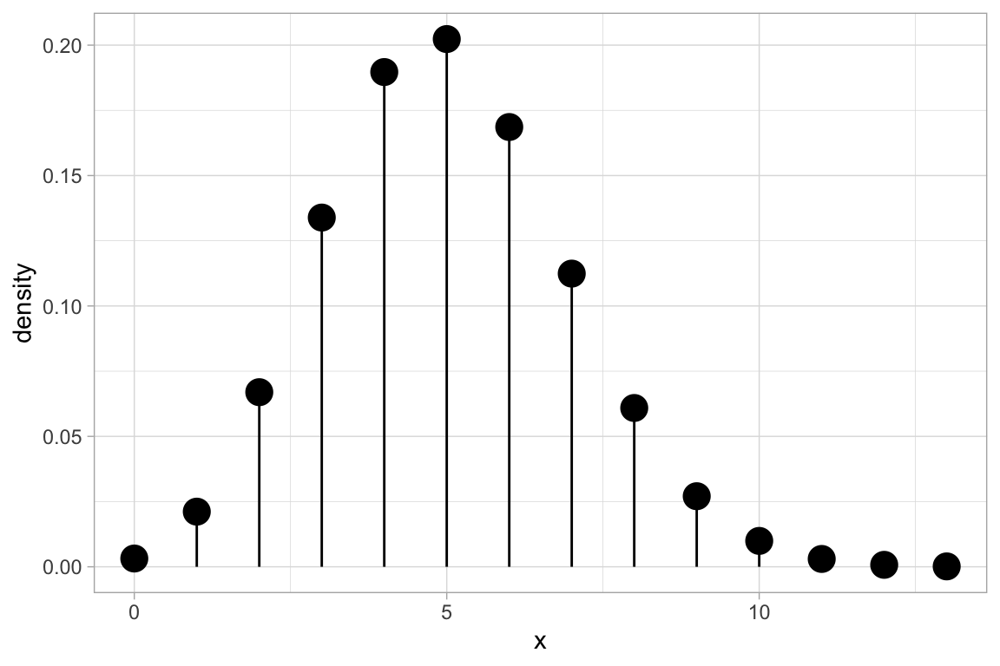

\
[`gf_dist`](../reference/gf_dist.md)`(``"binom"``, params ``=`` `[`list`](https://rdrr.io/r/base/list.html)`(``size ``=`` ``20``, prob ``=`` ``0.25``)``, size ``=`` ``3``)`

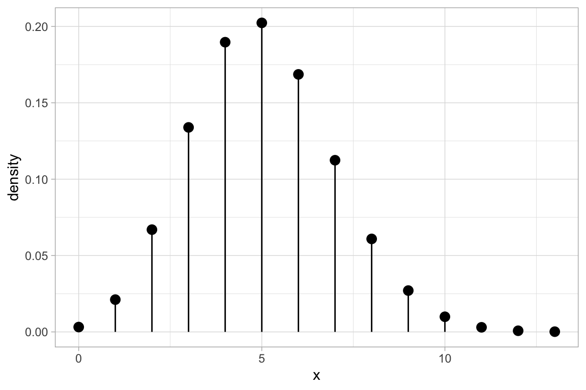

`ggformula` also provides an interface to
[`MASS::fitdistr()`](https://rdrr.io/pkg/MASS/man/fitdistr.html) for
fitting distributions to data and displaying the resulting pdf.

\
`x`` ``<-`` `[`rgamma`](https://rdrr.io/r/stats/GammaDist.html)`(``1000``, shape ``=`` ``2``, rate ``=`` ``5``)`\
[`gf_dhistogram`](../reference/gf_histogram.md)`(`` ``~`` ``x``, alpha ``=`` ``0.3``)`` ``|>`\
`  `[`gf_fitdistr`](../reference/gf_fitdistr.md)`(``dist ``=`` ``"dnorm"``, color ``=`` ``~`` ``"Normal"``)`` ``|>`` `\
`  `[`gf_fitdistr`](../reference/gf_fitdistr.md)`(``dist ``=`` ``"dgamma"``, color ``=`` ``~`` ``"Gamma"``)`` ``|>`\
`  `[`gf_fitdistr`](../reference/gf_fitdistr.md)`(``dist ``=`` ``"dweibull"``, color ``=`` ``~`` ``"Weibull"``)`` ``|>`` `\
`  `[`gf_labs`](../reference/gf_aux.md)`(``color ``=`` ``""``)`\
`` #> `stat_bin()` using `bins = 30`. Pick better value `binwidth`. ``\
`#> Warning in densfun(x, parm[1], parm[2], ...): NaNs produced`\
`#> Warning in densfun(x, parm[1], parm[2], ...): NaNs produced`\
`#> Warning in densfun(x, parm[1], parm[2], ...): NaNs produced`\
`#> Warning in densfun(x, parm[1], parm[2], ...): NaNs produced`\
`#> Warning in densfun(x, parm[1], parm[2], ...): NaNs produced`

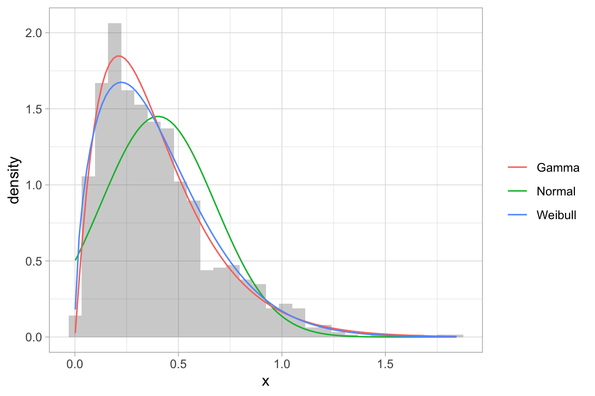

### Global plot adjustments

There are a number of things we may want to do to the entire plot –
adjusting labels, colors, fonts, etc. `ggformula` provides wrappers to
the `ggplot2` functions for this so that the chaining syntax can be
used.

\
`penguins`` ``|>`` `\
`  `[`gf_histogram`](../reference/gf_histogram.md)`(`` ``~`` ``body_mass_g``, alpha ``=`` ``0.2``, fill ``=`` ``"navy"``,`\
`              color ``=`` ``"gray50"``, binwidth ``=`` ``200``)`` ``|>`\
`  `[`gf_freqpoly`](../reference/gf_freqpoly.md)`(`` ``~`` ``body_mass_g``, binwidth ``=`` ``200``)`` ``|>`\
`  `[`gf_facet_grid`](../reference/gf_facet_grid.md)`(``species`` ``~`` ``.``)`` ``|>`` `\
`  `[`gf_labs`](../reference/gf_aux.md)`(``x ``=`` ``"bill length (mm)"``, title ``=`` ``"Palmer Penguins"``)`` ``|>`\
`  `[`gf_lims`](../reference/gf_aux.md)`(``x ``=`` `[`c`](https://rdrr.io/r/base/c.html)`(``2500``, ``6500``)``)`` ``|>`` `\
`  `[`gf_theme`](../reference/gf_theme.md)`(``theme ``=`` `[`theme_minimal`](https://ggplot2.tidyverse.org/reference/ggtheme.html)`(``)``)`\
`` #> Warning: Removed 2 rows containing non-finite outside the scale range (`stat_bin()`). ``\
`` #> Removed 2 rows containing non-finite outside the scale range (`stat_bin()`). ``

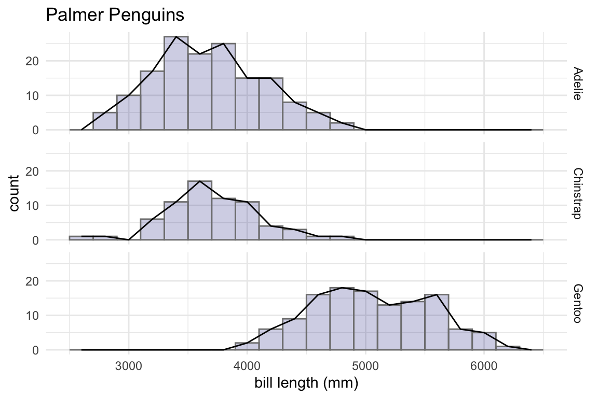

\
\
`penguins`` ``|>`` `\
`  `[`gf_histogram`](../reference/gf_histogram.md)`(`` ``~`` ``body_mass_g`` ``|`` ``species`` ``~`` ``.``, alpha ``=`` ``0.5``, fill ``=`` ``"white"``,`\
`              binwidth ``=`` ``200``, color ``=`` ``"gray40"``)`` ``|>`\
`  `[`gf_freqpoly`](../reference/gf_freqpoly.md)`(`` ``~`` ``body_mass_g``, color ``=`` ``"skyblue"``, `\
`               binwidth ``=`` ``200``, size ``=`` ``1.2``, alpha ``=`` ``0.8``)`` ``|>`\
`  `[`gf_labs`](../reference/gf_aux.md)`(``x ``=`` ``"bill length (mm)"``, title ``=`` ``"Palmer Penguins"``)`` ``|>`\
`  `[`gf_lims`](../reference/gf_aux.md)`(``x ``=`` `[`c`](https://rdrr.io/r/base/c.html)`(``2500``, ``6500``)``)`` ``|>`` `\
`  `[`gf_theme`](../reference/gf_theme.md)`(``theme ``=`` `[`theme_dark`](https://ggplot2.tidyverse.org/reference/ggtheme.html)`(``)``)`\
`` #> Warning: Using `size` aesthetic for lines was deprecated in ggplot2 3.4.0. ``\
`` #> ℹ Please use `linewidth` instead. ``\
`` #> Removed 2 rows containing non-finite outside the scale range (`stat_bin()`). ``\
`` #> Removed 2 rows containing non-finite outside the scale range (`stat_bin()`). ``\
`#> ℹ The deprecated feature was likely used in the base package.`\
`#>   Please report the issue to the authors.`

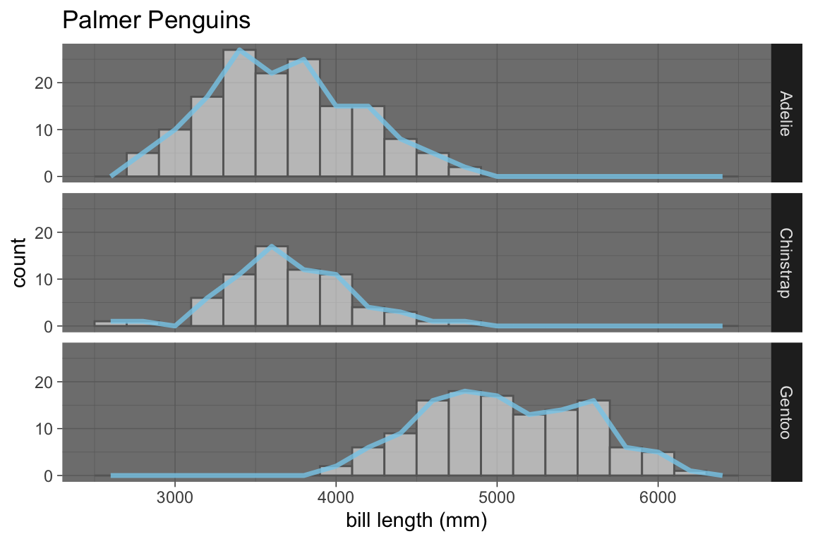

For convenience, a few modifications can also be made directly in the
original function call:

\
`penguins`` ``|>`` `\
`  `[`gf_dhistogram`](../reference/gf_histogram.md)`(`` ``~`` ``body_mass_g`` ``|`` ``species`` ``~`` ``.``, `\
`                alpha ``=`` ``0.5``, fill ``=`` ``"skyblue"``, color ``=`` ``"navy"``, binwidth ``=`` ``200``, `\
`                xlab ``=`` ``"body mass (g)"``, title ``=`` ``"Palmer Penguins"`\
`  ``)`` `\
`#> Warning: Removed 2 rows containing non-finite outside the scale range`\
`` #> (`stat_bin()`). ``

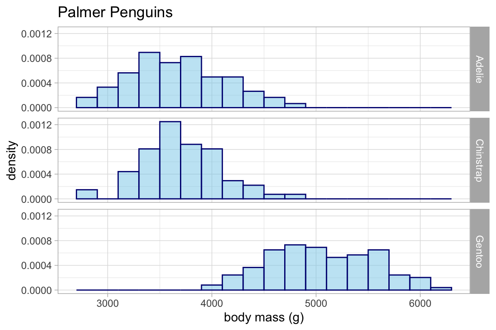

### Horizontal Geoms

Some of the geoms in ggplot2 can have either a horizontal or vertical
direction. Often ggplot2 will correctly determine which orientation is
intended. If not, set `orientation = 'x'` or `orientation = 'y'` to
explicitly set the direction of the geom.

\
[`gf_boxplot`](../reference/gf_boxplot.md)`(``high_temp`` ``~`` ``city``, data ``=`` ``Weather``)`

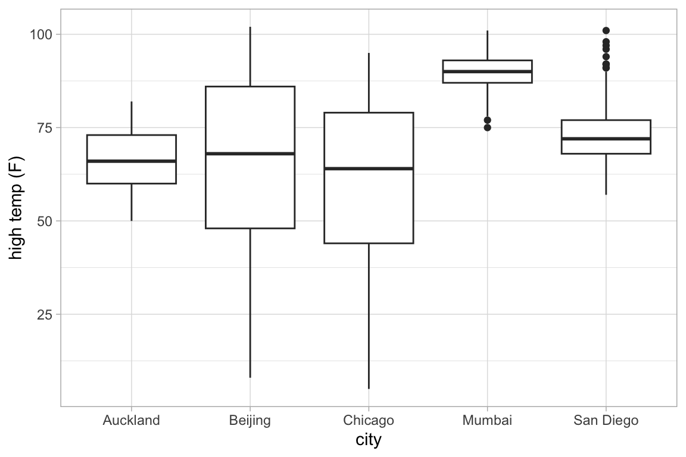

\
\
`# auto-detected because city is discrete`\
[`gf_boxplot`](../reference/gf_boxplot.md)`(``city`` ``~`` ``high_temp``, data ``=`` ``Weather``)`

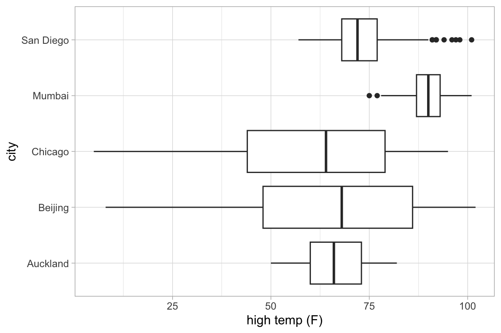

\
\
`# auto-detected based on groups`\
[`gf_boxplot`](../reference/gf_boxplot.md)`(``month`` ``~`` ``high_temp`` ``|`` ``~`` ``city``, group ``=`` ``~`` ``month``, data ``=`` ``Weather``)`

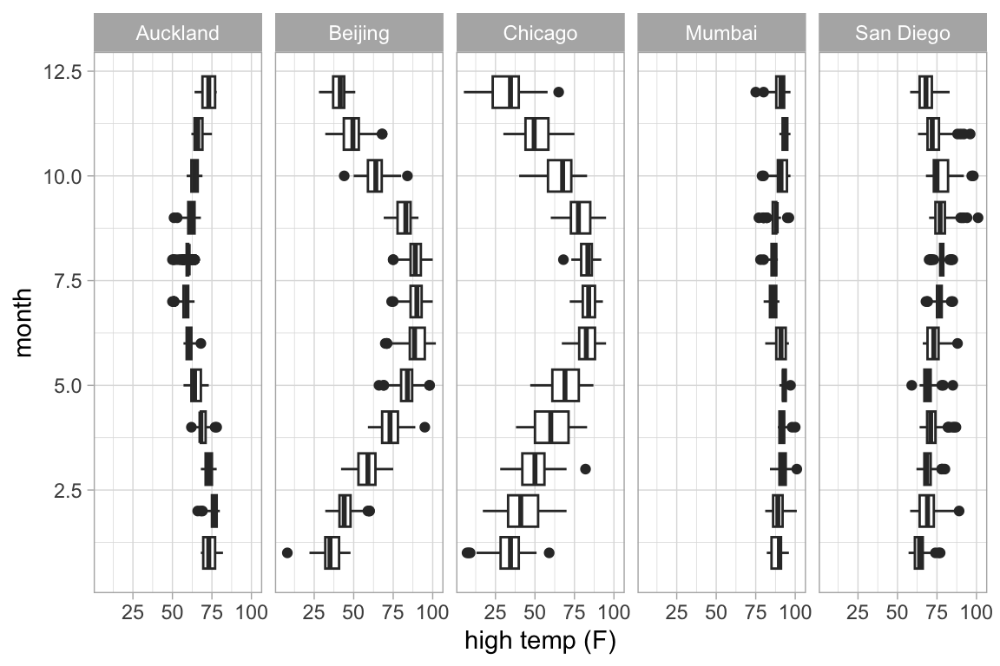

\
[`gf_boxplot`](../reference/gf_boxplot.md)`(``high_temp`` ``~`` ``month`` ``|`` ``city`` ``~`` ``.``, group ``=`` ``~`` ``month``, data ``=`` ``Weather``)`

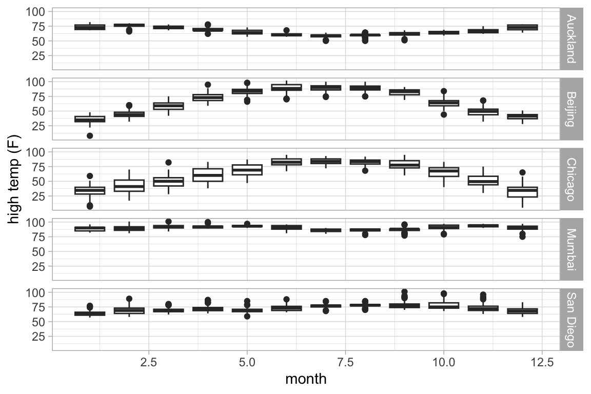

\
\
`# defaults to veritcal without groups `\
[`gf_boxplot`](../reference/gf_boxplot.md)`(``month`` ``~`` ``high_temp`` ``|`` ``~`` ``city``, data ``=`` ``Weather``)`\
`#> Warning: Orientation is not uniquely specified when both the x and y aesthetics are`\
`#> continuous. Picking default orientation 'x'.`\
`#> Warning: Continuous x aesthetic`\
`` #> ℹ did you forget `aes(group = ...)`? ``

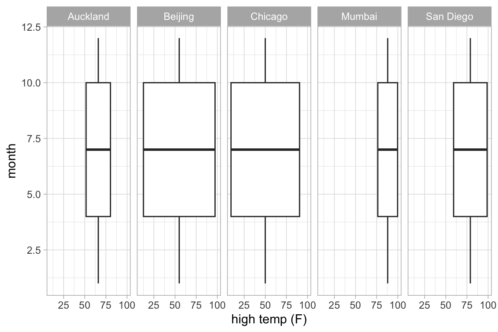

\
\
`# explicit horizontal orientation`\
[`gf_boxplot`](../reference/gf_boxplot.md)`(``month`` ``~`` ``high_temp`` ``|`` ``city`` ``~`` ``.``, data ``=`` ``Weather``, orientation ``=`` ``'y'``)`\
`#> Warning: Continuous y aesthetic`\
`` #> ℹ did you forget `aes(group = ...)`? ``

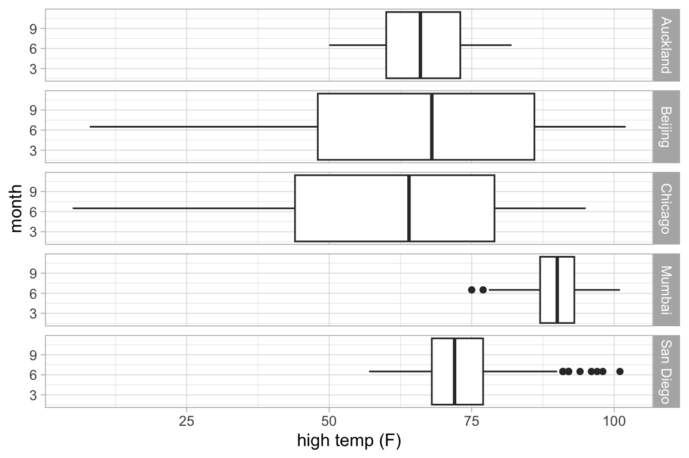

[^1]: labels
