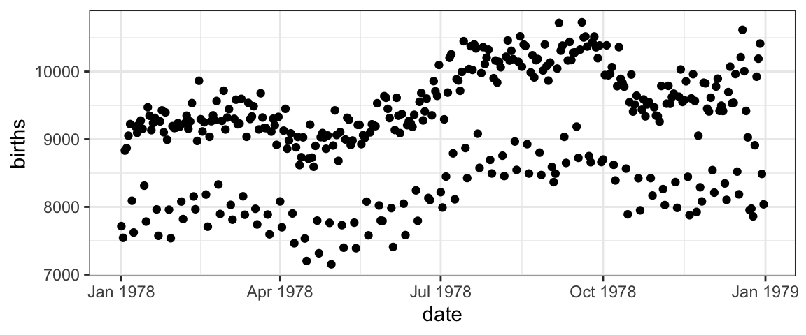
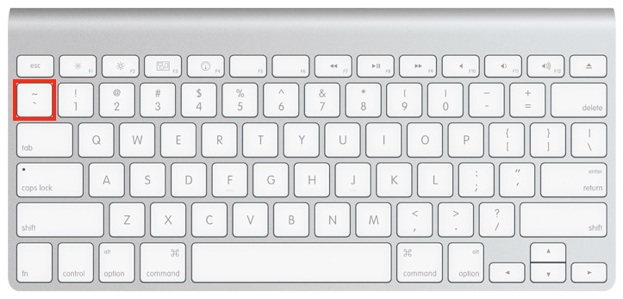
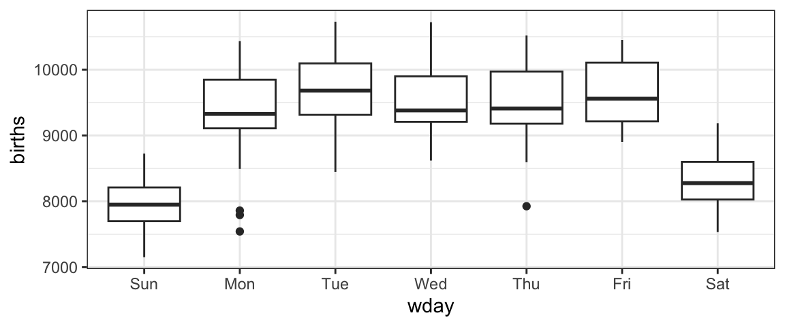

# 

# Plotting with formulas

### How do we make this plot?

#### US Births in 1978

Here is an interesting plot showing the number of live births in the
United States each day of 1978. We are going to use it to learn how to
create plots using the `ggformula` package.

#### Two important questions

To get R (or any software) to create this plot (or do anything else,
really), there are two important questions you must be able to answer.
Before continuing, see if you can figure out what they are.

#### The Questions

To get R (or any software) to create this plot, there are two important
questions you must be able to answer:

##### 1. What do you want the computer to do?

##### 2. What must the computer know in order to do that?

#### Answers to the questions

To make this plot, the answers to our questions are

##### 1. What do you want the computer to do?

**A.** Make a scatter plot (i.e., a **plot** consisting of **points**)

##### 2. What must the computer know in order to do that?

**A.** The data used for the plot:

- The variable to be plotted along the \\y\\ axis.
- The variable to be plotted along the \\x\\ axis.
- The data set that contains the variables.

We just need to learn how to tell R these answers.

### Plotting with Formulas

#### The Formula Template

We will provide answers to our two questions by filling in the boxes of
this important template:

### **goal ( yyy ~ xxx , data = mydata )**

 

We just need to identify which portions of our answers go into which
boxes.

#### The Name of the Game

It is useful to provide names for the boxes:

### **goal (  y  ~  x  , data = mydata , …)**

 

These names can help us remember which things go where. (The `...`
indicates that there are some additional arguments we will add
eventually.)

##### Other versions

Sometimes we will add or subtract a bit from our formula. Here are some
other forms we will eventually see.

\
`# simpler version`\
`goal``(`` ``~`` ``x``, data ``=`` ``mydata`` ``)`\
`# fancier version`\
`goal``(`` ``y`` ``~`` ``x`` ``|`` ``z`` , data ``=`` ``mydata`` ``)`\
`# unified version`\
`goal``(`` ``formula`` , data ``=`` ``mydata`` ``)`

#### 2 Questions and the Formula Template

 

### **goal (  y  ~  x  , data = mydata )**

 

##### Q. What do you want R to do? A. goal

- This determines the function to use.
- For a plot, the function will describe what sorts of marks to draw
  (points, in our example).

##### Q. What must R know to do that? A. arguments

- This determines the inputs to the function.
- For a plot, we must identify the variables and the data frame that
  contains them.

### Assembling the pieces

##### Template

 

### **goal (  y  ~  x  , data = mydata )**

 

##### Pieces

|          |              |                  |
|----------|--------------|------------------|
| box      | fill in with | purpose          |
| `goal`   | `gf_point`   | plot some points |
| `y`      | `births`     | y-axis variable  |
| `x`      | `date`       | x-axis variable  |
| `mydata` | `Births1978` | name of data set |

##### Exercise

Put each piece in its place in the template below and then run the code
to create the plot.

If you get an “object not found” or “could not find function” error
message, that indicates that you have not correctly filled in one of the
four boxes from the template.

Note: R is case sensitive, so watch your capitalization.

For the record, here are the first few rows of `Births1978`.

      births       date day_of_year
    1   7716 1978-01-01           1
    2   7543 1978-01-02           2
    3   8833 1978-01-03           3

### Using formulas to describe plots

The most distinctive feature of `ggformula` plots is the use of formulas
to describe the positional information of a plot. Formulas in R always
involve the tilde character, which is easy to overlook. It looks like
this:

The position of  on the keyboard varies from
brand to brand. On Apple keyboards, it’s here.

#### Formula shapes

Most `gf_` functions take a formula that describes the positional
attributes of the plot. Using one of these functions with no arguments
will show you the “shape” of the formula it requires.

##### Exercise

Run this code to see the formula shape for
[`gf_point()`](../reference/gf_point.md).

You should see that [`gf_point()`](../reference/gf_point.md)’s formula
has the shape `y ~ x`, so the \\y\\-variable name goes before the tilde
and the \\x\\-variable name goes after. (Think: “y depends on x”. Also
note that the \\y\\-axis label appears farther left than the \\x\\-axis
label.)

##### Exercise

Reverse the roles of the variables – changing `births ~ date` to
`date ~ birth` – to see how the plot changes.

##### Exercise

Change `date` to `day_of_year` and see how the plot changes. (If you do
this on a separate line, you will see both plots at once.)

### Changing things up – different data

This tutorial includes similar data sets for the years 1969 to 1988. To
use data from a different year, just change the name of the data set to
indicate the year.

##### Exercise

Fill in the “blanks” below to create plots for three different years. To
what extent do the patterns from 1978 persist over time?

(Note: This creates three separate plots. We will learn how to combine
them into a single plot shortly.)

### Changing things up – different types of plots

Our plots have points because we have used
[`gf_point()`](../reference/gf_point.md). But there are many other `gf_`
functions that create different types of plots.

##### Exercise

Experiment with some other plot types by changing
[`gf_point()`](../reference/gf_point.md) to one of the following:

- [`gf_line()`](../reference/gf_line.md): connect the dots
- [`gf_smooth()`](../reference/gf_smooth.md): smoothed version of
  [`gf_line()`](../reference/gf_line.md)
- [`gf_lm()`](../reference/gf_smooth.md): regression line (same as
  [`gf_smooth()`](../reference/gf_smooth.md) with `method = "lm"`)
- [`gf_spline()`](../reference/gf_spline.md): another type of smoother
  (using splines)

### Changing things up – gf options

If you created the spline plot, you probably found it “too wiggly”. If
you created the smoothed plot, you might prefer that the gray bands not
be displayed. For any of these plots you might have preferred different
colors or sizes of things. Such global characteristics of a plot can be
adjusted with additional arguments to the `gf_` function. These go in
the `...` part of the template.

 

#### **goal (  y  ~  x  , data = mydata , …)**

 

The general form for these is `option = value`.

For example,

- `spar = 0.5` (or any number between 0 and 1) controls the amount of
  smoothing in [`gf_spline()`](../reference/gf_spline.md).
- `se = TRUE` (note capitalization) turns on the “error band” in
  [`gf_smooth()`](../reference/gf_smooth.md) and
  [`gf_lm()`](../reference/gf_smooth.md).
- `color = "red"` or `fill = "navy"` (note quotes) can be used to change
  the colors of things. (`fill` is typically used for regions that are
  “filled in” and `color` for dots and lines.)
- `alpha = 0.5` (or any number between 0 and 1) will set the opacity (0
  is completely transparnt and 1 is completely opaque).

##### Exercises

Here are some examples. Adjust some of the options to see how things
change. We’ve inserted some line breaks to make the options easier to
locate in the code.

##### What attributes are available?

You can learn about the attributes available for a given layer using the
“quick help” for a layer function. You can find out more by reading the
help file produced with `?`.

##### What are the color names?

Curious to know all the available color names? Run this code.

### Multiple layers with \|\>

We said that [`gf_point()`](../reference/gf_point.md) creates a plot
with points. This isn’t quite true. Technically, it creates a **layer**
with points. A plot may have multiple layers. To create a multi-layered
plot, simply append `|>` at the end of the code for one layer and follow
that with another layer.

##### Exercise

1.  If you run the following code as is, you will get three separate
    plots.
2.  Combine these three layers into a single plot by appending `|>` at
    the end of the first two lines.
3.  That’s pretty ugly. Now change the x-axis variable to `day_of_year`
    so that all three years are aligned.
4.  If you like, change the plot type to
    [`gf_smooth()`](../reference/gf_smooth.md) or
    [`gf_spline()`](../reference/gf_spline.md).

### Mapping attributes

The births data in 1978 contains two clear “waves” of dots. One
conjecture is that these are weekdays and weekends. We can test this
conjecture by putting different days in different colors.

In the lingo of `ggformula`, we need to **map** color to the variable
`wday`. **Mapping** and **setting** attributes are different in an
important way.

- `color = "navy"` **sets** the color to “navy”. All the dots will be
  navy.

- `color = ~ wday` **maps** color to `wday`. This means that the color
  will depend on the values of `wday`. A legend (aka, a guide) will be
  automatically included to show us which days are which.

##### Exercise

1.  Change the color argument so that it maps to `wday`. Don’t forget
    the tilde (`~`).

2.  Try some other plot types: [`gf_line()`](../reference/gf_line.md),
    [`gf_smooth()`](../reference/gf_smooth.md), etc. Which do you like
    best? Why?

**Question 1.** Does it appear that the conjecture about weekends is
generally correct?

NoteAnswer

Yes – the two bands of points correspond to weekdays (higher) and
weekends (lower); mapping color to `wday` shows this directly.

**Question 2.** What happens if you omit the `~` before `wday`?

NoteAnswer

There is an error message: `'wday' not found`. Without the tilde, R
looks for an object named `wday` in your environment (rather than a
column in the data), and there isn’t one.

### Facets

If we want to look at all 20 years of birth data, overlaying the data is
likely to put too much information in too little space and make it hard
to tell which data is from which year. (Deciphering 20 colors or 20
shapes can be hard, too.) Instead, let’s put each year in separate
**facet** or sub-plot. Facets are better than 20 separate plots because
the coordinate systems are shared across the facets which saves space
and makes comparisons across facets easier.

There are two ways to create facets. The simplest way is to add a
vertical bar `|` to our formula.

The second way is to add on a facet command using `|>`:

##### Exercise

Edit one of the plots above to do the following:

1.  map color to `wday`
2.  change from points to lines or one of the smoothers

##### Exercise

Now edit one the plots above to

1.  remove the facets, and
2.  use `date` instead of `day_of_year`

What advantage do we get from using facets in this case?

### Facet Grids and Facet Wraps

The faceting we did on the previous page is called facet wrapping. If
the facets don’t fit nicely in one row, the facets continue onto
additional rows.

A facet grid uses rows, or columns, or both in a fixed way.

##### Exercise

Recreate the plot above using
[`gf_facet_grid()`](../reference/gf_facet_grid.md). This works much like
[`gf_facet_wrap()`](../reference/gf_facet_grid.md) and accepts a formula
with one of three shapes

- `y ~ x` (facets along both axes)
- `~ x` (facets only along x-axis)
- `y ~ .` (facets only along y-axis; notice the important dot in this
  one)

(These three formula shapes can also be used on the right side of `|`.)

### Plots with one positional variable

Some `gf_` functions only require the user to supply one variable. The
y-positions for these plots can calculated from the x-variable.

Here are two examples. Run the code below to see the formula shapes used
by these plots.

Notice that when there is only one variable it is always on the
**right** side. Other examples of functions that take just one variable
include [`gf_dens()`](../reference/gf_density.md),
[`gf_freqpoly()`](../reference/gf_freqpoly.md),
[`gf_dotplot()`](../reference/gf_dotplot.md),
[`gf_bar()`](../reference/gf_bar.md), and
[`gf_qq()`](../reference/gf_qq.md).

##### Exercise

Create some “one-variable” plots using the functions listed above and
the template below. Which variable should you use?

### Your Turn

Time to explore on your own. Here are three data sets you can use.

- `HELPrct` has data from a study of people addicted to alcohol,
  cocaine, or heroine
- `KidsFeet` has information about some kids’ feet.
- `NHANES` has lots of physiologic and other measurements from 10,000
  subjects in the National Health and Nutrition Evaluation Survey. (This
  data set will only be available if the NHANES package is installed
  where this tutorial is running.)

To find out more about the data sets use
[`?HELPrct`](https://rdrr.io/pkg/mosaicData/man/HELPrct.html),
[`?KidsFeet`](https://rdrr.io/pkg/mosaicData/man/KidsFeet.html), or
`?NHANES`. To see the first few rows of the data, you can use
[`head()`](https://rdrr.io/r/utils/head.html).

To get a list of functions available in `ggformula`, run this code
chunk.

##### Exercise.

Make some plots to explore one or more of these data sets.

- Experiment with different types of plots.
- Use mapping and/or facets to reveal groups.
- You can put more than one plot in a code chunk, but we’ve provided two
  chunks in case you want to separate your work that way. Use one chunk
  for experimenting and copy and paste your favorites to the other chunk
  if you like.

### Creating data summaries with df_stats()

[`df_stats()`](https://rdrr.io/pkg/mosaicCore/man/df_stats.html) works
much like the plotting functions in `ggformula` but it produces a data
frame of summary information rather than a plot. These summary data
frames can be useful for plotting or for obtaining some numerical
precision for the patterns we see in our plots.

Consider this plot

We can see clear trends, but what if we want to know the mean and
standard deviation, or the median and IQR for the number of births on
each of the seven weekdays?

##### Exercise

Change [`gf_boxplot()`](../reference/gf_boxplot.md) to
[`df_stats()`](https://rdrr.io/pkg/mosaicCore/man/df_stats.html).

The default use of
[`df_stats()`](https://rdrr.io/pkg/mosaicCore/man/df_stats.html)
computes some of the most common summary statistics. But we can use
[`df_stats()`](https://rdrr.io/pkg/mosaicCore/man/df_stats.html) to
create other numerical summaries as well.

##### Exercise

Modify the code above to compute some other summaries of your choosing.

#### Chaining with df_stats()

#### Combining with plots

In addition to the usual plot elements (lines, points, etc.), sometimes
it is useful to add text with [`gf_text()`](../reference/gf_text.md) or
[`gf_label()`](../reference/gf_text.md).

See if you can figure out what this does before your execute it.

### Where do we go from here?

If you are fussy about your plots, you may be wondering how to have more
control over things like:

- the colors, shapes, and sizes chosen when mapping attributes
- labeling, including titles and axis labels
- fonts, colors, and sizes of text
- color of plot elements like background, gridlines, facet labels, etc.

As you can imagine, all of these things can be adjusted pretty much
however you like. See the [Refining ggformula
plots](refining-ggformula.md) tutorial for more.

### A quick anatomy lesson

Not biological anatomy, rather plot anotomy. In order to talk about
plots, it is handy to have words for their various components.

- A **frame** is the bounding rectagle in which the plot is constructed.
  This is essentially what you may think of as the x- and y- axes, but
  the plot isn’t actually required to have visible “axes”.

- **glyphs** or **marks** are the particular symbols placed on the plot
  (examples: dots, lines, smiley faces, your favorite emoji, or whatever
  gets drawn).

- Each glyph has a number of **attributes** or **properties**.

  - These always include position (you have to put them somewhere).
  - Other attributes incude things like size, color, shape.
  - Not all glyphs have the same attributes (points have shape, but
    lines do not, for example).

- **scales** map raw data over to attributes of the plot.

- **guides** go in the other direction and help the human map graphical
  attributes back to the raw data. Guides include what you might call a
  legend, but also things like axis labeling.

- **facets** are coordinated subplots.
