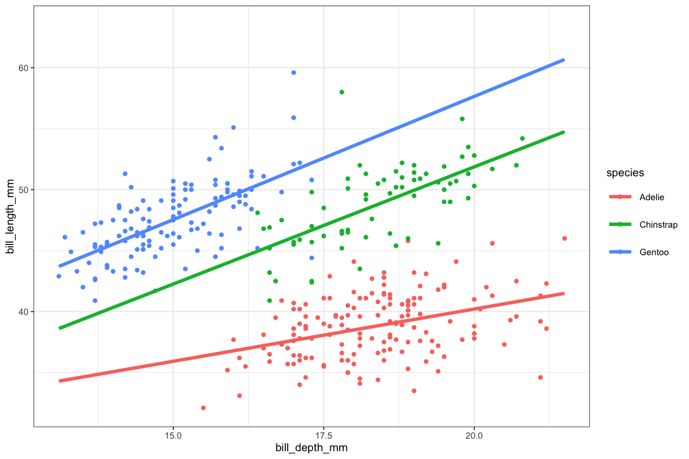

# 

# Refining ggformula plots

### Refining ggformula plots

If you are fussy about your plots, you may be wondering how to have more
control over things like:

- the colors, shapes, and sizes chosen when mapping attributes
- labeling, including titles and axis labels
- fonts, colors, and sizes of text
- color of plot elements like background, gridlines, facet labels, etc.

As you can imagine, all of these things can be adjusted pretty much
however you like. This tutorial will introduce you to refining plots in
`ggformula`.

### A quick anatomy lesson

Not biological anatomy, rather plot anotomy. In order to talk about
plots, it is handy to have words for their various components.

- A **frame** is the bounding rectangle in which the plot is
  constructed. This is essentially what you may think of as the x- and
  y- axes, but the plot isn’t actually required to have visible “axes”.

- **glyphs** or **marks** are the particular symbols placed on the plot
  (examples: dots, lines, smiley faces, your favorite emoji, or whatever
  gets drawn).

- Each glyph has a number of **attributes** or **properties**.

  - These always include position (you have to put them somewhere).
  - Other attributes incude things like size, color, shape.
  - Not all glyphs have the same attributes (points have shape, but
    lines do not, for example).

- **facets** are coordinated subplots.

- **scales** map raw data over to attributes of the plot.

- **guides** go in the other direction and help the human map graphical
  attributes back to the raw data. Guides include what you might call a
  legend, but also things like axis labeling.

- **coordinates** are something like scales for positional attributes
  and define the coordinate system for the frame.

- **statistics** (stats) transform data before the plot is generated. A
  common example is the use of
  [`stat_bin()`](https://ggplot2.tidyverse.org/reference/geom_histogram.html)
  to bin raw data before generating a histogram.

### Glyphs that use more than two positions

In addition to functions like
[`gf_histogram()`](../reference/gf_histogram.md) that require only a
single position variable and like
[`gf_point()`](../reference/gf_point.md) that require two, there are
several `gf_` functions that require more than two position variables.
How these positions are communicated via slots in the formula is
described by the “shape” listed in the quick help for these functions.

**Exercise 1** Edit the code below to reveal the formula shape for some
of the following: [`gf_linerange()`](../reference/gf_linerange.md),
[`gf_errorbar()`](../reference/gf_errorbar.md),
[`gf_errorbarh()`](../reference/ggstance.md),
[`gf_ribbon()`](../reference/gf_ribbon.md),
[`gf_crossbar()`](../reference/gf_crossbar.md).

**Exercise 2** The `Weather` data set has temperature information for
five cities for each day in 2016 and 2017. Edit the code below to use
[`gf_linerange()`](../reference/gf_linerange.md) or
[`gf_pointrange()`](../reference/gf_linerange.md). For a fancier plot,
map the color to one of the three temperature variables.

### Annotation

#### Titles and axis labels

Plot titles and axis labels can be set using
[`gf_labs()`](../reference/gf_aux.md). Text can be provied for `title`,
`subtitle`, `caption`, and the positional attributes (`x` and `y`).

**Exercise 3** Edit some of the labels of this plot as you see fit.
Notice that labels can be turned off by setting them to ““. (We’ll learn
how to improve the color scheme shortly.)

#### Text and other labels

Arbitrary text can be placed on a plot using
[`gf_text()`](../reference/gf_text.md) or
[`gf_label()`](../reference/gf_text.md).

**Exercise 4**  

1.  Run the code below.

2.  Then change [`gf_text()`](../reference/gf_text.md) to
    [`gf_label()`](../reference/gf_text.md) to see how these differ.

3.  Now change things so that the text or labels (your choice) are red.

### gf_refine()

[`gf_refine()`](../reference/gf_aux.md) converts plot elements from
native `ggplot2` into a form that makes them chainable with `ggformula`.
Those familiar with `ggplot2` can replace

\
`p`` ``+`` ``foo``(``...``)`

\
`p`` ``|>`` `[`gf_refine`](../reference/gf_aux.md)`(``foo``(``...``)``)`

For those not already familiar with `ggplot2`, in the remainder of this
tutorial, we illustrate some of the most common uses of
[`gf_refine()`](../reference/gf_aux.md).

### Controlling Scales

#### How scales work

When we include `color = ~ avg_temp` to out plot code, each value of the
variable `avg_temp` is assigned a color. It is the job of the color
scale to determine which values get mapped to which colors. (A guide can
be used so that humans can map back from colors to values when
interpreting the plot.) If we don’t like the default color choices, we
can tell R to use a different scale.

The situation is similar for other attributes (shape, size, fill, etc.),
each of which has its own scale.

#### Color and fill

The colors in our temperature map have two problems.

- First, the differences are a bit subtle.
- Second, the blues don’t communicate “hot” very well.

We can fix this by selecting a scale for color. This is done by passing
the desired scale as an argument to
[`gf_refine()`](../reference/gf_aux.md), a general purpose function for
refining our plots.

In the example below, we choose a rainbow of colors (and reverse the
order) so warmer temperatures have warmer colors.
[`scale_color_gradientn()`](https://ggplot2.tidyverse.org/reference/scale_gradient.html)
creates a scale by interpolating between several colors – in this case
five colors selected using the
[`rainbow()`](https://rdrr.io/r/grDevices/palettes.html) function.

**Exercise 5** You can also use
[`scale_color_gradientn()`](https://ggplot2.tidyverse.org/reference/scale_gradient.html)
with colors you enter manually. Add a few colors between navy and red to
make something more like the rainbow colors above.

#### Discrete colors

Discrete variables can also be mapped to colors. If you want to
determine which values are assigned to which colors, you can do this
with
[`scale_color_manual()`](https://ggplot2.tidyverse.org/reference/scale_manual.html)

**Exercise 6** Refine this plot using
[`scale_fill_manual()`](https://ggplot2.tidyverse.org/reference/scale_manual.html).
Replace the five colors in the example with five of your own choosing.
(Use [`colors()`](https://rdrr.io/r/grDevices/colors.html) to list the
possible color names.)

#### ColorBrewer scales

ColorBrewer, by Cynthia Brewer, Mark Harrower, and The Pennsylvania
State University, is a collection of nice looking color palettes
especially designed for use with maps, but useful for many other
purposes as well.

There are 3 types of ColorBrewer palettes, sequential, diverging, and
qualitative.

1.  Sequential (`type = "seq"`) palettes are suited to ordered data that
    progress from low to high. Lightness steps dominate the look of
    these schemes, with light colors for low data values to dark colors
    for high data values.

2.  Diverging (`type = "div"`) palettes put equal emphasis on mid-range
    critical values and extremes at both ends of the data range. The
    critical class or break in the middle of the legend is emphasized
    with light colors and low and high extremes are emphasized with dark
    colors that have contrasting hues.

3.  Qualitative (`type = "qual"`) palettes do not imply magnitude
    differences between legend classes, and hues are used to create the
    primary visual differences between classes. Qualitative schemes are
    best suited to representing nominal or categorical data.

To use a ColorBrewer palette, select
[`scale_color_brewer()`](https://ggplot2.tidyverse.org/reference/scale_brewer.html)
for discrete data or
[`scale_color_distiller()`](https://ggplot2.tidyverse.org/reference/scale_brewer.html)
for continuous data. The latter interpolates colors within one of the
categorical palettes from ColorBrewer.

**Exercise 7** Experiment with different colors by choosing different
values for `type` and `palette`.

#### Adjusing other scales

Other scales work similarly.

### Coordinates

#### coord_flip()

As the name suggests,
[`coord_flip()`](https://ggplot2.tidyverse.org/reference/coord_flip.html)
reverses the roles of the x- and y-axes. This is most useful for glyphs
that `ggplot2` only provides in a “vertical” version, such as boxplots
and violin plots.

**Exercise 8** Make horizontal violin plots by inserting
[`coord_flip()`](https://ggplot2.tidyverse.org/reference/coord_flip.html)
into [`gf_refine()`](../reference/gf_aux.md). Change the plot to
boxplots if you prefer those.

Tip[`coord_flip()`](https://ggplot2.tidyverse.org/reference/coord_flip.html)
often not needed.

Many `ggplot2` geoms determine whether to draw horizontal or vertical
version based on the types of data supplied in the variables, so
`ccord_flip()` can often be avoid by simply reversing which variable
goes where.

If the default orientation isn’t the desired one, the `orientation`
argument can be used to clarify.

#### coord_equal()

When the x- and y-axes are on the same scale, it is sometimes good to
force both scales to be rendered at the same size. This also forces an
identity line to have a true 45 degree slope.

**Exercise 9** Use
[`coord_equal()`](https://ggplot2.tidyverse.org/reference/coord_fixed.html)
to force equally-sized coordinate scales in the plot below.

#### coord_trans()

[`coord_trans()`](https://ggplot2.tidyverse.org/reference/coord_transform.html)
is used to construct scales with a transformation built in.

##### Example

The example below isn’t very useful, but demonstrates two of the
transformations that are available. Find out more with `?coord_trans()`.

Built-in transformations include
[`asn_trans()`](https://scales.r-lib.org/reference/transform_asn.html),
[`atanh_trans()`](https://scales.r-lib.org/reference/transform_atanh.html),
[`boxcox_trans()`](https://scales.r-lib.org/reference/transform_boxcox.html),
[`date_trans()`](https://scales.r-lib.org/reference/transform_date.html),
[`exp_trans()`](https://scales.r-lib.org/reference/transform_exp.html),
[`hms_trans()`](https://scales.r-lib.org/reference/transform_timespan.html),
[`identity_trans()`](https://scales.r-lib.org/reference/transform_identity.html),
[`log10_trans()`](https://scales.r-lib.org/reference/transform_log.html),
[`log1p_trans()`](https://scales.r-lib.org/reference/transform_log.html),
[`log2_trans()`](https://scales.r-lib.org/reference/transform_log.html),
[`log_trans()`](https://scales.r-lib.org/reference/transform_log.html),
[`logit_trans()`](https://scales.r-lib.org/reference/transform_probability.html),
[`probability_trans()`](https://scales.r-lib.org/reference/transform_probability.html),
[`probit_trans()`](https://scales.r-lib.org/reference/transform_probability.html),
[`reciprocal_trans()`](https://scales.r-lib.org/reference/transform_reciprocal.html),
[`reverse_trans()`](https://scales.r-lib.org/reference/transform_reverse.html),
[`sqrt_trans()`](https://scales.r-lib.org/reference/transform_sqrt.html),
and
[`time_trans()`](https://scales.r-lib.org/reference/transform_time.html).
New transformations can be created using
[`trans_new()`](https://scales.r-lib.org/reference/new_transform.html)
in the `scales` package.

### Controlling the view

Often it is useful to limit or expand the view of the data presented in
a plot. There are three ways this can be done.

1.  Filter the data and build the plot only from the resulting (smaller)
    data set.

2.  Use `gf_lim()` to set limits for the x- and y-axes.

3.  Use scales for x and y to set the limits.

In this section we will use a different data set. `penguins` contains
data collected by Palmer recording measurements of some penguins.

    # A tibble: 3 × 8
      species island    bill_length_mm bill_depth_mm flipper_length_mm body_mass_g
      <fct>   <fct>              <dbl>         <dbl>             <int>       <int>
    1 Adelie  Torgersen           39.1          18.7               181        3750
    2 Adelie  Torgersen           39.5          17.4               186        3800
    3 Adelie  Torgersen           40.3          18                 195        3250
    # ℹ 2 more variables: sex <fct>, year <int>

    Warning: Removed 2 rows containing non-finite outside the scale range
    (`stat_lm()`).

    Warning: Removed 2 rows containing missing values or values outside the scale range
    (`geom_point()`).

#### Filtering the data

#### gf_lims()

#### Using scales to limit the view

### Themes

#### Using predefined themes

A number of predefined themes exist that control the appearance of
non-data elements of plots. In this tutorial, we set the default theme
using

\
[`theme_set`](https://ggplot2.tidyverse.org/reference/get_theme.html)`(`[`theme_bw`](https://ggplot2.tidyverse.org/reference/ggtheme.html)`(``)``)`

Other themes include
[`theme_minimal()`](https://ggplot2.tidyverse.org/reference/ggtheme.html),
[`theme_classic()`](https://ggplot2.tidyverse.org/reference/ggtheme.html),
[`theme_gray()`](https://ggplot2.tidyverse.org/reference/ggtheme.html),
[`theme_light()`](https://ggplot2.tidyverse.org/reference/ggtheme.html),
[`theme_map()`](https://jrnold.github.io/ggthemes/reference/theme_map.html),
and `theme_quickmap()`. The `ggthemes` package includes some additional
themes, including
[`theme_economist()`](https://jrnold.github.io/ggthemes/reference/theme_economist.html),
[`theme_economist_white()`](https://jrnold.github.io/ggthemes/reference/theme_economist.html),
[`theme_excel()`](https://jrnold.github.io/ggthemes/reference/theme_excel.html),
[`theme_fivethirtyeight()`](https://jrnold.github.io/ggthemes/reference/theme_fivethirtyeight.html),
[`theme_stata()`](https://jrnold.github.io/ggthemes/reference/theme_stata.html),
[`theme_tufte()`](https://jrnold.github.io/ggthemes/reference/theme_tufte.html),
and
[`theme_wsj()`](https://jrnold.github.io/ggthemes/reference/theme_wsj.html).
Many of these themes mimic the look of other software packages or of
popular publications.

The theme can be set for an individual plot using
[`gf_theme()`](../reference/gf_theme.md).

**Exercise 10**  

1.  Run the code below.

2.  Choose a different theme in place of
    [`theme_fivethirtyeight()`](https://jrnold.github.io/ggthemes/reference/theme_fivethirtyeight.html)

3.  Themes have optional arguments. Try
    `theme_fivethrityeight(base_size = 8)`. Experiment with different
    sizes and themes.

#### Adjusting theme elements

Individual theme elements can also be adjusted.

**Exercise 11** Edit the code below to adjust theme elements. See
[`?theme`](https://ggplot2.tidyverse.org/reference/theme.html) for
details regarding the elements and how to change them.

### Stats

Most often, users will have little need to adust the stat used to make
layer of a plot since the default stat is usually what you need. For
example, the default stat for
[`gf_histogram()`](../reference/gf_histogram.md) is
[`stat_bin()`](https://ggplot2.tidyverse.org/reference/geom_histogram.html),
which bins the data before plotting the rectangular bars. So the
following are equivalent.

This also explains why the message reported when you create a histogram
without setting `binwidth` is coming from `stat_bin`. Notice that the
stat can be specified by a quoted string that names the part after
`stat_` or it can be specified by providing the function (potentially
with optional arguments included).

Other non-identity stats that get used with particular functions include

- [`stat_density()`](https://ggplot2.tidyverse.org/reference/geom_density.html)
  gets used with [`gf_density()`](../reference/gf_density.md) and
  [`gf_dens()`](../reference/gf_density.md)
- [`stat_density2d()`](https://ggplot2.tidyverse.org/reference/geom_density_2d.html)
  gets used with [`gf_density2d()`](../reference/gf_density_2d.md)
- [`stat_count()`](https://ggplot2.tidyverse.org/reference/geom_bar.html)
  gets used with [`gf_bar()`](../reference/gf_bar.md)
  ([`gf_col()`](../reference/gf_col.md) uses
  [`stat_identity()`](https://ggplot2.tidyverse.org/reference/stat_identity.html))

Occasionally it is useful to use a non-default stat. In particular,
[`stat_summary()`](https://ggplot2.tidyverse.org/reference/stat_summary.html)
and
[`stat_summary_bin()`](https://ggplot2.tidyverse.org/reference/stat_summary.html)
can be used to avoid common data transformation situations where a
function is used to aggregate over unique values of `x` or over bins of
`x` values.

These stats are designed to work with
[`gf_linerange()`](../reference/gf_linerange.md) and
[`gf_pointrange()`](../reference/gf_linerange.md), so three summary
functions can be specified.\
`fun.ymin` and `fun.ymax` return results that are available in
`after_stat(ymin)` and `after_stat(ymax)`.

The default summary function is `mean_se` which computes the mean, and
the mean one standard errors added and subtracted.

We can create our own functions for use with `stat_summary`. The
funcition is easiest to use if we write the function to take a vector
`x` as input and to produce a data frame with columns `y`, `ymin`, and
`ymax`. Here is an example that creates a “3-number summary” that can be
used to present the median and first and third quartiles.
