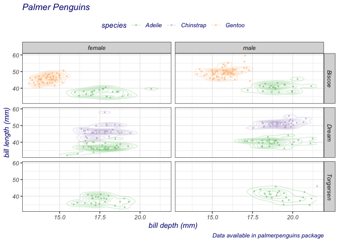

# ggformula

## Formula interface to ggplot2

`ggformula` introduces a family of graphics functions,
[`gf_point()`](reference/gf_point.md),
[`gf_density()`](reference/gf_density.md), and so on, bring the formula
interface to
[`ggplot()`](https://ggplot2.tidyverse.org/reference/ggplot.html). This
captures and extends the excellent simplicity of the `lattice`-graphics
formula interface, while providing the intuitive “add this component”
capabilities of `ggplot2`.

## Installation

You can install ggformula from CRAN sith

``` r

install.packages("ggformula")
```

or from github with:

``` r

# install.packages("devtools")
devtools::install_github("ProjectMOSAIC/ggformula")
```

## Using ggformula

The following example illustrates a typical plot constructed with
ggformula.

``` r

suppressPackageStartupMessages(library(ggformula))
data(penguins, package = "palmerpenguins")
penguins |> 
  tidyr::drop_na() |> # to avoid erros with default bandwidth calculation in stat_density_2d
  set_variable_labels(
    bill_length_mm = "bill length (mm)",
    bill_depth_mm = "bill depth (mm)"
  ) |>
  gf_jitter(bill_length_mm ~ bill_depth_mm | island ~ sex, color = ~ species,
          width = 0.05, height = 0.05, size = 0.5, alpha = 0.6) |>
  gf_density2d(alpha = 0.3) |>
  gf_labs(title = "Palmer Penguins",
          caption = "Data available in palmerpenguins package"
  ) |>
  gf_refine(scale_color_brewer(type = "qual")) |>
  gf_theme(theme_bw()) |>
  gf_theme(
    legend.position = 'top',
    text = element_text(colour = "navy", face = "italic")
  )
```



### More Information

Find out more about `ggformula` at
<https://www.mosaic-web.org/ggformula/>.
